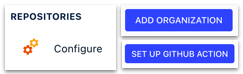

# Welcome to Moderne

You're about to do large-scale refactoring and code improvement without writing a single line of code. Pretty awesome, right?

[Moderne.io ](https://moderne.io)provides customers with an intuitive view for searching, analyzing, and transforming code across their entire organization.

A recipe is designed to transform code at the AST level. While resulting code may look different, the meaning of the code remains the same.



