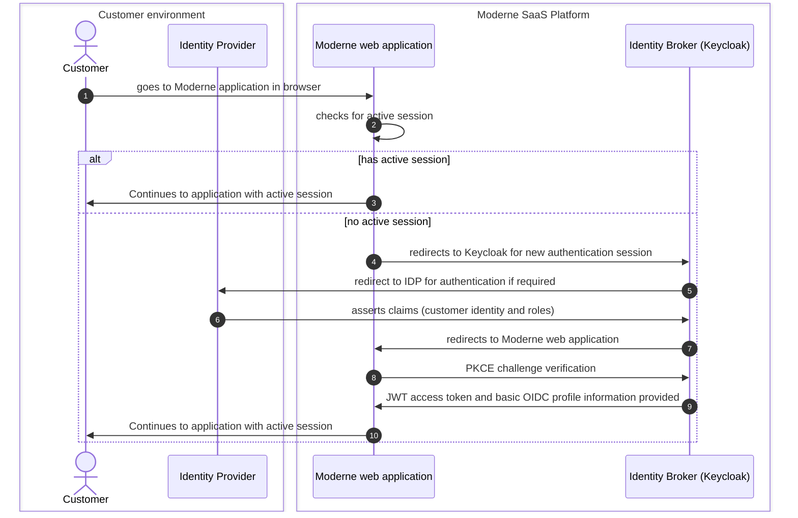

# Authentication

### Goals

This doc will help you understand:

1. The architecture of the Moderne Platform's authentication integration with your [Identity Provider (IdP)](#user-content-fn-1)[^1].
2. How to prepare for a [Single Sign-On (SSO)](#user-content-fn-2)[^2] integration with the Moderne Platform.

### Architectural overview

The Moderne Platform employs robust authentication mechanisms tailored for each customer. Our system utilizes a dedicated [Keycloak server](https://www.keycloak.org/) that operates as an [identity broker](#user-content-fn-3)[^3] – which interfaces with your IdP to manage access credentials securely.&#x20;

Moderne supports seamless integration by offering various authentication options:

* **Social Logins**: Enable users to authenticate using their existing accounts (e.g., Google, GitHub) for quick and convenient sign-in experiences.
* **SAML** (Security Assertion Markup Language): Facilitates SSO capabilities by leveraging pre-existing enterprise identity infrastructures that adhere to industry standards.
* **OIDC** (Open Authorization): Provides a modern, flexible authentication framework based on open protocols and allows for secure authorization across different services and applications.

SAML or OIDC provides customers with the ability to assert claims for each authenticating principal. Claims can define a principal's email, first name, last name, and whether they should be assigned the role of `admin`.


**Claims** are _assertions_ about a user, _as asserted by the Identity Provider_.

**Example:** _Alice's email is alice@example.com_ or _Bob is an administrator_


Claims are updated each time a principal authenticates through their Identity Provider to the Moderne platform.

#### Authenticating to Moderne



### Configuring authentication

When configuring your authentication to the Moderne SaaS, you will need to select one of the choices below.

#### SAML integration

1. Coordinate with your IAM team to create a new SSO application in your identity provider using the following `Redirect URI` (Please make sure to replace `CUSTOMER_NAME` through the URI):
   * `https://login.CUSTOMER_NAME.moderne.io/auth/realms/CUSTOMER_NAME/broker/CUSTOMER_NAME/endpoint`
2. Provide the URL that points to the IdP metadata to Moderne, along with the names of attributes for the claims. ([See example](authentication.md#example-saml-idp-metadata))
   * When setting up a claim for the `admin` attribute, use `admin` as the _Attribute Name_ and a simple string value of either `true` or `false`


An [example of a SAML payload](authentication.md#example-idp-saml-response) can be provided to Moderne as well to help expedite the configuration process.


#### OIDC integration

1. Provide the following to to Moderne:
   1. Discovery end-point URI
      * Example: `http://localhost:8081/auth/realms/my-service/.well-known/openid-configuration`
   2. Client ID
      * Example: `my-service-id`
   3. Client Secret

### Appendix

#### Terminology

* **Single Sign-On (SSO)**: A process where a user only needs to authenticate once to access multiple applications or systems.
* **Service Provider (SP)**: An application that consumes authentication services from an Identity Provider (IdP).
* **Identity Provider (IdP)**: An application that provides authentication services to Service Providers (SPs).
* **Identity Broker**: An intermediary service that lets you connect with the Identity Providers.
* **OpenID Connect (OIDC)**: A standard for Single Sign-On (SSO) using OpenID technology.
* **OAuth 2.0**: A standard for authorization that enables applications to access protected resources on behalf of the user.

#### Example SAML IdP metadata

```xml
<EntityDescriptor
    ID="_c066524f-ba36-49d5-9dfa-ae14e13c1392"
    entityID="https://idp.EXAMPLE.com"
    validUntil="2022-07-20T09:48:54Z"
    cacheDuration="PT15M"
    xmlns="urn:oasis:names:tc:SAML:2.0:metadata"
    xmlns:saml2="urn:oasis:names:tc:SAML:2.0:assertion">

    <IDPSSODescriptor WantAuthnRequestsSigned="true" protocolSupportEnumeration="urn:oasis:names:tc:SAML:2.0:protocol">
        <SingleSignOnService Binding="urn:oasis:names:tc:SAML:2.0:bindings:HTTP-Redirect" Location="https://idp.EXAMPLE.com/saml/sso" />
        <SingleSignOnService Binding="urn:oasis:names:tc:SAML:2.0:bindings:HTTP-POST" Location="https://idp.EXAMPLE.com/saml/sso" />
        <SingleSignOnService Binding="urn:oasis:names:tc:SAML:2.0:bindings:HTTP-Artifact" Location="https://idp.EXAMPLE.com/saml/sso" />

        <SingleLogoutService Binding="urn:oasis:names:tc:SAML:2.0:bindings:HTTP-Redirect" Location="https://idp.EXAMPLE.com/saml/slo" />
        <SingleLogoutService Binding="urn:oasis:names:tc:SAML:2.0:bindings:HTTP-POST" Location="https://idp.EXAMPLE.com/saml/slo" />
        <SingleLogoutService Binding="urn:oasis:names:tc:SAML:2.0:bindings:HTTP-Artifact" Location="https://idp.EXAMPLE.com/saml/slo" />

        <ArtifactResolutionService Binding="urn:oasis:names:tc:SAML:2.0:bindings:SOAP" Location="https://idp.EXAMPLE.com/saml/ars" index="0" />

        <NameIDFormat>urn:oasis:names:tc:SAML:1.1:nameid-format:unspecified</NameIDFormat>
        <NameIDFormat>urn:oasis:names:tc:SAML:2.0:nameid-format:transient</NameIDFormat>
        <NameIDFormat>urn:oasis:names:tc:SAML:2.0:nameid-format:persistent</NameIDFormat>
        <NameIDFormat>urn:oasis:names:tc:SAML:1.1:nameid-format:emailAddress</NameIDFormat>

        <KeyDescriptor use="signing">
            <KeyInfo
                xmlns="http://www.w3.org/2000/09/xmldsig#">
                <X509Data>
                    <X509Certificate>IDP_PUBLIC_SIGNING_CERTIFICATE_USED_FOR_SIGNING_RESPONSES</X509Certificate>
                </X509Data>
            </KeyInfo>
        </KeyDescriptor>
    </IDPSSODescriptor>

    <Organization>
        <OrganizationName xml:lang="en-US">Example</OrganizationName>
        <OrganizationDisplayName xml:lang="en-US">Example Org</OrganizationDisplayName>
        <OrganizationURL xml:lang="en-US">https://example.com/</OrganizationURL>
    </Organization>

    <ContactPerson contactType="technical">
        <Company>Example</Company>
        <GivenName>bob</GivenName>
        <SurName>smith</SurName>
        <EmailAddress>bob@example.com</EmailAddress>
    </ContactPerson>

</EntityDescriptor>
```

#### Example SAML request to IdP

```xml
<samlp:AuthnRequest xmlns:samlp="urn:oasis:names:tc:SAML:2.0:protocol"
                    xmlns="urn:oasis:names:tc:SAML:2.0:assertion"
                    xmlns:saml="urn:oasis:names:tc:SAML:2.0:assertion"
                    AssertionConsumerServiceURL="https://login.EXAMPLE.moderne.io/auth/realms/EXAMPLE/broker/EXAMPLE/endpoint"
                    Destination="https://sso.EXAMPLE.com/idp/sso2.saml"
                    ForceAuthn="false"
                    ID="FAKE_DATA"
                    IssueInstant="2024-05-21T17:50:22.024Z"
                    ProtocolBinding="urn:oasis:names:tc:SAML:2.0:bindings:HTTP-POST"
                    Version="2.0"
                    >
    <saml:Issuer>https://login.shelter.moderne.io/auth/realms/shelter</saml:Issuer>
    <dsig:Signature xmlns:dsig="http://www.w3.org/2000/09/xmldsig#">
        <dsig:SignedInfo>
            <dsig:CanonicalizationMethod Algorithm="http://www.w3.org/2001/10/xml-exc-c14n#" />
            <dsig:SignatureMethod Algorithm="http://www.w3.org/2001/04/xmldsig-more#rsa-sha256" />
            <dsig:Reference URI="#FAKE_DATA">
                <dsig:Transforms>
                    <dsig:Transform Algorithm="http://www.w3.org/2000/09/xmldsig#enveloped-signature" />
                    <dsig:Transform Algorithm="http://www.w3.org/2001/10/xml-exc-c14n#" />
                </dsig:Transforms>
                <dsig:DigestMethod Algorithm="http://www.w3.org/2001/04/xmlenc#sha256" />
                <dsig:DigestValue>FAKE_DATA</dsig:DigestValue>
            </dsig:Reference>
        </dsig:SignedInfo>
        <dsig:SignatureValue>FAKE_DATA</dsig:SignatureValue>
        <dsig:KeyInfo>
            <dsig:KeyName>FAKE_DATA</dsig:KeyName>
            <dsig:X509Data>
                <dsig:X509Certificate>FAKE_DATA</dsig:X509Certificate>
            </dsig:X509Data>
        </dsig:KeyInfo>
    </dsig:Signature>
    <samlp:NameIDPolicy AllowCreate="true"
                        Format="urn:oasis:names:tc:SAML:1.1:nameid-format:unspecified"
                        />
</samlp:AuthnRequest>

```

#### Example of claims from an IdP SAML response&#x20;

```xml
<saml:AttributeStatement>
    <saml:Attribute Name="firstName"
                    NameFormat="urn:oasis:names:tc:SAML:2.0:attrname-format:unspecified"
                    >
        <saml:AttributeValue xsi:type="xs:string"
                                xmlns:xs="http://www.w3.org/2001/XMLSchema"
                                xmlns:xsi="http://www.w3.org/2001/XMLSchema-instance"
                                >ALICE</saml:AttributeValue>
    </saml:Attribute>
    <saml:Attribute Name="lastName"
                    NameFormat="urn:oasis:names:tc:SAML:2.0:attrname-format:unspecified"
                    >
        <saml:AttributeValue xsi:type="xs:string"
                                xmlns:xs="http://www.w3.org/2001/XMLSchema"
                                xmlns:xsi="http://www.w3.org/2001/XMLSchema-instance"
                                >BOB</saml:AttributeValue>
    </saml:Attribute>
    <saml:Attribute Name="admin"
                    NameFormat="urn:oasis:names:tc:SAML:2.0:attrname-format:unspecified"
                    >
        <saml:AttributeValue xsi:type="xs:string"
                                xmlns:xs="http://www.w3.org/2001/XMLSchema"
                                xmlns:xsi="http://www.w3.org/2001/XMLSchema-instance"
                                >false</saml:AttributeValue>
    </saml:Attribute>
    <saml:Attribute Name="email"
                    NameFormat="urn:oasis:names:tc:SAML:2.0:attrname-format:basic"
                    >
        <saml:AttributeValue xsi:type="xs:string"
                                xmlns:xs="http://www.w3.org/2001/XMLSchema"
                                xmlns:xsi="http://www.w3.org/2001/XMLSchema-instance"
                                >USER@EXAMPLE.COM</saml:AttributeValue>
    </saml:Attribute>
</saml:AttributeStatement>
```

[^1]: An application that provides authentication services to Service Providers (SPs).

[^2]: A process where a user only needs to authenticate once to access multiple applications or systems.

[^3]: An intermediary service that lets you connect with the Identity Providers.
