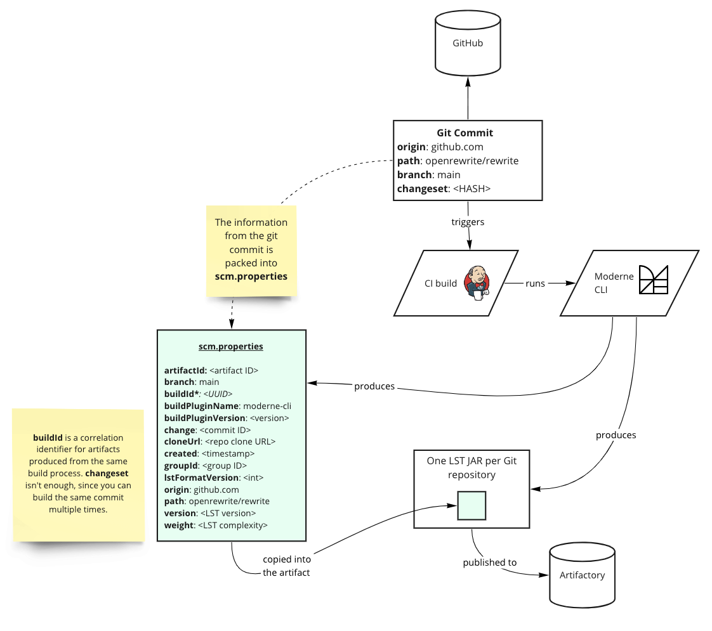
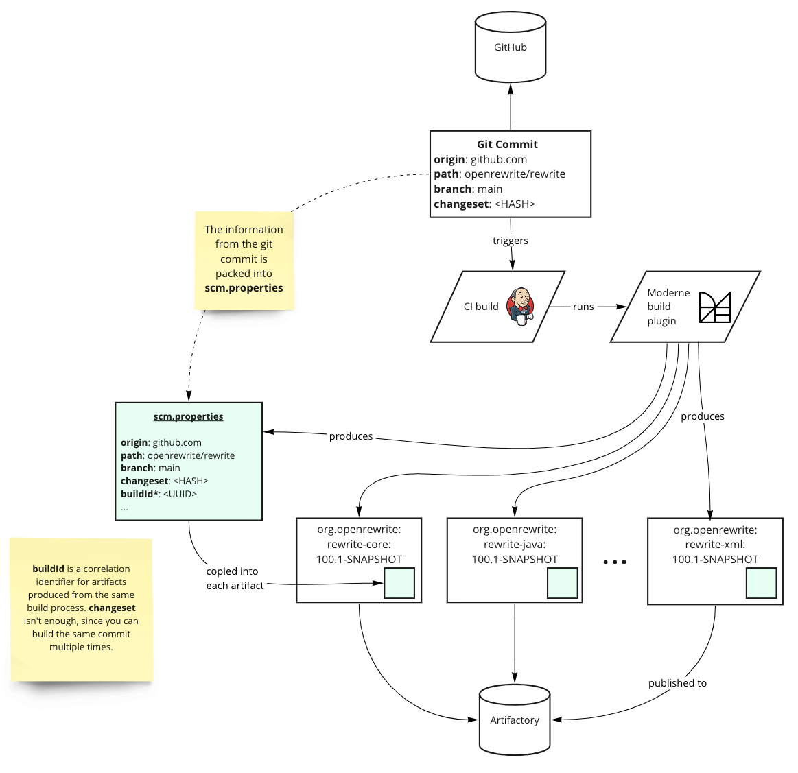

# How LST artifacts are produced

Moderne operates on a format-preserving and type-attributed Lossless Semantic Tree (LST) which is an intermediate, compiler-produced representation of the code. This LST can be projected losslessly back to the original source code (including all of its original formatting) but contains far more information than the text of the original code.

This LST artifact is either produced by the [Moderne CLI](../../../user-documentation/moderne-developer-experience/getting-started/cli-intro.md) (**recommended**) or by the [Moderne build plugins](../how-to-guides/integrating-private-code.md#mavengradle-plugins). These artifacts are typically produced in CI jobs (usually created by the [mod-connect tool](https://github.com/moderneinc/mod-connect)) that run on GitHub or Jenkins and they are designed to be published to an artifact repository alongside other artifacts such as binary JARs, JavaDocs, sources, etc.

In this doc, we'll illustrate the relationship between the various components: source control, commits, CI builds, the Moderne CLI / Moderne build plugins, and the artifact repository.

## Moderne CLI flow

1. **Git commit** - The process that creates the LST artifact begins when code is committed to a long-living branch in your SCM that you want Moderne to ingest (such as the `main` branch). This commit should trigger a CI build of the repository.
2. **CI build** - The CI build checks out and compiles the source code at this commit and then runs the [Moderne CLI publish command](../../../user-documentation/moderne-developer-experience/getting-started/cli-intro.md#publish). The CI system in use doesn't matter. It could be Jenkins, GitHub Actions, CircleCI, Concourse, etc.
3. **Moderne CLI** - The Moderne CLI will create one LST artifact (not in a JAR format) per subproject. Once these LST artifacts have been built, the Moderne CLI will combine them all into a JAR and add a `scm.properties` file to it that provides key information about the build (such as a unique `buildId` that identifies this particular build process). Lastly, the Moderne CLI will push this JAR to the artifact repository of your choice.


Some subprojects might not publish artifacts – such as benchmarking, testing, or sample subprojects. The Moderne CLI is designed to publish LST artifacts for these subprojects anyway.



The `buildId` correlation identifier is necessary to identify artifacts emanating from a particular build _process_. This is because builds of the same git changeset will not necessarily produce the same LST, as the project may have dependencies with dynamic version constraints that resolve to different versions for different builds of the same changeset.

We still preserve the changeset, as this is the starting point of any later commit workflow after a recipe run in Moderne, but `buildId` is how we group artifacts from the same build process together to form an overall understanding of the code at the time this build occurred.

Build ids increase over time; so newer LSTs will have a higher `buildId`.


## Moderne build plugin flow

1. **Git commit** - The process that creates the LST artifact begins when code is committed to a long-living branch in your SCM that you want Moderne to ingest (such as the `main` branch). This commit should trigger a CI build of the repository.
2. **CI build** - The CI build checks out and compiles the source code at this commit and then executes the Maven or Gradle build task in the relevant Moderne build plugin. The CI system used in this step does not matter. It could be Jenkins, GitHub Actions, CircleCI, Concourse, etc.
3. **Moderne build plugin** - The Moderne build plugins will create one JAR per subproject. Each JAR contains an LST artifact which, itself, contains the serialized representation of the LST along with a `scm.properties` file. The `scm.properties` file provides key information about the build (such as a unique `buildId` that identifies this particular build process). Once these JARs have all been built, the build plugin will publish each JAR to the artifact repository of your choice.


Some subprojects might not publish artifacts – such as benchmarking, testing, or sample subprojects. The Moderne build plugins are designed to publish LST artifacts for these subprojects anyway.



The `buildId` correlation identifier is necessary to identify artifacts emanating from a particular build _process_. This is because builds of the same git changeset will not necessarily produce the same LST, as the project may have dependencies with dynamic version constraints that resolve to different versions for different builds of the same changeset.

We still preserve the changeset, as this is the starting point of any later commit workflow after a recipe run in Moderne, but `buildId` is how we group artifacts from the same build process together to form an overall understanding of the code at the time this build occurred.

Build IDs increase over time; so newer LSTs will have a higher `buildId`.

