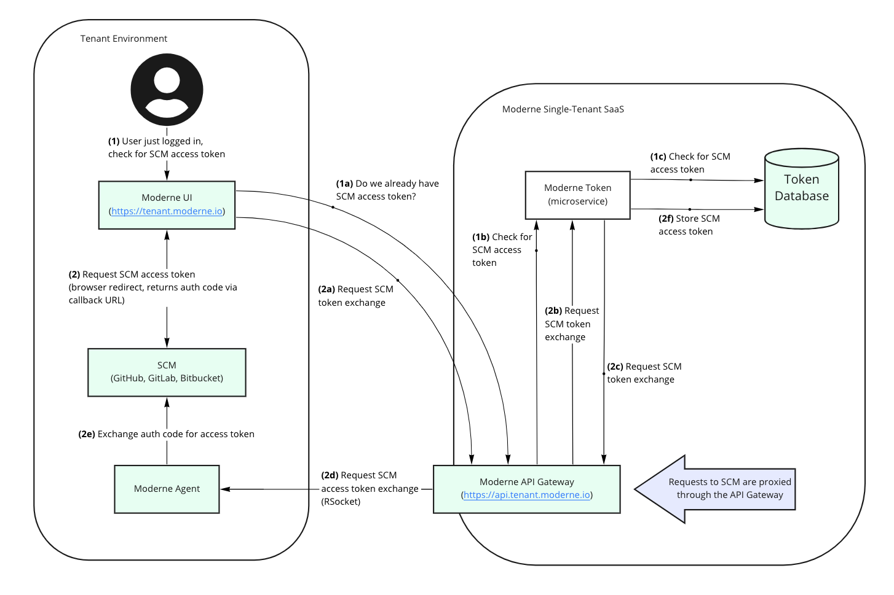

# Sensitive data flow

To give you a better understanding of how sensitive artifacts flow through Moderne services and the services they connect to, this document will:

* [Explain how artifacts are encrypted/decrypted](flow.md#encryption-and-decryption-of-lst-artifacts)
* [Talk through each of the components that touch those artifacts](flow.md#moderne-agent)
* [Discuss how users sign into Moderne and how Moderne connects with your identity provider](flow.md#moderne-single-sign-on)
* [Explain how Moderne securely integrates with SCMs](flow.md#integrating-with-scms)
* [Provide some diagrams that show key authorization flows](flow.md#sso-identity-brokering)

## Encryption and decryption of LST artifacts

Moderne manages the encryption of sensitive data by using a "customer-managed key" (CMK). This technique is known by one of several names:

* CMK - Customer Managed Key
* EKM - Enterprise Key Management
* BYOK - Bring Your Own Keys
* CHEK - Customer-Held Encryption Keys
* BYOE - Bring Your Own Encryption

The [Moderne agent](flow.md#moderne-agent) that is deployed in your environment is the source of this CMK. You may cut off access to sensitive data by turning off the agent.

LST artifacts are encrypted before they are transmitted to Moderne. When [workers](flow.md#moderne-worker) need to access these artifacts, they will make a request to the agent to obtain the key to decrypt them. This will happen as the artifacts are deserialized into memory.

Your custom recipe artifacts are similarly encrypted before they are transmitted. They are then decrypted by the [recipe execution service](flow.md#moderne-recipe-execution) – with the key again being obtained from the agent. The recipe execution service will use these artifacts to build a category tree of the available recipes. Worker instances will use these artifacts to run a recipe.

Below you can find a component diagram that has been simplified to only show interactions that are related to the encryption and decryption of LST artifacts:

Let's walk through each of these components while focusing on how artifacts flow through them.

### Moderne agent

The Moderne agent establishes a persistent bidirectional RPC connection to the [Moderne API gateway](flow.md#moderne-api-gateway) over HTTPS (egress only). Artifacts are transmitted to the API gateway via this secure connection. The agent is responsible for encrypting these artifacts. You must provide the agent with an [AES](https://en.wikipedia.org/wiki/Advanced\_Encryption\_Standard) key in order for it to function properly.

The [Moderne recipe execution service](flow.md#moderne-recipe-execution) and [Moderne workers](flow.md#moderne-worker) request this symmetric key to decrypt artifacts any time they read one from storage.

### Moderne API gateway

The API gateway receives requests from the [Moderne agent](flow.md#moderne-agent) to store artifacts via a persistent bidirectional connection secured over HTTPS. These artifacts are passed to the [Moderne artifact storage service](flow.md#moderne-artifact-storage) for storage. LST artifacts are already encrypted by the time they arrive at the API gateway and they are stored in this encrypted state.

### Moderne artifact storage

The Moderne artifact storage service is responsible for receiving pre-encrypted LST artifacts and recipe JARs and storing them in a private object store depending on the cloud provider you use ([Azure Blob Storage](https://learn.microsoft.com/en-us/azure/storage/blobs/), [Google Cloud Storage](https://cloud.google.com/storage), or [AWS S3](https://aws.amazon.com/pm/serv-s3/)).

This service does not require access to encryption keys as it never needs to decrypt the artifacts.

### Moderne worker

Whenever a worker needs an artifact to perform some task, it will make a request to the [Moderne agent](flow.md#moderne-agent) through the [API gateway](flow.md#moderne-api-gateway). This request will retrieve the key needed to decrypt said artifact as it caches the artifact in memory.

Periodically, workers check for the continued existence of a connection to the Moderne agent. When this connection is severed, the worker evacuates its in-memory LST and recipe cache, effectively making it so your code and recipes become unreadable to Moderne until the connection is restored.

### Moderne recipe execution

The Moderne recipe execution service needs recipe artifacts in order to build a category tree of available recipes. To meet this need, it will make a request to the [Moderne agent](flow.md#moderne-agent) through the [API gateway](flow.md#moderne-api-gateway). This request will retrieve the key needed to decrypt the recipe artifacts.

Periodically, the recipe execution service checks for the continued existence of a connection to the Moderne agent. When this connection is severed, it evacuates your recipes from the category tree until the connection is restored.

## Moderne service deployment and operationalization

Moderne microservices are deployed via a Moderne Spinnaker installation. Moderne monitors the performance of live service instances via a privately hosted Grafana/Prometheus instance.

## Moderne single sign-on

When a user tries to sign into the Moderne SaaS, Moderne uses OIDC or SAML to authenticate with your identity provider. Roles are used to separate users into regular users and administrators. Users not assigned either of these roles cannot access the service.

## Integrating with SCMs

Moderne users can authorize the creation of an OAuth token for Moderne to use via a standard OAuth web application flow (such as in this [GitHub example](https://docs.github.com/en/apps/oauth-apps/building-oauth-apps/authorizing-oauth-apps#web-application-flow)). As part of this process, a user may be required to authenticate with the SCM first if they don't have an active session. Please note that the redirect part of the OAuth process goes from a developer's workstation to the SCM directly. If your SCM is self-hosted, that request does not go outside of your environment.

In order to set up this OAuth process, an OAuth client for Moderne needs to be created. The homepage URL and callback URL should both be [https://TENANT.moderne.io](https://tenant.moderne.io). Furthermore, the client id and client secret need to be provided to the Moderne SaaS. For instructions on how to configure this, please see our [configuring the Moderne agent docs](../../how-to-guides/agent-configuration/).

All of the user interactions that result in authorization decisions within GitHub, Bitbucket, and GitLab (such as viewing diffs, committing, and making PRs) come to these SCMs through the agent on behalf of the user. From GitHub, Bitbucket, or GitLab’s perspective, all interactions appear to come from the user at the agent's location. Therefore, the Moderne SaaS doesn’t require any changes to how GitHub, Bitbucket, or GitLab is used internally.

Moderne does not need a separate configuration of who can access what code. Instead, it aligns access to the SCM that stores the code in question. When a user authenticates with the SCM, that OAuth access token is stored in a token database.

When a user attempts to access recipe details, the worker uses that token to make an authorization request to the SCM by tunneling the request through the API gateway and agent. Tokens are good for _up to_ 8 hours depending on the SCM used.

User authorization on a particular repo is also retrieved and cached for some configurable amount of time.

### SSO identity brokering

### SCM authorization

### User flows

#### Get recipe execution details

#### Commit or open a pull request

