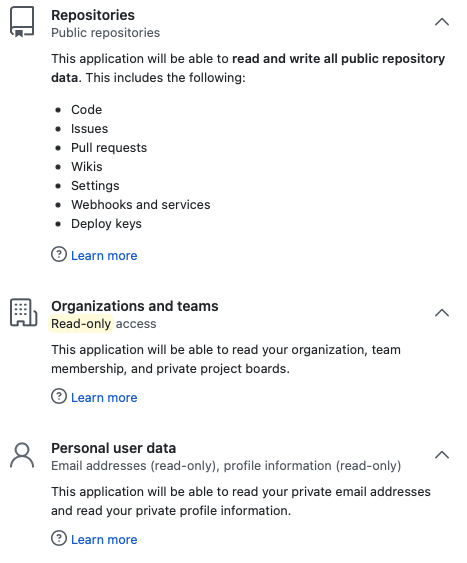

# GitHub permissions

Moderne uses a GitHub OAuth application to perform various actions on your behalf. Below is an explanation of those permissions and how they're used by Moderne.

## OAuth permission

Moderne requires a select number of OAuth scopes necessary to help you transform your code.

| Repositories (public)                 | Read/write | Create branches, create forks of public repositories, and push changesets on your behalf.                                                                                                                                                                                                                                                                         |
| ------------------------------------- | ---------- | ----------------------------------------------------------------------------------------------------------------------------------------------------------------------------------------------------------------------------------------------------------------------------------------------------------------------------------------------------------------- |
| Repositories (private) **(optional)** | Read/write | 
Create branches, create forks of private repositories, and push changesets on your behalf.  Only enabled if <code>includePrivateRepos=true</code> is set in agent configuration for GitHub. See <a data-mention href="../how-to-guides/agent-configuration/configure-an-agent-with-github.md">configure-an-agent-with-github.md</a> for more detail.
 |
| Organizations and teams               | Read-only  | Understand the organizations you belong to and your level of access within them.                                                                                                                                                                                                                                                                                  |
| Workflow                              | Read/write | Recipes that alter GitHub Action workflow files require this permission to make commits to them.                                                                                                                                                                                                                                                                  |
| Personal user data                    | Read-only  | Recognize your account as a new or returning user. Email and Profile are included by default with OpenID Connect through OAuth.                                                                                                                                                                                                                                   |

## GitHub OAuth applications vs. GitHub applications

Those familiar with GitHub authentication may wonder why Moderne doesn't use GitHub apps for authentication instead of OAuth apps, since GitHub apparently favors GitHub apps as a replacement for OAuth apps. The reason Moderne is unable to use GitHub app authentication is because creating a user-owned fork of a public repository using Github app authentication requires:

* The individual user to install the GitHub app into their personal account (not just an organization they belong to).
* Permissions `administration:read` and `administration:write` must be granted.
* The GitHub application must be installed with "all repositories" access.

Creating forks of public repositories is an important workflow for Moderne, and we don't believe users should need to grant such permissive access to accomplish it. With a GitHub OAuth application, all that is necessary is the `public_repo` scope, which doesn't grant Moderne read and write access to all your private repositories without restriction.
