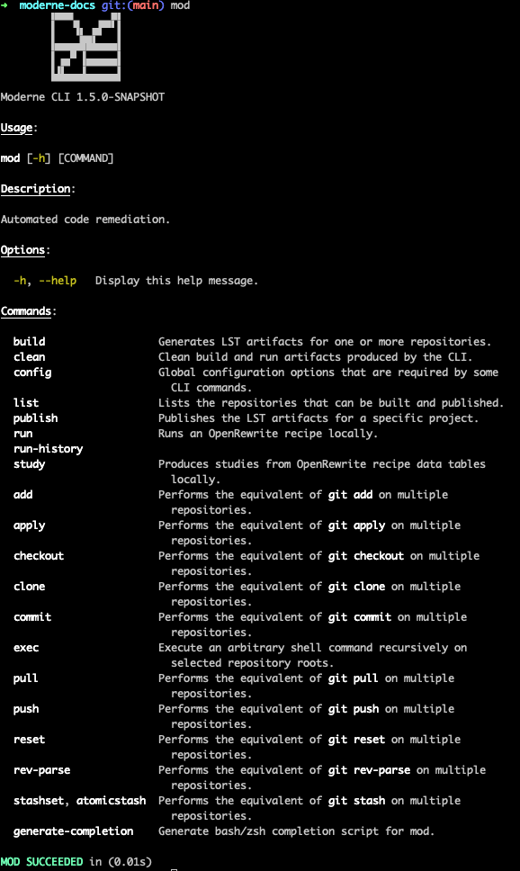

# Getting started with the Moderne CLI

The Moderne CLI is a command line tool that allows you to build [Lossless Semantic Tree](https://docs.moderne.io/concepts/lossless-semantic-trees) (LST) artifacts, publish them to an artifact repository of your choosing, and run recipes from your local machine.

To ensure you can use the Moderne CLI successfully, in this guide, we will:

* [Explain how to install the Moderne CLI](#installation)
* [Walk you through configuring the CLI](#configuring-the-cli)
* [Help you get familiar with the Moderne CLI by demonstrating how to migrate a sample repository from Spring Boot 2 to 3 using the CLI](#using-the-moderne-cli)
* [Show you how you can use the CLI to make changes to many repositories at once](#running-recipes-against-multiple-local-repositories)
* [Provide more details for each command in case you want to learn more](#commands) 


Moderne offers a [Spring Boot Migration Workshop](https://moderneinc.github.io/springboot-migration-workshop/docs/moderne-cli) that may be useful for learning about the CLI. It largely covers similar topics as this doc but in a slightly different manner.


## Installation

To install the Moderne CLI please:

1. Go to the [Moderne platform](https://app.moderne.io/) and sign in.

2. Download the CLI for your operating system:



* [Moderne CLI 0.2.52 (Stable)](https://pkgs.dev.azure.com/moderneinc/moderne_public/_packaging/moderne/maven/v1/io/moderne/moderne-cli-macos/v0.2.52/moderne-cli-macos-v0.2.52)
* [Moderne CLI 1.4.4 (Staging)](https://pkgs.dev.azure.com/moderneinc/moderne_public/_packaging/staging/maven/v1/io/moderne/moderne-cli-macos/v1.4.4/moderne-cli-macos-v1.4.4)
* You can also install the latest stable version via Brew: `brew install moderneinc/moderne/mod`


* [Moderne CLI 0.2.52 (Stable)](https://pkgs.dev.azure.com/moderneinc/moderne_public/_packaging/moderne/maven/v1/io/moderne/moderne-cli-linux/v0.2.52/moderne-cli-linux-v0.2.52)
* [Moderne CLI 1.4.4 (Staging)](https://pkgs.dev.azure.com/moderneinc/moderne_public/_packaging/staging/maven/v1/io/moderne/moderne-cli-linux/v1.4.4/moderne-cli-linux-v1.4.4)


* [Moderne CLI 0.2.52 (Stable)](https://pkgs.dev.azure.com/moderneinc/moderne_public/_packaging/moderne/maven/v1/io/moderne/moderne-cli-windows/v0.2.52/moderne-cli-windows-v0.2.52)
* [Moderne CLI 1.4.4 (Staging)](https://pkgs.dev.azure.com/moderneinc/moderne_public/_packaging/staging/maven/v1/io/moderne/moderne-cli-windows/v1.4.4/moderne-cli-windows-v1.4.4)



3. Regardless of how you downloaded the Moderne CLI, you'll need to save it somewhere
   that your terminal can access. This could involve updating your `PATH` to
   point to a specific location or this could involve putting it in a directory
   that's already on your `PATH` such as a `/usr/bin` directory.

4. Ensure you can run the Moderne CLI by typing `mod`. If everything is set up
   correctly, you should see a list of commands:

   

### (Optionally) Set up auto-completion in your terminal

The Moderne CLI offers a command which generates a completion script that can be used to set up auto-completion in your terminal. After initializing this script, you can type `mod config` and press tab and then your terminal will offer suggestions for the sub-commands or parameters:


To configure this for the terminal you're using please enter the following command in your terminal:

```shell
source <(mod generate-completion)
```

Or, if you want to configure auto-completion so that it works for _every_ terminal instance you make, please update your `~/.zshrc` or `~/.bashrc` file and add this command to the bottom of it:

```shell
# The next line enables shell command completion for mod
source <(mod generate-completion)
```

## Configuring the CLI

Before you can run most commands, you'll need to configure the CLI:

### Create an access token and give it to the CLI

Go to [https://app.moderne.io/settings/access-token](https://app.moderne.io/settings/access-token), enter a human-readable name for the token (e.g., cli-token), and then press `generate`.

Once created, copy the token and use it in the following command:

```shell
mod config moderne edit https://app.moderne.io --token mat-YOUR_TOKEN_HERE
```

This command will set up the connection to Moderne so that you can install and run recipes. If you have a private tenant, you'll want to replace `https://app.moderne.io` with the link to your Moderne UI. 

### Install recipes

With the Moderne connection established, you can install recipes so you can run them locally by running the following command:

```shell
mod config recipes moderne sync
```

This will grab all of the recipes from the tenant you specified in `mod config` and download them to your machine so you can use the CLI to run them on your repositories.

If you want to install a specific recipe rather than all of the recipes, you can also do so by using the following command:

```shell
mod config recipes moderne install <recipe_search_term> 
```

### (Optionally) Configure artifact publishing

If you want to publish artifacts from the CLI, you'll need to run the following command:

```shell
mod config artifacts edit <your-artifact-repository-url> --user <user> --password <password>
```

## Using the Moderne CLI

Imagine that you want to migrate a repository from Spring Boot 2 to Spring Boot 3, but you don't want to configure any build plugins or have to deal with modifying your repository. Let's walk through how you can use the Moderne CLI to do that by running the CLI on a sample repository.

### Configure the sample repository

1. Clone the [Spring PetClinic repository](https://github.com/spring-projects/spring-petclinic):

```shell
git clone https://github.com/spring-projects/spring-petclinic
```

2. Check out the last Spring Boot 2.0 commit:

```shell
cd spring-petclinic
git checkout b527de52f5fd19f9fe550372c017d145a3b2a809
```

3. If you tried building this repository right now, you would more than likely
   run into errors. This is because this version of the Spring PetClinic repo
   requires Java 8. To ensure that everything builds correctly, you may need to
   download Java 8 and update your `JAVA_HOME` environment variable. If you are
   on a Unix-based system, we recommend using [SDKMan](https://sdkman.io/):

```shell
sdk install java 8.0.392-amzn
sdk use java 8.0.392-amzn
```

  * If you want to use `sdk` and the `8.0.392-amzn` distribution 
    is not available for you, select any distribution that represents a Java 8 version.

  * If you aren't on a Unix-based system or you don't want to install SDKMan,
    you'll need to install Java 8 and run something like:

```shell
export JAVA_HOME=REPLACE_FOR_LOCATION_OF_JAVA_8
```

4. With Java 8 configured, make sure that the Spring PetClinic repository builds
   on your machine:

```shell
./mvnw package -DskipTests
```

5. If everything has been set up correctly, you should see a `BUILD SUCCESS`
   message after the project is built and the tests passed.

### Migrate to Spring Boot 3 using the Moderne CLI

Now that the repository is configured, it's time to migrate it to Spring Boot 3
using the Moderne CLI.

1. Run the build command to generate the LST for the PetClinic repo:

```shell
mod build .
```


2. Kick off the migration recipe by running the following command from the
   `spring-petclinic` repository:

```shell
mod run . --recipe org.openrewrite.java.spring.boot3.UpgradeSpringBoot_3_1
```


3. The previous command will generate a patch file (`fix.patch`) that contains the changes the recipe would make to your repository. You can examine the file with your favorite editor, or you can apply the changes to the code and use `git diff` to check out the changes:

```shell
mod apply . --last-recipe-run
git diff
```

If you've run many recipes and want to apply a specific one, you can do so by specifying the recipe run ID which is the date time + some random letters that appears in the path before the patch files in the `mod run` output:


```shell
mod apply . --recipe-run <recipe-run-id>
git diff
```

If you look at the results, you should see that:

* The `@Autowired` annotation was removed
* JUnit 4 has been replaced with JUnit 5
* `javax` has been replaced with `jakarta`
* The code has been migrated to Java 17 and text blocks are used
* Some best practices were applied (such as adding the `public` test method modifier)

You've now successfully used the Moderne CLI to migrate a project from Spring Boot 2 to 3!

## Running recipes against multiple local repositories

In the previous example, we used the Moderne CLI to run a recipe against a single repository. This is fine when you only have one repository you're working with. However, what if you wanted to run a recipe against many repositories at once? Checking them out locally, building each of them, and then running a separate run command for each would take a considerable amount of time.

Fortunately, the Moderne CLI offers the ability to work on groups of repositories. Let's walk through an example of how you might do so.

For this exercise, we have prepared a list of real Spring 2.x open-source repositories from the `spring-projects` GitHub organization that can be migrated. These repositories have been added to the Moderne platform and put inside of the `Spring Projects 2.x` organization.

### Clone the repositories

To clone all of these repositories at once:

```shell
mkdir workshop
cd workshop
mod clone . --moderne-organization "Spring Projects 2.x"
```


### Build the repositories

With the repositories cloned, you can then build them all at once by running this command:

```shell
mod build .
```


Since these repositories exist inside of Moderne, the CLI will attempt to download the pre-built artifacts from Moderne rather than taking the time to build each of them. This can save you a considerable amount of time when running recipes.

If you'd prefer to build each of the repositories locally, you can specify the `--no-download` flag:

```shell
mod build workshop --no-download
```

### Run recipes

With the LST artifacts built for each of the repositories, you can now run recipes against all of them. For instance, let's say we wanted to run a recipe to migrate them all to Spring Boot 3. We could run this command:

```shell
mod run workshop --recipe org.openrewrite.java.spring.boot3.UpgradeSpringBoot_3_1
```


This will generate a series of `patch` files that contain the changes the recipe will make. Feel free to examine them with your favorite text editor. Once you're ready, you can apply the changes to all of the repositories by running the following command:

### Apply the changes

```shell
mod apply . --latest-recipe-run
```


From there, you can preview the changes with Git by going into each repository and running the `git diff` command.

### Commit

Lastly, if everything looks good, you can commit the changes to all of the repositories at once by running the following command:

```shell
mod commit . -m "Migrate to spring boot 3" --last-recipe-run
```


If you'd rather make a branch for each of the repositories to work in instead, you can use the `mod checkout` command.


## Commands

For more details about the Moderne CLI and each of the commands, check out the [Moderne CLI man pages](https://moderneinc.github.io/moderne-cli/).

Below, we'll provide some context for the core commands.

* [Build](cli-intro.md#build)
* [Publish](cli-intro.md#publish)
* [Run](cli-intro.md#run)


To set up a pipeline that automatically builds and publishes LST artifacts for all of your repositories, please use the [mod-connect](https://github.com/moderneinc/mod-connect) tool.


### Build

The `build` command generates the LST artifacts for one or more projects. Once generated, the artifacts can be uploaded to your artifact management tool so that Moderne can ingest them - or - they can be used to run recipes locally.

While it is possible to manually build and publish your artifacts, we strongly recommend using the [mod-connect tool](https://github.com/moderneinc/mod-connect) to set up [Jenkins](https://github.com/moderneinc/mod-connect#mod-connect-jenkins) or [GitHub actions](https://github.com/moderneinc/mod-connect#mod-connect-github) for ingesting LST artifacts in bulk.

If the path provided to this command is not a Git repository, then this command will recursively look through all the directories on the path for Git repositories. You can specify `repository-*` options to filter this to your needs.

If the command executes successfully, the LST artifact for each project will be stored in a `.moderne/build` directory inside of each repository that is built. The generated artifact will look similar to: `spring-petclinic-20230919115358-ast.jar`.

If you've set up a connection with Moderne (by running the `mod config moderne` command), the `build` command will attempt to download LST artifacts from Moderne instead of building them locally. This will allow you to quickly run recipes and make changes. If you do not want the `build` command to look for LST artifacts in Moderne, you can add the `--no-download` flag to the command. 

[Find all of the parameters for the build command here](https://moderneinc.github.io/moderne-cli/mod-build.html)

### Publish

The publish command allows you to manually publish LST artifacts for one or more projects. Once published to your artifact management tool, Moderne will be able to ingest them and they will, in turn, be usable inside of the SaaS.

This command is typically used for publishing LST artifacts from CI systems that we don't have a [mod-connect](https://github.com/moderneinc/mod-connect) command for. If you use Jenkins or GitHub, we strongly recommend using the [mod-connect tool](https://github.com/moderneinc/mod-connect) for building, publishing, and ingesting LST artifacts in bulk.

You can also use this command for _debugging purposes_ if you want to do a one-off test of uploading an artifact somewhere.

You must have run `mod build` before you can run this command. You also must have set up an artifact repository connection via the `mod config artifacts` command.

[Find all of the parameters for the publish command here](https://moderneinc.github.io/moderne-cli/mod-publish.html)

### Run

The `run` command allows you to run [OpenRewrite](https://docs.openrewrite.org/) recipes locally. Before you can run recipes, you'll need to [create a Moderne access token](/references/create-api-access-tokens.md) and configure it via the `mod config moderne` command. You'll also need to install recipes via the `mod config recipes` command. Lastly, you'll need to run `mod build` in the repository/repositories where you want to run recipes.

[Find all of the parameters for the run command here](https://moderneinc.github.io/moderne-cli/mod-run.html)

## Differences between the Moderne CLI and the OpenRewrite build plugins

The OpenRewrite build plugins are designed to run a _single recipe_ on a _single repository_ at a time. When you run a recipe using these plugins, a new LST is produced regardless of whether or not the code for that repository has changed. This LST is temporarily stored in memory and used by the recipe before being discarded at the end of the recipe run. For large projects, this can be problematic as the entire LST _must_ fit in memory for the recipe to work.

In contrast, the Moderne CLI is designed for scale. You can run recipes against multiple repositories at once and the LST does not need to fit into memory. This is because the Moderne CLI uses proprietary code to build the LST up in parts and then serializes/writes it to the disk (as part of the `mod build` command). Likewise, the `mod run` command will read this LST from the disk in pieces as it runs recipes rather than building the LST every time.

When running the Moderne CLI commands for the first time, you might notice that running a single recipe on a single repository is slower than the OpenRewrite build plugins. This is due to the fact that the OpenRewrite build plugins do not serialize the LST and write it to disk.

However, if you wanted to run more recipes against the same LST, you would see that the Moderne CLI drastically increases in speed compared to the OpenRewrite build plugins as the Moderne CLI can read the pre-built LST and execute recipes against it rather than having to build it again each time. Furthermore, if you wanted to, you could use the Moderne CLI to run a recipe against many repositories at once – which the OpenRewrite build plugins can't do.
