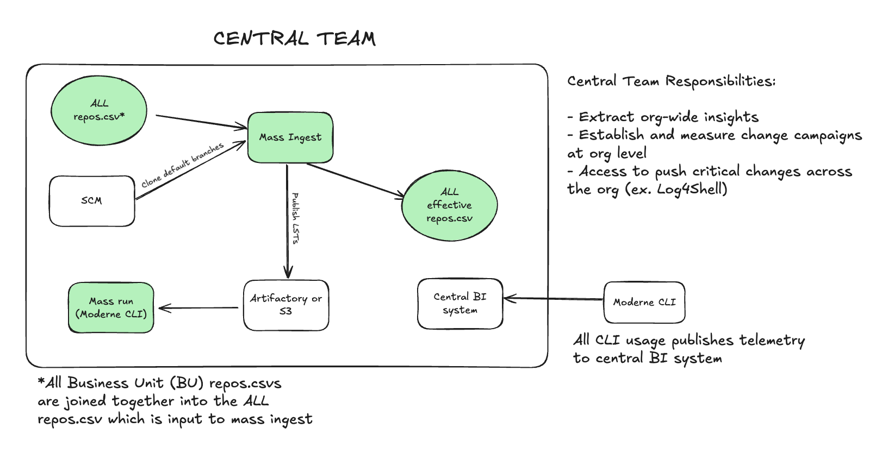
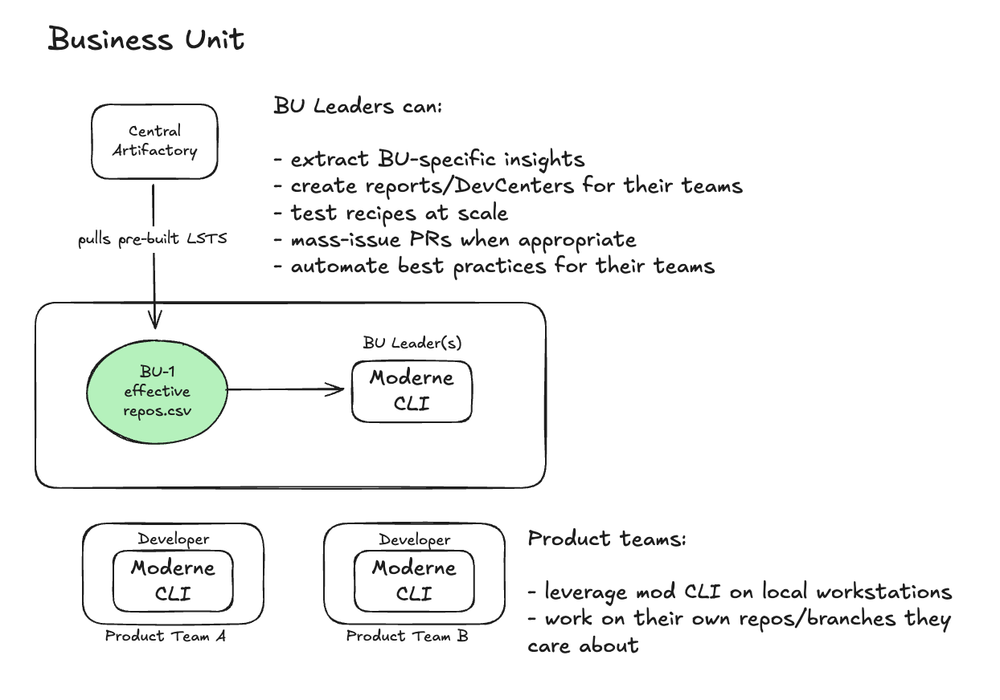

# Moderne DX overview

Moderne DX brings the power of large-scale code insights and remediations into air-gapped or highly secure environments. It enables organizations to modernize, secure, and maintain codebases with speed and precision, while ensuring all of their code and data remains under their own security controls.

In this doc, we will help you understand what Moderne DX is and explain the components that make it up.

## Understanding Moderne DX

Think of Moderne DX as a "platform development kit" - it gives you the tools and blueprints to build as much or as little as you need.

With DX, you can achieve the exact same outcomes as with the [Moderne Platform](../../../user-documentation/moderne-platform/getting-started/running-your-first-recipe.md) since the LST building and recipe running capabilities are identical.

The key difference is that DX relies more on developers to drive value and create reports for management - whereas the Moderne Platform makes it easier to see the status of and track improvements across your codebases. The Moderne Platform also handles access control automatically (aligning with your SCM permissions), whereas with DX, you manage access control yourself.

DX delivers these capabilities through two customizable pipelines:

* **Mass ingest** produces [LSTs](../../moderne-platform/references/lossless-semantic-trees.md) for all your repositories and publishes them to your artifact repository (e.g., Artifactory). You can then use this central data store to quickly answer questions like, "What's the impact of the Log4Shell vulnerability?" or "How are we doing migrating our services to Java 21?"
* **Mass run** executes recipes at scale across those repositories, enabling large-scale remediation and reporting.

Both pipelines are customizable blueprints that work with your existing infrastructure - no central service required.

:::tip
Moderne DX can also serve as a stepping stone towards a hybrid SaaS offering. The mass ingest process you set up as part of DX is exactly the same as what powers the Moderne Platform. This allows you to get started with Moderne without going through an internal cloud security review, while demonstrating the value of Moderne to your business.
:::

## Components

Now that you understand DX at a high level, let's talk about the various components that make it up. Below you'll find diagrams for both the central team and individual business units (BUs).

<figure>
  
  <figcaption>_Central team components._</figcaption>
</figure>

<figure>
  
  <figcaption>_Business unit components._</figcaption>
</figure>

### Mass ingest

Mass ingest serves two purposes:

* It clones all of the repositories specified across the `repos.csv` files your business units have created. It then builds the LSTs for each of these repositories - which the Moderne CLI will use to run recipes against.
* It produces an effective `repos.csv` - which includes the published URI of all built LSTs. This can then easily be shared with others to let them quickly download the LSTs and run recipes.

:::warning
It is very important that a central team owns mass ingest. This is because, when onboarding new teams, you don't want to have to wait for their repos to build and be published. With a central team owning it all, any time you onboard someone new, their LSTs and publish locations will already be available in the easily shareable effective `repos.csv` file.
:::

Mass ingest is deployed to servers such as EC2 or Azure VMs, and can be scaled out to tens or hundreds of thousands of repositories by deploying to AWS/Azure Batch (or similar services).

:::tip
We recommend running mass ingest daily and ingesting every repository. The most important reason for this is that source code, CLI versions, and transitive dependencies can change from day to day - which could cause problems if a user attempts to run a recipe on an out-of-date LST.
:::

For more details on setting up and configuring mass ingest, please see our [mass ingest documentation](../how-to-guides/mass-ingest-dx.md).

### Mass run

Mass run is a central worker (or set of workers) that uses the Moderne CLI to run recipes across all of your repositories at scale.

With mass run, central teams and business unit leaders can do things like:

* Run search recipes to extract org-wide insights
* Push critical security fixes out to teams across the organization
* Generate reports and DevCenter dashboards

For more details on setting up and configuring mass run, please see our [mass run documentation](../how-to-guides/mass-run-dx.md).

### Effective repos.csv

The effective `repos.csv` file is a central configuration file that defines your repositories, their organizational structure, and the LSTs' publish locations. This file is produced by mass ingest, and centrally hosted either as a static file or URL. There can be one single effective `repos.csv` for the entire company, or one per business unit. This file is used by end users to download and run recipes on the LSTs of the repositories they own and care about. It contains information about the repositories themselves, as well as the location of the published LST.

For more details on the repos.csv format and columns, please see our [repos.csv documentation](../../../user-documentation/moderne-cli/references/repos-csv.md).

### Moderne CLI

The [Moderne CLI](../../../user-documentation/moderne-cli/getting-started/cli-intro.md) is what supercharges your developers and your leaders. It can do both large-scale impact analysis and perform upgrades, migrations, and automate maintenance tasks - all via recipes built on top of OpenRewrite.

The CLI serves three distinct groups within your organization:

**A central team**

The central team uses the CLI to:

* Extract org-wide insights across all repositories
* Establish and measure change campaigns at the org level
* Push critical changes across the entire organization (e.g., Log4Shell remediations)

**Business unit leaders**

BU leaders use the CLI to:

* Extract BU-specific insights from their repositories
* Create reports and [DevCenters](../../../user-documentation/moderne-cli/how-to-guides/cli-dev-center.md) for their teams
* Test recipes at scale before rolling them out
* Mass-issue PRs when appropriate
* Automate best practices for their teams

**Individual developers**

Developers use the CLI on their local workstations to:

* Build LSTs locally for their development branches (this is fast and doesn't require central team involvement)
* Run recipes on their own repos and branches
* Push both routine changes (such as remediating SonarQube issues) and not-so-routine changes (such as a Spring Boot or Angular upgrade)

:::tip
Developers typically build their own LSTs locally for the branches they're working on. This is not time-consuming, and these development branches are usually not covered by the central team's mass ingest anyway. This approach avoids the complexity of trying to secure access to centrally produced LSTs.
:::

### Telemetry

On every LST build, recipe run, and git push, the Moderne CLI generates telemetry files. These files include information such as:

* Whether or not the command succeeded or failed
* How long it took to run the command
* What user ran the command
* The recipe details and results

This information can be published to your central BI portal and used to verify that you're achieving your desired results. The telemetry can also be used to incentivize developers, teams, and business units to onboard onto Moderne and drive value across the platform.

For detailed information on how telemetry works and how to collect it, check out our [full guide on CLI telemetry](../../../user-documentation/moderne-cli/how-to-guides/cli-telemetry.md).

## Pull-based vs push-based changes

Now that you understand the components, it's important to know how changes flow through your organization. There are two types of changes you'll make with Moderne DX: pull-based and push-based.

**Push-based changes** are centrally-initiated, small-scale updates that can be deployed rapidly across repositories. These work well when changes are:

* Urgent and time-sensitive (e.g., security vulnerabilities)
* Small and deterministic
* Low-risk and easy to review

Examples include Log4Shell remediations, security patches, and simple dependency updates.

**Pull-based changes** are developer-driven transformations where product teams run recipes, examine results, and test locally. These are appropriate when changes are:

* Complex or context-sensitive
* Large in scope (framework migrations, major refactors)
* Require team-specific testing and staged rollout

Examples include Spring Boot upgrades, Angular migrations, and significant refactoring efforts.

:::warning
A common mistake is having a central team try to **push** large-scale migrations (like Spring Boot upgrades) as PRs across the entire org without context on the nuances of each codebase. Instead, these types of changes are better candidates to be **pulled** by the developer team.
:::

For more guidance on choosing between these approaches, see [our blog post on large-scale code changes](https://www.moderne.ai/blog/large-scale-code-changes).

## Next steps

* [Set up mass ingest](../how-to-guides/mass-ingest-dx.md) to begin building LSTs for your repositories
* [Learn about the architecture](../references/moderne-dx-architecture.md) and how Moderne DX compares to Moderne Platform
