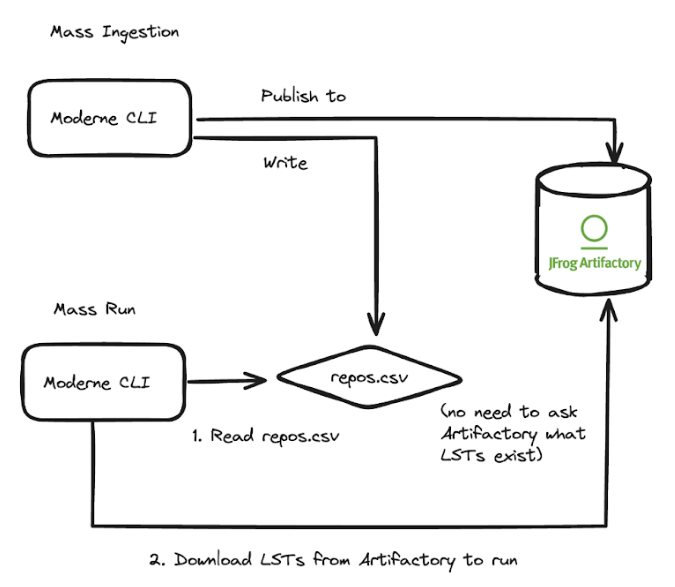

# Moderne DX architecture

## Architecture diagram

<figure>
  
  <figcaption></figcaption>
</figure>

## Comparison with Moderne Enterprise

### Capabilities

|                                      |      Moderne DX      | Moderne Platform  |
| ------------------------------------ | :------------------: | :-------------------------: |
| SCA - auto search and remediation    |  :white_check_mark:  |     :white_check_mark:      |
| SAST - auto search and remediation   |  :white_check_mark:  |     :white_check_mark:      |
| OWASP Top 10 auto-remediation        |  :white_check_mark:  |     :white_check_mark:      |
| Framework and library auto-migration |  :white_check_mark:  |     :white_check_mark:      |
| Global code intelligence             |  :white_check_mark:  |     :white_check_mark:      |
| Custom recipe development assistance |  :white_check_mark:  |     :white_check_mark:      |

### Features

|                                |      Moderne DX      | Moderne Platform  |
| ------------------------------ | :------------------: | :-------------------------: |
| Moderne CLI – multi-repo DevEx |  :white_check_mark:  |     :white_check_mark:      |
| IDE plugin                     |  :white_check_mark:  |     :white_check_mark:      |
| Recipe marketplace             |  :white_check_mark:  |     :white_check_mark:      |
| Data tables (impact analysis)  |  :white_check_mark:  |     :white_check_mark:      |
| Data visualizations            |                      |     :white_check_mark:      |
| Code intel dashboards          |  :white_check_mark:  |     :white_check_mark:      |
| AI integrations                |  :white_check_mark:  |     :white_check_mark:      |
| Change campaigns               |  :white_check_mark:  |     :white_check_mark:      |
| Organizational hierarchy       |  :white_check_mark:  |     :white_check_mark:      |
| Reporting                      |  :white_check_mark:  |     :white_check_mark:      |
| Centralized LST management     |  :white_check_mark:  |     :white_check_mark:      |

### Implementation

|                                                      |      Moderne DX      | Moderne Platform  |
| ---------------------------------------------------- | :------------------: | :-------------------------: |
| SSO integration for login                            |  :white_check_mark:  |     :white_check_mark:      |
| VCS (GitHub, GitLab, Bitbucket) integration          |  :white_check_mark:  |     :white_check_mark:      |
| Artifact repository (Artifactory, Nexus) integration |  :white_check_mark:  |     :white_check_mark:      |
| Hybrid single tenant or multitenant                  |                      |     :white_check_mark:      |
| Fully on premises                                    |  :white_check_mark:  |                             |
