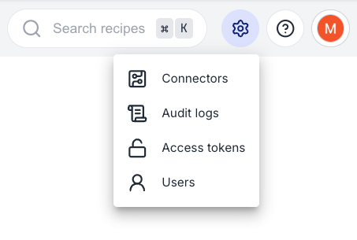
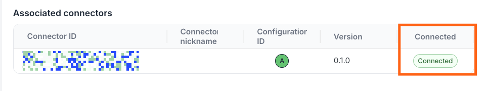
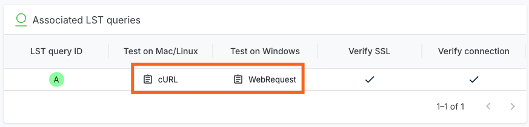
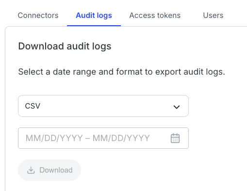
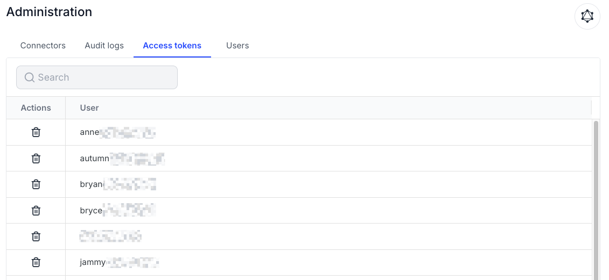
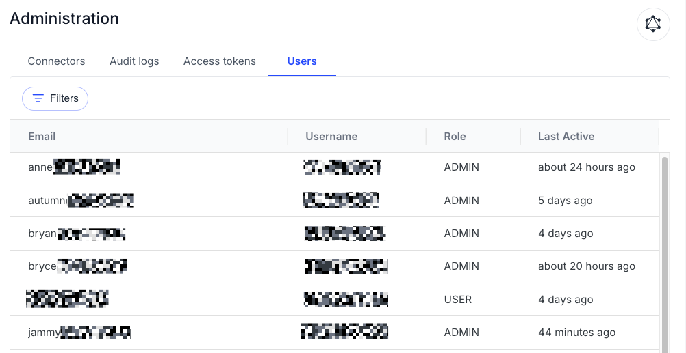

import VersionBanner from '@site/src/components/VersionBanner';

<VersionBanner version="v2" linkPath="/administrator-documentation/moderne-platform-v1/getting-started/admin-pages" />

# Admin pages explained

As an administrator (admin) in the Moderne Platform, you have access to a variety of admin pages that let you manage and control various aspects of the platform. To help ensure you can perform your administrative tasks efficiently and effectively, let's walk through each of these pages.

## Navigating to the admin pages

All of the admin pages can be found by clicking on the gear icon in the top-right corner of the navbar. Clicking on that icon will open up a modal that contains all of the admin pages:

<figure>
  
  <figcaption>_Admin link modal_</figcaption>
</figure>

## Connectors page

You can think of the Connectors page as a sort of landing area that shows all of the technologies you've configured your Connectors to have access to. You can click on each tool to get taken to a details page that has more information about a particular connection. This can be particularly useful for debugging whether or not a service is connected to the Connector.

You can see whether or not a Connector is connected to a particular service by scrolling to the bottom of the details page and looking at the `Connected` column:

<figure>
  
  <figcaption>_Connected status_</figcaption>
</figure>

For Artifactory specifically, you can also get an AQL query to test to make sure you've configured it correctly. You can do this by clicking on the Artifactory card, and then clicking on `cURL` or `WebRequest` underneath the `Test on Mac/Linux` or `Test on Windows` label:

<figure>
  
  <figcaption>_AQL query link_</figcaption>
</figure>

:::info
If you configure the same connection in multiple Connectors, you will only see it once on the Connectors page.
:::

## Audit log page

The audit log page lists all actions taken by users on the platform. You can select a date range and a format type before pressing the download button:

<figure>
  
  <figcaption>_Audit logs page_</figcaption>
</figure>

For a detailed overview of what is logged, how entries are structured, retention policies, and confidential data exclusions, see the [audit logging reference](../references/audit-logging.md).

## Access tokens page

The access tokens page lets you see who has created an access token for your tenant. It also lets you remove all access tokens for a particular user.

The search box lets you enter partial searches such as `@moderne.io` to find all users with an `@moderne.io` email address.

To remove access tokens for a user, click on the trash can icon under `Actions` and then press `Delete` in the modal that appears.

<figure>
  
  <figcaption>_Access tokens page_</figcaption>
</figure>

## Users page

The users page lets you see who has access to your tenant along with their username, role, and the last time they were active.

<figure>
  
  <figcaption>_Users page_</figcaption>
</figure>