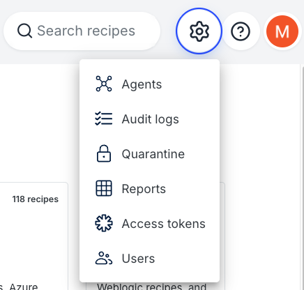
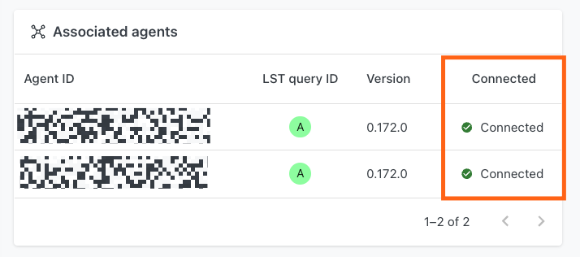
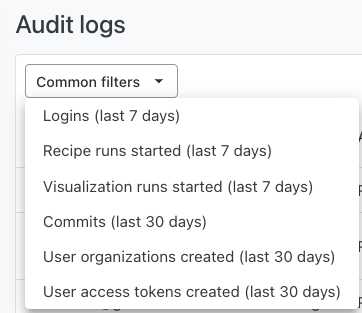
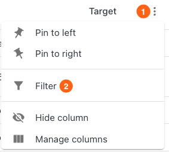

# Admin pages explained

As an administrator (admin) in the Moderne Platform, you have access to a variety of admin pages that let you manage and control various aspects of the platform. To help ensure you can perform your administrative tasks efficiently and effectively, let's walk through each of these pages.

## Navigating to the admin pages

All of the admin pages can be found by clicking on the `Admin` link in the Moderne nav sidebar: 

<figure>
  
  <figcaption>_Admin link in the sidebar_</figcaption>
</figure>

Clicking on that will open up a modal that contains all of the admin pages:

<figure>
  
  <figcaption>_Admin link modal_</figcaption>
</figure>

## Agents page 

You can think of the agents page as a sort of landing area that shows all of the technologies you've configured your agents to have access to. You can click on each tile to get taken to a details page that has more information about a particular connection. This can be particularly useful for debugging whether or not a service is connected to the agent. 

You can see whether or not an agent is connected to a particular service by scrolling to the bottom of the details page and looking at the `Connected` column:

<figure>
  
  <figcaption>_Connected status_</figcaption>
</figure>

For Artifactory specifically, you can also get an AQL query to test to make sure you've configured it correctly. You can do this by clicking on the Artifactory card, and then clicking on `CURL` or `WebRequest` underneath the `Test on Mac/Linux` or `Test on Windows` label:

<figure>
  
  <figcaption>_AQL query link_</figcaption>
</figure>

:::info
If you configure the same connection in multiple agents, you will only see it once on the Agents page.
:::

## Audit log page

The audit log page lists all actions taken by users on the platform.

In the top-left hand corner of the page, there is a filter dropdown that lets you select common, important, filters such as all logins in the last week or all commits in the last month:

<figure>
  
  <figcaption>_Audit page common filters_</figcaption>
</figure>

For information about how to add/remove columns or how to add custom filters on individual columns, please see the [filtering section](#filtering) at the bottom of this doc.

## Workers page

Workers are configured by Moderne and are servers that run recipes. As Moderne controls these, this page will likely not be of use to you or your team. It's mainly there for debugging issues that may arise and for confirming that there are indeed workers available to run recipes.

## Quarantine page

As an admin, you can quarantine repositories in the Moderne Platform. This prevents recipes from being run on said repositories.

Consider the case where you have some old repositories that aren't building. Instead of having error messages appear when you run recipes or having the DevCenter provide warnings about repositories not building, you can quarantine these repositories until they're fixed or removed.

For information about how to add/remove columns or how to add custom filters on individual columns, please see the [filtering section](#filtering) at the bottom of this doc.

## Reports page

The reports page is exactly as it sounds; it contains a list of detailed reports that you can download. These reports contain more information than you would obtain in the audit log. 

## Access tokens page

The access tokens page lets you see who has created an access token for your tenant. It also lets you remove all access tokens for a particular user.

The search box lets you enter partial searches such as `@moderne.io` to find all users with an `@moderne.io` email address.

To remove access tokens for a user, click on the trash can icon under `Actions` and then press `Delete` in the modal that appears.

## Filtering

All Moderne pages that have tables offer the same filtering abilities.

You can filter individual columns by mousing over the column name, clicking on the three vertical dots that appear, and then clicking on `Filter`:

<figure>
  
  <figcaption>_Column filtering_</figcaption>
</figure>

You can then select the column you're interested in, choose the operator you want to apply to that column, and enter the value you want to search for. To combine filters together, press the `Add filter`.

<figure>
  
  <figcaption>_Filter modal_</figcaption>
</figure>

If you want to add or remove columns from the table, you can mouse over any column, click on the three vertical dots that appear, and then select `Manage columns`. You'll then see a modal that you can add or remove columns: 

<figure>
  
  <figcaption>_Audit log columns_</figcaption>
</figure>