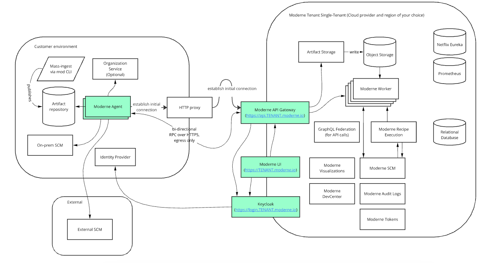

import Tabs from '@theme/Tabs';
import TabItem from '@theme/TabItem';

# Configure an agent to connect to Moderne via an HTTP proxy

If your organization requires an HTTP proxy in order to be able to access the public internet, you can configure this proxy for communication between the Moderne Agent and the Moderne API Gateway.

This proxy will be used for egress, and then the API gateway will establish the Layer 7 connection with the Moderne Agent through which all further communication will pass.

<figure>
  
  <figcaption></figcaption>
</figure>

## Agent configuration

The following table contains all the variables/arguments you need to add to your Moderne Agent run command to work with your HTTP proxy. Please note that these variables/arguments must be combined with ones found in other steps in the [Configuring the Moderne agent guide](./agent-config.md).

<Tabs groupId="agent-type">
<TabItem value="oci-container" label="OCI Container">

**Environment variables:**

| Variable Name                         | Required | Default | Description                                 |
|---------------------------------------|----------|---------|---------------------------------------------|
| `MODERNE_AGENT_APIGATEWAY_PROXY_HOST` | `false`  |         | Host (without scheme) for the proxy server. |
| `MODERNE_AGENT_APIGATEWAY_PROXY_PORT` | `false`  |         | Port for the proxy server.                  |

:::info
If you include either a host or port, you must include both.
:::

**Example:**

```bash
docker run \
# ... Existing variables
-e MODERNE_AGENT_APIGATEWAY_PROXY_HOST=proxy.mycompany.com \
-e MODERNE_AGENT_APIGATEWAY_PROXY_PORT=8179 \
# ... Additional variables
```
</TabItem>

<TabItem value="executable-jar" label="Executable JAR">

**Arguments:**

| Argument Name                           | Required | Default | Description                                 |
|-----------------------------------------|----------|---------|---------------------------------------------|
| `--moderne.agent.apiGateway.proxy.host` | `false`  |         | Host (without scheme) for the proxy server. |
| `--moderne.agent.apiGateway.proxy.port` | `false`  |         | Port for the proxy server.                  |

:::info
If you include either a host or port, you must include both.
:::

**Example:**

```bash
java -jar moderne-agent-{version}.jar \
# ... Existing arguments
--moderne.agent.apiGateway.proxy.host=proxy.mycompany.com \
--moderne.agent.apiGateway.proxy.port=8179 \
# ... Additional arguments
```
</TabItem>
</Tabs>
