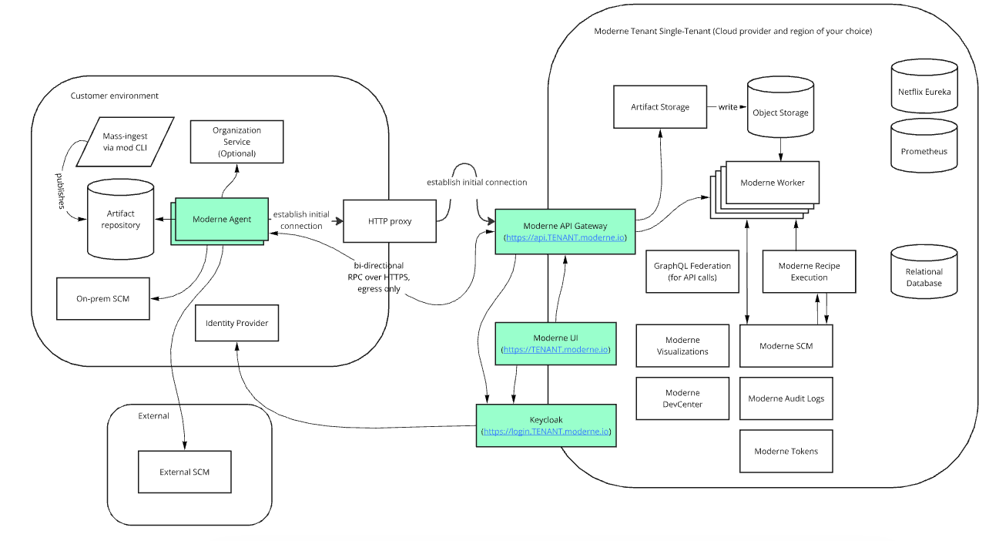

import Tabs from '@theme/Tabs';
import TabItem from '@theme/TabItem';
import VersionBanner from '@site/src/components/VersionBanner';

<VersionBanner version="v2" linkPath="/administrator-documentation/moderne-platform-v1/how-to-guides/agent-configuration/configure-an-agent-to-connect-to-moderne-via-an-http-proxy" />

# Configure a Connector to connect to Moderne via an HTTP proxy

If your organization requires an HTTP proxy in order to be able to access the public internet, you can configure this proxy for communication between the Moderne Connector and the Moderne API Gateway.

This proxy will be used for egress, and then the API gateway will establish the Layer 7 connection with the Moderne Connector through which all further communication will pass.

<figure>
  
  <figcaption></figcaption>
</figure>

## HTTP CONNECT proxy

If your organization uses an HTTP CONNECT proxy for outbound traffic, configure the Connector with the proxy host and port. The following variables/arguments must be combined with ones found in other steps in the [Configuring the Moderne Connector guide](./agent-config.md).

<Tabs groupId="agent-type">
<TabItem value="oci-container" label="OCI Container">

**Environment variables:**

| Variable Name                             | Required | Default | Description                                 |
|-------------------------------------------|----------|---------|---------------------------------------------|
| `MODERNE_CONNECTOR_APIGATEWAY_PROXY_HOST` | `false`  |         | Host (without scheme) for the proxy server. |
| `MODERNE_CONNECTOR_APIGATEWAY_PROXY_PORT` | `false`  |         | Port for the proxy server.                  |

:::info
If you include either a host or port, you must include both.
:::

**Example:**

```bash
docker run \
# ... Existing variables
-e MODERNE_CONNECTOR_APIGATEWAY_PROXY_HOST=proxy.mycompany.com \
-e MODERNE_CONNECTOR_APIGATEWAY_PROXY_PORT=8179 \
# ... Additional variables
```

</TabItem>

<TabItem value="executable-jar" label="Executable JAR">

**Arguments:**

| Argument Name                               | Required | Default | Description                                 |
|---------------------------------------------|----------|---------|---------------------------------------------|
| `--moderne.connector.apiGateway.proxy.host` | `false`  |         | Host (without scheme) for the proxy server. |
| `--moderne.connector.apiGateway.proxy.port` | `false`  |         | Port for the proxy server.                  |

:::info
If you include either a host or port, you must include both.
:::

**Example:**

```bash
java -jar connector-{version}.jar \
# ... Existing arguments
--moderne.connector.apiGateway.proxy.host=proxy.mycompany.com \
--moderne.connector.apiGateway.proxy.port=8179 \
# ... Additional arguments
```

</TabItem>
</Tabs>

