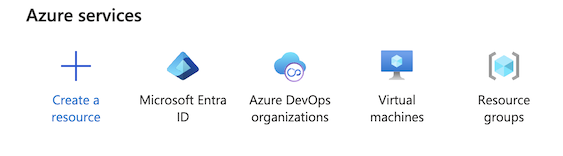
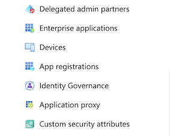
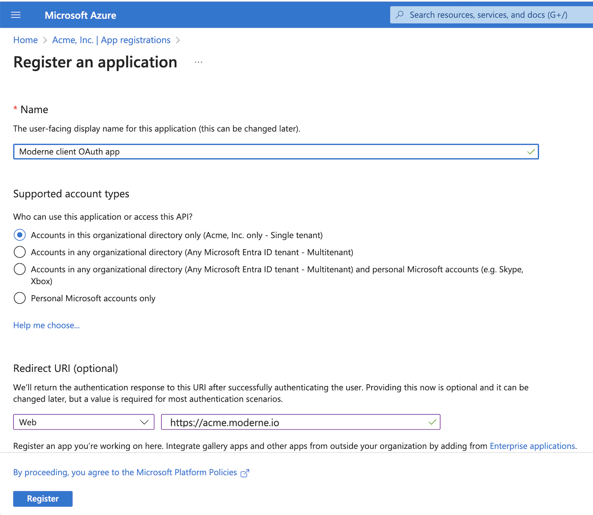
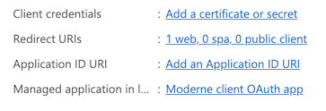
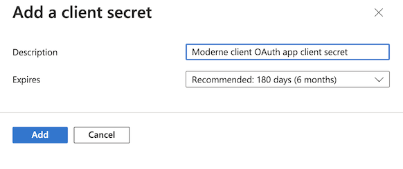
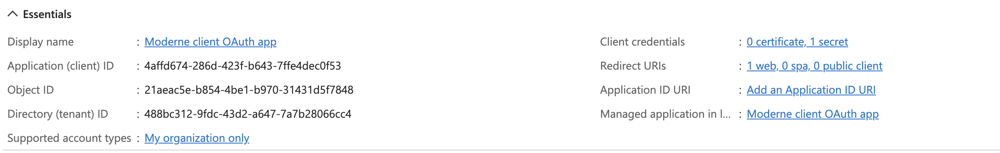

import Tabs from '@theme/Tabs';
import TabItem from '@theme/TabItem';

# Configure an agent with Azure DevOps Services

In order to view recipe results and commit changes from a recipe back to Azure DevOps Services, you'll need to register a Microsoft Entra ID OAuth app and configure the Moderne agent with the appropriate variables.

:::info
Azure DevOps Services supports two OAuth 2.0 models: Microsoft Entra ID OAuth and the legacy Azure DevOps OAuth 2.0 models. The Moderne platform only supports the Microsoft Entra ID OAuth model.
:::

## Azure DevOps Services Configuration

### Step 1: Create a Microsoft Entra ID OAuth App registration

1. Navigate to https://portal.azure.com
2. Under Azure services, click on **Microsoft Entra ID**
    <figure>
      
      <figcaption></figcaption>
    </figure>
3. Click on **App registrations**
    <figure>
      
      <figcaption></figcaption>
    </figure>
4. Click on **New registration**
5. In the Register an application form:
    1. Enter "Moderne client OAuth app" or similar in the **Name** field
    2. Select **Single Tenant** under **Supported account types**
    3. In the **Redirect URI** section, enter a Web platform entry with the URL `https://<TENANT>.moderne.io`
    <figure>
      
      <figcaption></figcaption>
    </figure>
6. Click **Register**
7. In the app's Overview page click **Add a certificate or secret**
    <figure>
      
      <figcaption></figcaption>
    </figure>
8. Click **New client secret**
9. In the Add a client secret form:
    1. Enter "Moderne client OAuth app client secret" or similar in the **Description** field
    2. Optionally set a non-default secret expiration in the **Expires** field
        <figure>
          
          <figcaption></figcaption>
        </figure>
    3. Click **Add**
10. Under Manage, click on **API permissions**
    1. Add Azure DevOps permissions for **vso.code_manage** and **vso.graph**
    <figure>
      
      <figcaption></figcaption>
    </figure>

#### Understanding the required permissions

The OAuth app requests the following API permissions. Each permission is used for a specific set of operations:

| Permission       | Required | Purpose                                                                                                                                                                                                        |
| ---------------- | -------- | -------------------------------------------------------------------------------------------------------------------------------------------------------------------------------------------------------------- |
| `vso.code_manage` | Yes      | Covers all repository operations: listing repositories, creating forks, managing branches, and creating, updating, merging, and approving pull requests. Also used to read build statuses and evaluate branch policies (such as minimum reviewer counts and required builds) to determine whether a pull request is ready to merge. |
| `vso.graph`       | Yes      | Used to retrieve the authenticated user's profile (display name and email) so that Moderne can associate commits with the correct user.                                                                      |
| `offline_access`  | Yes      | Allows Moderne to refresh the access token without requiring the user to re-authorize. Requested automatically during the OAuth flow.                                                                        |

<details>
<summary>Detailed list of Azure DevOps API calls Moderne makes</summary>

**User identity** (uses `vso.graph` permission):

| API endpoint                                                       | Method | Purpose                            |
| ------------------------------------------------------------------ | ------ | ---------------------------------- |
| `/{organization}/_apis/connectionData`                             | GET    | Get authenticated user info        |
| `/{organization}/_apis/graph/users/{descriptor}` (vssps.dev.azure.com) | GET | Get user profile details           |

**Repository access checks** (uses `vso.code_manage` permission):

| API endpoint                                                     | Method | Purpose                            |
| ---------------------------------------------------------------- | ------ | ---------------------------------- |
| `/{organization}/_apis/git/repositories`                         | GET    | List repositories to verify access |
| `/{organization}/{project}/_apis/git/repositories`               | GET    | List repositories in a project     |
| `/{organization}/{project}/_apis/git/repositories/{repository}`  | GET    | Retrieve repository details        |

**Pull request operations** (uses `vso.code_manage` permission):

| API endpoint                                                                               | Method | Purpose                  |
| ------------------------------------------------------------------------------------------ | ------ | ------------------------ |
| `/{org}/{project}/_apis/git/repositories/{repo}/pullRequests`                              | GET    | Find existing pull request         |
| `/{org}/{project}/_apis/git/repositories/{repo}/pullRequests`                              | POST   | Create pull request                |
| `/{org}/{project}/_apis/git/repositories/{repo}/pullRequests/{id}`                         | GET    | Get pull request details           |
| `/{org}/{project}/_apis/git/repositories/{repo}/pullRequests/{id}`                         | PATCH  | Update, merge, or close pull request |
| `/{org}/{project}/_apis/git/repositories/{repo}/pullRequests/{id}/statuses`                | GET    | Get pull request status checks     |
| `/{org}/{project}/_apis/git/repositories/{repo}/pullRequests/{id}/reviewers/{reviewerId}`  | PUT    | Approve pull request     |

**Branch policy checks** (uses `vso.code_manage` permission):

Azure DevOps uses [branch policies](https://learn.microsoft.com/en-us/azure/devops/repos/git/branch-policies) to enforce rules before a pull request can be merged — such as requiring a minimum number of reviewers, mandatory build validation, or specific required reviewers. Moderne reads these policies to accurately report whether a pull request is blocked or ready to merge.

| API endpoint                                                                | Method | Purpose                                                                   |
| --------------------------------------------------------------------------- | ------ | ------------------------------------------------------------------------- |
| `/{org}/{project}/_apis/policy/types`                                       | GET    | List available policy types (e.g., minimum reviewers, required build)     |
| `/{org}/{project}/_apis/policy/configurations?policyType={type}`            | GET    | Read policy configurations for a specific type                            |
| `/{org}/{project}/_apis/policy/evaluations?artifactId={id}`                 | GET    | Check whether branch policies are satisfied for a given pull request      |

**Fork and branch operations** (uses `vso.code_manage` permission):

| API endpoint                                                                          | Method | Purpose                |
| ------------------------------------------------------------------------------------- | ------ | ---------------------- |
| `/{org}/{project}/_apis/git/repositories`                                             | POST   | Create fork repository |
| `/{org}/{project}/_apis/git/repositories/{repo}`                                      | DELETE | Delete fork repository (only forks created by Moderne are deleted — the original repository is never modified or deleted) |
| `/{org}/{project}/_apis/git/repositories/{repo}/refs?filter=heads/{branch}`           | GET    | Get branch ref         |
| `/{org}/{project}/_apis/git/repositories/{repo}/pushes`                               | POST   | Create branch          |

</details>

:::tip
The OAuth token is scoped to the individual user who authorizes it — Moderne can only perform actions that the user already has permission to do. The token does not grant Moderne any additional access beyond what the user themselves can do in Azure DevOps.
:::

## Agent configuration

### Step 2: Configure the Moderne Agent

The following table contains all of the variables/arguments you need to add to your Moderne agent run command in order for it to work with your Azure DevOps Services instance. Please note that these variables/arguments must be combined with ones found in other steps in the [Configuring the Moderne agent guide](./agent-config.md).

Values for client ID, client secret and tenant ID can be found in the Overview page for your OAuth app's registration:


:::info
You can configure multiple Azure DevOps OAuth apps by including multiple entries, each with a different `{index}`.
:::

<Tabs groupId="agent-type">
<TabItem value="oci-container" label="OCI Container">

**Environment variables:**

| Variable Name                                          | Required                                         | Default | Description                                                                                                                                                                  |
|--------------------------------------------------------|--------------------------------------------------|---------|------------------------------------------------------------------------------------------------------------------------------------------------------------------------------|
| `MODERNE_AGENT_AZUREDEVOPS_{index}_OAUTH_CLIENTID`     | `true`                                           |         | The client ID of the registered OAuth app.                                                                                                                                   |
| `MODERNE_AGENT_AZUREDEVOPS_{index}_OAUTH_CLIENTSECRET` | `true`                                           |         | The client secret of the registered OAuth app.                                                                                                                               |
| `MODERNE_AGENT_AZUREDEVOPS_{index}_OAUTH_TENANTID`     | `true`                                           |         | The Azure tenant ID of the registered OAuth app.                                                                                                                             |
| `MODERNE_AGENT_AZUREDEVOPS_{index}_SKIPSSL`            | `false`                                          | `false` | Specifies whether or not to skip SSL validation for HTTP connections to this Azure DevOps instance. This must be set to `true` if you use a self-signed SSL/TLS certificate. |
| `MODERNE_AGENT_AZUREDEVOPS_{index}_SSH_PRIVATEKEY`     | `false`                                          |         | The SSH private key used to establish a SSH connection with Azure DevOps.                                                                                                    |
| `MODERNE_AGENT_AZUREDEVOPS_{index}_SSH_PASSPHRASE`     | `true` (If the SSH key is specified + encrypted) |         | The passphrase used to encrypt the SSH private key                                                                                                                           |
| `MODERNE_AGENT_AZUREDEVOPS_{index}_SSH_SSHFILENAME`    | `true` (If the SSH key is specified)             |         | The file name of the private key, which the agent will store locally.                                                                                                        |
| `MODERNE_AGENT_AZUREDEVOPS_{index}_SSH_USER`           | `true` (If the SSH key is specified)             |         | The username used for SSH communication with Azure DevOps.                                                                                                                   |

**Example:**

```bash
docker run \
# ... Existing variables
-e MODERNE_AGENT_AZUREDEVOPS_0_OAUTH_CLIENTID=4affd674-286d-423f-b643-7ffe4dec0f53 \
-e MODERNE_AGENT_AZUREDEVOPS_0_OAUTH_CLIENTSECRET=yourClientSecret \
-e MODERNE_AGENT_AZUREDEVOPS_0_OAUTH_TENANTID=488bc312-9fdc-43d2-a647-7a7b28066cc4 \
# ... Additional variables
```
</TabItem>

<TabItem value="executable-jar" label="Executable JAR">

**Arguments:**

| Argument Name                                             | Required                                         | Default | Description                                                                                                                                                                  |
|-----------------------------------------------------------|--------------------------------------------------|---------|------------------------------------------------------------------------------------------------------------------------------------------------------------------------------|
| `--moderne.agent.azuredevops[{index}].oauth.clientId`     | `true`                                           |         | The client ID of the registered OAuth app.                                                                                                                                   |
| `--moderne.agent.azuredevops[{index}].oauth.clientSecret` | `true`                                           |         | The client secret of the registered OAuth app.                                                                                                                               |
| `--moderne.agent.azuredevops[{index}].oauth.tenantId`     | `true`                                           |         | The Azure tenant ID of the registered OAuth app.                                                                                                                             |
| `--moderne.agent.azuredevops[{index}].skipSsl`            | `false`                                          | `false` | Specifies whether or not to skip SSL validation for HTTP connections to this Azure DevOps instance. This must be set to `true` if you use a self-signed SSL/TLS certificate. |
| `--moderne.agent.azuredevops[{index}].ssh.privateKey`     | `false`                                          |         | The SSH private key used to establish a SSH connection with Azure DevOps.                                                                                                    |
| `--moderne.agent.azuredevops[{index}].ssh.passphrase`     | `true` (If the SSH key is specified + encrypted) |         | The passphrase used to encrypt the SSH private key                                                                                                                           |
| `--moderne.agent.azuredevops[{index}].ssh.sshFileName`    | `true` (If the SSH key is specified)             |         | The file name of the private key, which the agent will store locally.                                                                                                        |
| `--moderne.agent.azuredevops[{index}].ssh.user`           | `true` (If the SSH key is specified)             |         | The username used for SSH communication with Azure DevOps.                                                                                                                   |

**Example:**

```bash
java -jar moderne-agent-{version}.jar \
# ... Existing arguments
--moderne.agent.azuredevops[0].oauth.clientId=4affd674-286d-423f-b643-7ffe4dec0f53 \
--moderne.agent.azuredevops[0].oauth.clientSecret=yourClientSecret \
--moderne.agent.azuredevops[0].oauth.tenantId=488bc312-9fdc-43d2-a647-7a7b28066cc4 \
# ... Additional arguments
```
</TabItem>
</Tabs>
