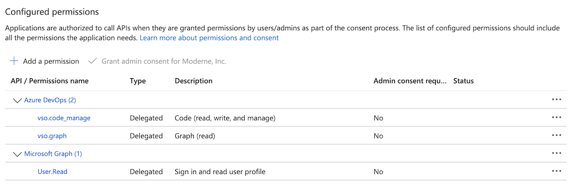

import Tabs from '@theme/Tabs';
import TabItem from '@theme/TabItem';

# Configure an agent with Azure DevOps Services

In order to view recipe results and commit changes from a recipe back to Azure DevOps Services, you'll need to register a Microsoft Entra ID OAuth app and configure the Moderne agent with the appropriate variables.

:::info
Azure DevOps Services supports two OAuth 2.0 models: Microsoft Entra ID OAuth and the legacy Azure DevOps OAuth 2.0 models. The Moderne platform only supports the Microsoft Entra ID OAuth model.
:::

## Azure DevOps Services Configuration

### Step 1: Create a Microsoft Entra ID OAuth App registration

1. Natigate to https://portal.azure.com
2. Under Azure services, click on **Microsoft Entra ID**
    <figure>
      
      <figcaption></figcaption>
    </figure>
3. Click on **App registrations**
    <figure>
      
      <figcaption></figcaption>
    </figure>
4. Click on **New registration**
5. In the Register an application form:
    1. Enter "Moderne client OAuth app" or similar in the **Name** field
    2. Select **Single Tenant** under **Supported account types**
    3. In the **Redirect URI** section, enter a Web platform entry with the URL `https://your-domain.moderne.io`
    <figure>
      
      <figcaption></figcaption>
    </figure>
6. Click **Register**
7. In the app's Overview page click **Add a certificate or secret**
    <figure>
      
      <figcaption></figcaption>
    </figure>
8. Click **New client sercret**
9. In the Add a client secret form:
    1. Enter "Moderne client OAuth app client secret" or similar in the **Description** field
    2. Optionally set a non-default secret expiration in the **Expires** field
        <figure>
          
          <figcaption></figcaption>
        </figure>
    3. Click **Add**
10. Under Manage, click on **API permissions**
    1. Add Azure DevOps permissions for **vso.code_manage** and **vso.graph**
    <figure>
      
      <figcaption></figcaption>
    </figure>

## Agent configuration

### Step 2: Configure the Moderne Agent

The following table contains all of the variables/arguments you need to add to your Moderne agent run command in order for it to work with your Azure DevOps Services instance. Please note that these variables/arguments must be combined with ones found in other steps in the [Configuring the Moderne agent guide](./agent-config.md).

Values for client ID, client secret and tenant ID can be found in the Overview page for your OAuth app's registration:


:::info
You can configure multiple Azure DevOps OAuth apps by including multiple entries, each with a different `{index}`.
:::

<Tabs groupId="agent-type">
<TabItem value="oci-container" label="OCI Container">

**Variables:**

| Variable Name                                          | Required                                         | Default | Description                                                                                                                                                                  |
|--------------------------------------------------------|--------------------------------------------------|---------|------------------------------------------------------------------------------------------------------------------------------------------------------------------------------|
| `MODERNE_AGENT_AZUREDEVOPS_{index}_OAUTH_CLIENTID`     | `true`                                           |         | The client ID of the registered OAuth app.                                                                                                                                   |
| `MODERNE_AGENT_AZUREDEVOPS_{index}_OAUTH_CLIENTSECRET` | `true`                                           |         | The client secret of the registered OAuth app.                                                                                                                               |
| `MODERNE_AGENT_AZUREDEVOPS_{index}_OAUTH_TENANTID`     | `true`                                           |         | The Azure tenant ID of the registered OAuth app.                                                                                                                             |
| `MODERNE_AGENT_AZUREDEVOPS_{index}_SKIPSSL`            | `false`                                          | `false` | Specifies whether or not to skip SSL validation for HTTP connections to this Azure DevOps instance. This must be set to `true` if you use a self-signed SSL/TLS certificate. |
| `MODERNE_AGENT_AZUREDEVOPS_{index}_SSH_PRIVATEKEY`     | `false`                                          |         | The SSH private key used to establish a SSH connection with Azure DevOps.                                                                                                    |
| `MODERNE_AGENT_AZUREDEVOPS_{index}_SSH_PASSPHRASE`     | `true` (If the SSH key is specified + encrypted) |         | The passphrase used to encrypt the SSH private key                                                                                                                           |
| `MODERNE_AGENT_AZUREDEVOPS_{index}_SSH_SSHFILENAME`    | `true` (If the SSH key is specified)             |         | The file name of the private key, which the agent will store locally.                                                                                                        |
| `MODERNE_AGENT_AZUREDEVOPS_{index}_SSH_USER`           | `true` (If the SSH key is specified)             |         | The username used for SSH communication with Azure DevOps.                                                                                                                   |

**Example:**

```bash
docker run \
# ... Existing variables
-e MODERNE_AGENT_AZUREDEVOPS_0_OAUTH_CLIENTID=4affd674-286d-423f-b643-7ffe4dec0f53 \
-e MODERNE_AGENT_AZUREDEVOPS_0_OAUTH_CLIENTSECRET=yourClientSecret \
-e MODERNE_AGENT_AZUREDEVOPS_0_OAUTH_TENANTID=488bc312-9fdc-43d2-a647-7a7b28066cc4 \
# ... Additional variables
```
</TabItem>

<TabItem value="executable-jar" label="Executable JAR">

**Arguments:**

| Argument Name                                             | Required                                         | Default | Description                                                                                                                                                                  |
|-----------------------------------------------------------|--------------------------------------------------|---------|------------------------------------------------------------------------------------------------------------------------------------------------------------------------------|
| `--moderne.agent.azuredevops[{index}].oauth.clientId`     | `true`                                           |         | The client ID of the registered OAuth app.                                                                                                                                   |
| `--moderne.agent.azuredevops[{index}].oauth.clientSecret` | `true`                                           |         | The client secret of the registered OAuth app.                                                                                                                               |
| `--moderne.agent.azuredevops[{index}].oauth.tenantId`     | `true`                                           |         | The Azure tenant ID of the registered OAuth app.                                                                                                                             |
| `--moderne.agent.azuredevops[{index}].skipSsl`            | `false`                                          | `false` | Specifies whether or not to skip SSL validation for HTTP connections to this Azure DevOps instance. This must be set to `true` if you use a self-signed SSL/TLS certificate. |
| `--moderne.agent.azuredevops[{index}].ssh.privateKey`     | `false`                                          |         | The SSH private key used to establish a SSH connection with Azure DevOps.                                                                                                    |
| `--moderne.agent.azuredevops[{index}].ssh.passphrase`     | `true` (If the SSH key is specified + encrypted) |         | The passphrase used to encrypt the SSH private key                                                                                                                           |
| `--moderne.agent.azuredevops[{index}].ssh.sshFileName`    | `true` (If the SSH key is specified)             |         | The file name of the private key, which the agent will store locally.                                                                                                        |
| `--moderne.agent.azuredevops[{index}].ssh.user`           | `true` (If the SSH key is specified)             |         | The username used for SSH communication with Azure DevOps.                                                                                                                   |

**Example:**

```bash
java -jar moderne-agent-{version}.jar \
# ... Existing arguments
--moderne.agent.azuredevops[0].oauth.clientId=4affd674-286d-423f-b643-7ffe4dec0f53 \
--moderne.agent.azuredevops[0].oauth.clientSecret=yourClientSecret \
--moderne.agent.azuredevops[0].oauth.tenantId=488bc312-9fdc-43d2-a647-7a7b28066cc4 \
# ... Additional arguments
```
</TabItem>
</Tabs>
