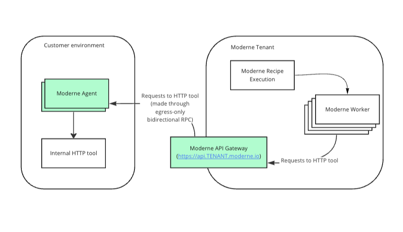

import Tabs from '@theme/Tabs';
import TabItem from '@theme/TabItem';

# Configure an agent with generic HTTP tools for use in recipes

You have internal services within your enterprise that you may want to use within your recipes. Some possible examples follow:

* Launch Darkly - I want to use a recipe to identify code paths that can no longer be hit due to a Launch Darkly flag that has been turned on for a long time.
* Security advisory database - I have a security advisory database internally, and I want to use a recipe to identify when my dependencies match a security advisory in my internal database.
* NPM Registries - I want to run a recipe that performs `npm install` commands that need to install dependencies from a private registry.

Setting up a generic HTTP tool will allow you to use `org.openrewrite.ipc.http.HttpSender` from your internal recipes to call tools inside your environment. [Example usage of HttpSender](https://github.com/openrewrite/rewrite-generative-ai/blob/357d5f39f22cf47f4d5df417c1ddb6c883dd5c24/src/main/java/org/openrewrite/ai/model/GenerativeCodeEditor.java#L48-L57). It also enables the use of `org.openrewrite.nodejs.NpmExecutor` in NodeJS recipes allowing the platform to proxy HTTP requests made during npm installs to the registry within your environment. [Example usage of NpmExecutor](https://gist.github.com/mike-solomon/4b105f388395ecfe2b005b02680215c8).

<figure>
  
  <figcaption></figcaption>
</figure>

## Agent configuration

The following table contains all the variables/arguments you need to add to your Moderne agent run command to work with your HTTP tool. Please note that these variables/arguments must be combined with ones found in other steps in the [Configuring the Moderne agent guide](./agent-config.md).

You can configure multiple generic HTTP tools by including multiple entries, each with a different `{index}`.

<Tabs groupId="agent-type">
<TabItem value="oci-container" label="OCI Container">

**Variables:**

| Variable Name                                             | Required | Default | Description                                                                                                                                                                                                             |
|-----------------------------------------------------------|----------|---------|-------------------------------------------------------------------------------------------------------------------------------------------------------------------------------------------------------------------------|
| `MODERNE_AGENT_HTTPTOOL_{index}_URL`                      | `true`   |         | Fully qualified URL to your HTTP tool.                                                                                                                                                                                  |
| `MODERNE_AGENT_HTTPTOOL_{index}_USERNAME`                 | `false`  |         | Username used to authenticate to HTTP tool. <br/><br/>**Note:** Only one of basic auth (username+password) and bearer token can be used. If username and password are specified, `bearerToken` must not be provided.    |
| `MODERNE_AGENT_HTTPTOOL_{index}_PASSWORD`                 | `false`  |         | Password used to authenticate to HTTP tool. <br/><br/>**Note:** Only one of basic auth (username+password) and bearer token can be used. If username and password are specified, `bearerToken` must not be provided.    |
| `MODERNE_AGENT_HTTPTOOL_{index}_BEARERTOKEN`              | `false`  |         | Bearer token used to authenticate to HTTP tool. <br/><br/>**Note:** Only one of basic auth (username+password) and bearer token can be used. If `bearerToken` is specified, username and password must not be provided. |
| `MODERNE_AGENT_HTTPTOOL_{index}_SKIPSSL`                  | `false`  | `false` | Specifies whether or not to skip SSL validation for HTTP connections to this HTTP tool. This must be set to `true` if you use a self-signed SSL/TLS certificate.                                                        |
| `MODERNE_AGENT_HTTPTOOL_{index}_SKIPVALIDATECONNECTIVITY` | `false`  | `false` | By default, on agent startup, we will validate that we can connect to this HTTP tool, and fail to start up the agent if we cannot. Set this to `true` to skip this validation.                                          |

**Example:**

```bash
docker run \
# ... Existing variables
-e MODERNE_AGENT_HTTPTOOL_0_URL=https://launchdarkly.mycompany.com \
-e MODERNE_AGENT_HTTPTOOL_0_USERNAME=myUser \
-e MODERNE_AGENT_HTTPTOOL_0_PASSWORD=${SECRET_NAME} \
# ... Additional variables
```
</TabItem>

<TabItem value="executable-jar" label="Executable JAR">

**Arguments:**

| Argument Name                                                | Required | Default | Description                                                                                                                                                                                                             |
|--------------------------------------------------------------|----------|---------|-------------------------------------------------------------------------------------------------------------------------------------------------------------------------------------------------------------------------|
| `--moderne.agent.httpTool[{index}].url`                      | `true`   |         | Fully qualified URL to your HTTP tool.                                                                                                                                                                                  |
| `--moderne.agent.httpTool[{index}].username`                 | `false`  |         | Username used to authenticate to HTTP tool. <br/><br/>**Note:** Only one of basic auth (username+password) and bearer token can be used. If username and password are specified, `bearerToken` must not be provided.    |
| `--moderne.agent.httpTool[{index}].password`                 | `false`  |         | Password used to authenticate to HTTP tool. <br/><br/>**Note:** Only one of basic auth (username+password) and bearer token can be used. If username and password are specified, `bearerToken` must not be provided.    |
| `--moderne.agent.httpTool[{index}].bearerToken`              | `false`  |         | Bearer token used to authenticate to HTTP tool. <br/><br/>**Note:** Only one of basic auth (username+password) and bearer token can be used. If `bearerToken` is specified, username and password must not be provided. |
| `--moderne.agent.httpTool[{index}].skipSsl`                  | `false`  | `false` | Specifies whether or not to skip SSL validation for HTTP connections to this HTTP tool. This must be set to `true` if you use a self-signed SSL/TLS certificate.                                                        |
| `--moderne.agent.httpTool[{index}].skipValidateConnectivity` | `false`  | `false` | By default, on agent startup, we will validate that we can connect to this HTTP tool, and fail to start up the agent if we cannot. Set this to `true` to skip this validation.                                          |

**Example:**

```bash
java -jar moderne-agent-{version}.jar \
# ... Existing arguments
--moderne.agent.httpTool[0].url=https://launchdarkly.mycompany.com \
--moderne.agent.httpTool[0].username=myUser \
--moderne.agent.httpTool[0].password=${SECRET_NAME} \
# ... Additional arguments
```
</TabItem>
</Tabs>
