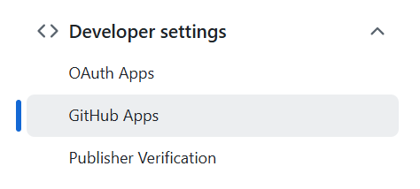
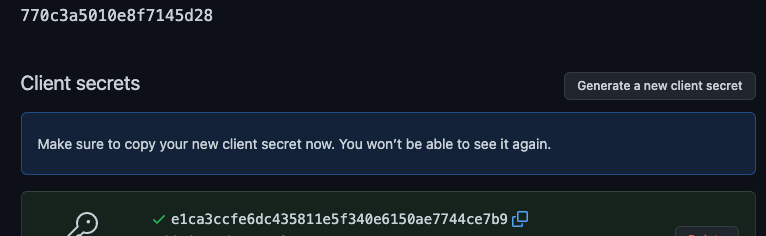
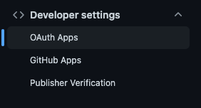
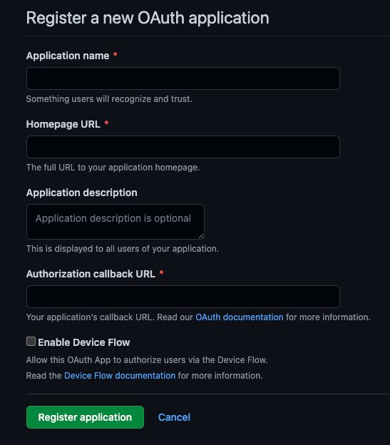

import Tabs from '@theme/Tabs';
import TabItem from '@theme/TabItem';

# Configure an agent with GitHub

In order to view recipe results and commit changes from a recipe back to GitHub, you'll need to create a GitHub app (preferred) or a GitHub OAuth app and configure the Moderne agent with the appropriate variables.

To assist with that, this guide will:

* Walk you through how to create a [GitHub application](#github-application-configuration-preferred) or [GitHub OAuth application](#github-oauth-application-configuration-alternative)
* [Provide you with a list of necessary variables the agent needs to communicate with your GitHub instance](#configure-the-moderne-agent)

:::tip Which should I choose?
GitHub Apps are recommended for their fine-grained permissions, short-lived tokens, and IP allow list support. OAuth Apps may be simpler if you support personal forks or have many independent organizations. See the [full comparison](../../references/github-permissions.md#github-applications-vs-github-oauth-applications) for details.
:::

## Prerequisites

* You will need administrator access to your organization's GitHub account

## GitHub application configuration (preferred)

1. Navigate to the settings page for your organization: `https://github.com/organizations/<YOUR_GITHUB_ORG>/settings/applications`
2. Expand `Developer settings` on the bottom left of the page:
   <figure>
     
     <figcaption></figcaption>
   </figure>
3. Click the `New GitHub App` button in the upper right of your screen.
4. Supply the required fields and register the application:

    | Field                                   | Example                                                                                                     |
    | --------------------------------------- |-------------------------------------------------------------------------------------------------------------|
    | Application Name                        | `Moderne SaaS`                                                                                              |
    | Homepage URL                            | `https://<TENANT>.moderne.io`                                                                               |
    | Authorization callback URL              | `https://<TENANT>.moderne.io`                                                                               |
    | Webhook Active                          | Disable                                                                                                     |
    | Repository Permissions                  | Contents - read/write<br/> Pull Requests - read/write<br/> Commit statuses - read-only<br/> Checks - read-only<br/> Workflows - read/write |
    | Account Permissions                     | Email Address - read-only                                                                                   |
    | Where can this GitHub App be installed? | You can choose either option based upon your specific needs:<br/> * Only on this account<br/> * Any account |

5. On your newly created application click the `Generate a new client secret` button:
   <figure>
     
     <figcaption></figcaption>
   </figure>
6. Copy the `Client ID` and `Client secret` from this page; they will be used as [arguments for the Moderne Agent](#configure-the-moderne-agent).
7. Install the GitHub App in your organization(s). See the [GitHub permissions documentation](../../references/github-permissions.md#installing-a-github-app) for detailed installation instructions.

:::note
After creating a GitHub App, you must install it in each organization or account where you want Moderne to operate. Without installation, GitHub will reject any attempts to commit changes.
:::

#### Example values

| Field                      | Example                          |
| -------------------------- |----------------------------------|
| Application Name           | `Moderne SaaS`                   |
| Homepage URL               | `https://companyname.moderne.io` |
| Authorization callback URL | `https://companyname.moderne.io` |

## GitHub OAuth application configuration (alternative)

1. Navigate to the settings page for your organization: `https://github.com/organizations/<YOUR_GITHUB_ORG>/settings/applications`
2. Expand `Developer settings` on the bottom left of the page:
   <figure>
     
     <figcaption></figcaption>
   </figure>
3. Click the `New OAuth App` button in the upper right of your screen.
4. Supply the required fields and register the application (See [examples](#example-values) below):
   <figure>
     
     <figcaption></figcaption>
   </figure>
5. On your newly created application click the `Generate a new client secret` button:
   <figure>
     
     <figcaption></figcaption>
   </figure>
6. Copy the `Client ID` and `Client secret` from this page; they will be used as [arguments for the Moderne Agent](#configure-the-moderne-agent).

#### Example values

| Field                      | Example                          |
| -------------------------- |----------------------------------|
| Application Name           | `Moderne SaaS`                   |
| Homepage URL               | `https://<TENANT>.moderne.io`    |
| Authorization callback URL | `https://<TENANT>.moderne.io` |

## Configure the Moderne Agent

The following table contains all of the variables/arguments you need to add to your Moderne agent run command in order for it to work with your GitHub instance. Please note that these variables/arguments must be combined with ones found in other steps in the [Configuring the Moderne agent guide](./agent-config.md).

:::info
You can configure multiple GitHub OAuth apps by including multiple entries, each with a different `{index}`.
:::

<Tabs groupId="agent-type">
<TabItem value="oci-container" label="OCI Container">

**Environment variables:**

| Variable Name                                                  | Required                                     | Default         | Description                                                                                                                                                                                                                      |
|----------------------------------------------------------------|----------------------------------------------|-----------------|----------------------------------------------------------------------------------------------------------------------------------------------------------------------------------------------------------------------------------|
| `MODERNE_AGENT_GITHUB_{index}_OAUTH_CLIENTID`                  | `true`                                       |                 | The client id configured in GitHub.                                                                                                                                                                                              |
| `MODERNE_AGENT_GITHUB_{index}_OAUTH_CLIENTSECRET`              | `true`                                       |                 | The client secret configured in GitHub.                                                                                                                                                                                          |
| `MODERNE_AGENT_GITHUB_{index}_URL`                             | `true`                                       |                 | The fully-qualified hostname of the running GitHub instance.                                                                                                                                                                     |
| `MODERNE_AGENT_GITHUB_{index}_SKIPSSL`                         | `false`                                      | `false`         | Specifies whether or not to skip SSL validation for HTTP connections to this GitHub instance. This must be set to `true` if you use a self-signed SSL/TLS certificate.                                                           |
| `MODERNE_AGENT_GITHUB_{index}_ALLOWABLE_ORGANIZATIONS_{index}` | `false`                                      | See description | Specifies what organizations you can fork recipe results to. By default, there are no restrictions on which organizations can be committed to. If you want multiple organizations, increase the last index and add one per line. |
| `MODERNE_AGENT_GITHUB_{index}_OAUTH_INCLUDEPRIVATEREPOS`       | `false`                                      | See description | By default, the OAuth app will only have access to public repositories within your organization(s). To provide the OAuth app access to private repositories, you can set this to `true`.                                         |
| `MODERNE_AGENT_GITHUB_{index}_SSH_PRIVATEKEY`                  | `false`                                      |                 | (Optional) The SSH private key used to establish a SSH connection with GitHub.                                                                                                                                                   |
| `MODERNE_AGENT_GITHUB_{index}_SSH_PASSPHRASE`                  | `true` (If the SSH private key is specified) |                 | The passphrase used to encrypt the SSH private key.                                                                                                                                                                              |
| `MODERNE_AGENT_GITHUB_{index}_SSH_SSHFILENAME`                 | `true` (If the SSH private key is specified) |                 | The file name of the private key, which the agent will store locally.                                                                                                                                                            |
| `MODERNE_AGENT_GITHUB_{index}_SSH_USER`                        | `true` (If the SSH private key is specified) |                 | The username used for SSH communication with GitHub.                                                                                                                                                                             |
| `MODERNE_AGENT_GITHUB_{index}_SSH_PORT`                        | `false`                                      | `7999`          | The port used to communicate via SSH with GitHub.                                                                                                                                                                                |

**Example:**

```bash
docker run \
# ... Existing variables
-e MODERNE_AGENT_GITHUB_0_OAUTH_CLIENTID=yourClientId \
-e MODERNE_AGENT_GITHUB_0_OAUTH_CLIENTSECRET=yourClientSecret \
-e MODERNE_AGENT_GITHUB_0_URL=https://myorg.github.com \
-e MODERNE_AGENT_GITHUB_0_ALLOWABLE_ORGANIZATIONS_0=moderne \
-e MODERNE_AGENT_GITHUB_0_ALLOWABLE_ORGANIZATIONS_1=openrewrite \
-e MODERNE_AGENT_GITHUB_0_OAUTH_INCLUDEPRIVATEREPOS=true \
# ... Additional variables
```
</TabItem>

<TabItem value="executable-jar" label="Executable JAR">

**Arguments:**

| Argument Name                                                     | Required                                     | Default         | Description                                                                                                                                                                                                                      |
|-------------------------------------------------------------------|----------------------------------------------|-----------------|----------------------------------------------------------------------------------------------------------------------------------------------------------------------------------------------------------------------------------|
| `--moderne.agent.github[{index}].oauth.clientId`                  | `true`                                       |                 | The client id configured in GitHub.                                                                                                                                                                                              |
| `--moderne.agent.github[{index}].oauth.clientSecret`              | `true`                                       |                 | The client secret configured in GitHub.                                                                                                                                                                                          |
| `--moderne.agent.github[{index}].url`                             | `true`                                       |                 | The fully-qualified hostname of the running GitHub instance.                                                                                                                                                                     |
| `--moderne.agent.github[{index}].skipSsl`                         | `false`                                      | `false`         | Specifies whether or not to skip SSL validation for HTTP connections to this GitHub instance. This must be set to `true` if you use a self-signed SSL/TLS certificate.                                                           |
| `--moderne.agent.github[{index}].allowableOrganizations[{index}]` | `false`                                      | See description | Specifies what organizations you can fork recipe results to. By default, there are no restrictions on which organizations can be committed to. If you want multiple organizations, increase the last index and add one per line. |
| `--moderne.agent.github[{index}].oauth.includePrivateRepos`       | `false`                                      | See description | By default, the OAuth app will only have access to public repositories within your organization(s). To provide the OAuth app access to private repositories, you can set this to `true`.                                         |
| `--moderne.agent.github[{index}].ssh.privateKey`                  | `false`                                      |                 | (Optional) The SSH private key used to establish a SSH connection with GitHub.                                                                                                                                                   |
| `--moderne.agent.github[{index}].ssh.passphrase`                  | `true` (If the SSH private key is specified) |                 | The passphrase used to encrypt the SSH private key.                                                                                                                                                                              |
| `--moderne.agent.github[{index}].ssh.sshFileName`                 | `true` (If the SSH private key is specified) |                 | The file name of the private key, which the agent will store locally.                                                                                                                                                            |
| `--moderne.agent.github[{index}].ssh.user`                        | `true` (If the SSH private key is specified) |                 | The username used for SSH communication with GitHub.                                                                                                                                                                             |
| `--moderne.agent.github[{index}].ssh.port`                        | `false`                                      | `7999`          | The port used to communicate via SSH with GitHub.                                                                                                                                                                                |

**Example:**

```bash
java -jar moderne-agent-{version}.jar \
# ... Existing arguments
--moderne.agent.github[0].oauth.clientId=yourClientId \
--moderne.agent.github[0].oauth.clientSecret=yourClientSecret \
--moderne.agent.github[0].url=https://myorg.github.com \
--moderne.agent.github[0].allowableOrganizations[0]=moderne \
--moderne.agent.github[0].allowableOrganizations[1]=openrewrite \
--moderne.agent.github[0].oauth.includePrivateRepos=true \
# ... Additional arguments
```
</TabItem>
</Tabs>
