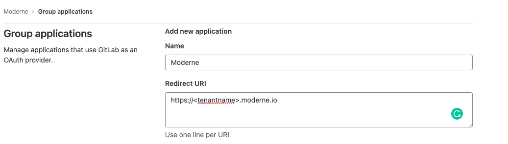
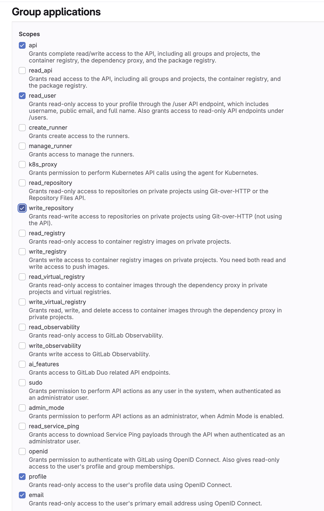
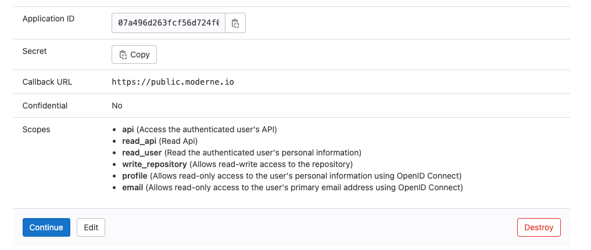

import Tabs from '@theme/Tabs';
import TabItem from '@theme/TabItem';
import VersionBanner from '@site/src/components/VersionBanner';

<VersionBanner version="v2" linkPath="/administrator-documentation/moderne-platform-v1/how-to-guides/agent-configuration/configure-an-agent-with-gitlab" />

# Configure a Connector with GitLab

In order to view recipe results and commit changes from a recipe back to GitLab, you'll need to create a GitLab OAuth app and configure the Moderne Connector with the appropriate variables.

To assist with that, this guide will:

* [Walk you through how to create a GitLab OAuth application](#step-1-create-an-oauth-application)
* [Provide you with a list of necessary variables the Connector needs to communicate with your GitLab instance](#step-2-configure-the-moderne-connector)

## Prerequisites

* You will need administrator access to your organization's GitLab account

## GitLab configuration

### Step 1: Create an OAuth application

1. Navigate to the Applications page for your organization: `https://gitlab.com/groups/<yourorg>/-/settings/applications`
2.  Provide an application name and redirect URI. The redirect URI will be in this format: `https://<tenantname>.moderne.io`:

    

3.  Pick the following scopes:

    

#### Understanding the required scopes

Moderne requests the following OAuth scopes. Each scope is used for a specific set of operations:

| Scope              | Required | Purpose                                                                                                                                                                                                                                                                           |
|--------------------|----------|-----------------------------------------------------------------------------------------------------------------------------------------------------------------------------------------------------------------------------------------------------------------------------------|
| `api`              | Yes      | Required for **write operations only**: creating, updating, closing, merging, and approving merge requests, and forking repositories. GitLab does not offer a narrower write scope for merge request operations. This scope is only exercised when a user commits recipe results. |
| `read_user`        | Yes      | Used to retrieve the authenticated user's identity (username, display name, and email) so that Moderne can associate commits with the correct user.                                                                                                                               |
| `write_repository` | Yes      | Used to push commits to repositories via Git-over-HTTP. This scope does **not** grant API write access — it only allows `git push`.                                                                                                                                               |
| `email`            | Yes      | Used to read the user's primary email address for commit attribution.                                                                                                                                                                                                             |

<details>
<summary>Detailed list of GitLab API calls Moderne makes</summary>

**User identity** (uses `read_user` and `email` scopes):

| API endpoint   | Method | Purpose                                   |
|----------------|--------|-------------------------------------------|
| `/api/v4/user` | GET    | Retrieve the authenticated user's profile |

**Repository access checks** (uses `api` scope, read-only):

| API endpoint                     | Method | Purpose                                               |
|----------------------------------|--------|-------------------------------------------------------|
| `/api/graphql` (projects query)  | POST   | Batch-verify that the user has access to repositories |
| `/api/v4/namespaces/{id}/exists` | GET    | Check whether a namespace or group exists             |
| `/api/v4/projects/{path}`        | GET    | Retrieve project metadata                             |

**Merge request operations** (uses `api` scope, write):

| API endpoint                                             | Method | Purpose                         |
|----------------------------------------------------------|--------|---------------------------------|
| `/api/v4/projects/{path}/merge_requests`                 | GET    | Find existing merge request     |
| `/api/v4/projects/{path}/merge_requests`                 | POST   | Create merge request            |
| `/api/v4/projects/{path}/merge_requests/{iid}`           | PUT    | Update merge request title/body |
| `/api/v4/projects/{path}/merge_requests/{iid}`           | PUT    | Close merge request             |
| `/api/v4/projects/{path}/merge_requests/{iid}/merge`     | PUT    | Merge a merge request           |
| `/api/v4/projects/{path}/merge_requests/{iid}/approve`   | POST   | Approve merge request           |
| `/api/v4/projects/{path}/merge_requests/{iid}/approvals` | GET    | Get approval status             |

**Fork operations** (uses `api` scope, write):

| API endpoint                   | Method | Purpose     |
|--------------------------------|--------|-------------|
| `/api/v4/projects/{path}/fork` | POST   | Create fork |

</details>

:::tip
The OAuth token is scoped to the individual user who authorizes it — Moderne can only perform actions that the user already has permission to do. The `api` scope does not grant Moderne any additional access beyond what the user themselves can do in GitLab.
:::

:::note
You may create the OAuth application at the **group level** rather than the instance level. Navigate to your group's **Settings > Applications** to register it there. The OAuth flow works identically regardless of where the application is registered.
:::

4. Click the Save application button
5.  Copy the `Application ID` and `Secret` from this page; they will be used as arguments for the Moderne Connector:

    

## Connector configuration

### Step 2: Configure the Moderne Connector

The following table contains all of the variables/arguments you need to add to your Moderne Connector run command in order for it to work with your GitLab instance. Please note that these variables/arguments must be combined with ones found in other steps in the [Configuring the Moderne Connector guide](./agent-config.md).

You can configure multiple GitLab OAuth apps by including multiple entries, each with a different `{index}`.

<Tabs groupId="agent-type">
<TabItem value="oci-container" label="OCI Container">

**Environment variables:**

| Variable Name                                   | Required                                     | Default | Description                                                                                                                                                            |
|-------------------------------------------------|----------------------------------------------|---------|------------------------------------------------------------------------------------------------------------------------------------------------------------------------|
| `MODERNE_SCM_GITLAB_{index}_OAUTH_CLIENTID`     | `true`                                       |         | The application id configured in GitLab.                                                                                                                               |
| `MODERNE_SCM_GITLAB_{index}_OAUTH_CLIENTSECRET` | `true`                                       |         | The secret configured in GitLab.                                                                                                                                       |
| `MODERNE_SCM_GITLAB_{index}_URI`                | `true`                                       |         | The fully-qualified hostname of your GitLab instance.                                                                                                                  |
| `MODERNE_SCM_GITLAB_{index}_SKIPSSL`            | `false`                                      | `false` | Specifies whether or not to skip SSL validation for HTTP connections to this GitLab instance. This must be set to `true` if you use a self-signed SSL/TLS certificate. |

**Example:**

```bash
docker run \
# ... Existing variables
-e MODERNE_SCM_GITLAB_0_OAUTH_CLIENTID=yourClientId \
-e MODERNE_SCM_GITLAB_0_OAUTH_CLIENTSECRET=yourClientSecret \
-e MODERNE_SCM_GITLAB_0_URI=https://your-gitlab.com \
# ... Additional variables
```
</TabItem>

<TabItem value="executable-jar" label="Executable JAR">

**Arguments:**

| Argument Name                                      | Required                                     | Default | Description                                                                                                                                                            |
|----------------------------------------------------|----------------------------------------------|---------|------------------------------------------------------------------------------------------------------------------------------------------------------------------------|
| `--moderne.scm.gitlab[{index}].oauth.clientId`     | `true`                                       |         | The application id configured in GitLab.                                                                                                                               |
| `--moderne.scm.gitlab[{index}].oauth.clientSecret` | `true`                                       |         | The secret configured in GitLab.                                                                                                                                       |
| `--moderne.scm.gitlab[{index}].uri`                | `true`                                       |         | The fully-qualified hostname of your GitLab instance.                                                                                                                  |
| `--moderne.scm.gitlab[{index}].skipSsl`            | `false`                                      | `false` | Specifies whether or not to skip SSL validation for HTTP connections to this GitLab instance. This must be set to `true` if you use a self-signed SSL/TLS certificate. |

**Example:**

```bash
java -jar connector-{version}.jar \
# ... Existing arguments
--moderne.scm.gitlab[0].oauth.clientId=yourClientId \
--moderne.scm.gitlab[0].oauth.clientSecret=yourClientSecret \
--moderne.scm.gitlab[0].uri=https://your-gitlab.com \
# ... Additional arguments
```
</TabItem>
</Tabs>
