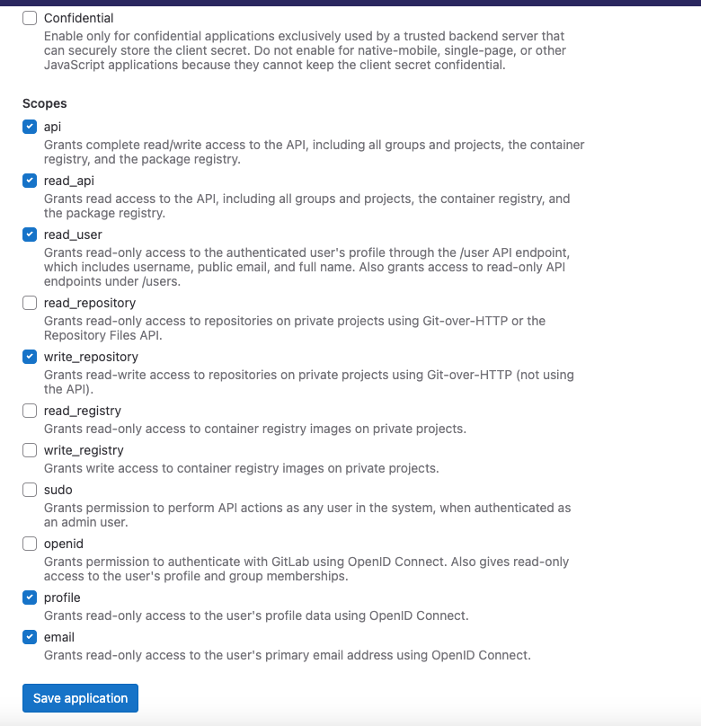

import Tabs from '@theme/Tabs';
import TabItem from '@theme/TabItem';

# Configure an agent with GitLab

In order to view recipe results and commit changes from a recipe back to GitLab, you'll need to create a GitLab OAuth app and configure the Moderne agent with the appropriate variables.

To assist with that, this guide will:

* [Walk you through how to create a GitLab OAuth application](#step-1-create-an-oauth-application)
* [Provide you with a list of necessary variables the agent needs to communicate with your GitLab instance](#step-2-configure-the-moderne-agent)

## Prerequisites

* You will need administrator access to your organization's GitLab account

## GitLab configuration

### Step 1: Create an OAuth application

1. Navigate to the Applications page for your organization: `https://gitlab.com/groups/<yourorg>/-/settings/applications`
2.  Provide an application name and redirect URI. The redirect URI will be in this format: `https://<tenantname>.moderne.io`:

    

3.  Pick the following scopes:

    

4. Click the Save application button
5.  Copy the `Application ID` and `Secret` from this page; they will be used as arguments for the Moderne Agent:

       

## Agent configuration

### Step 2: Configure the Moderne Agent

The following table contains all of the variables/arguments you need to add to your Moderne agent run command in order for it to work with your GitLab instance. Please note that these variables/arguments must be combined with ones found in other steps in the [Configuring the Moderne agent guide](./agent-config.md).

You can configure multiple GitLab OAuth apps by including multiple entries, each with a different `{index}`.

<Tabs groupId="agent-type">
<TabItem value="oci-container" label="OCI Container">

**Environment variables:**

| Variable Name                                     | Required                                     | Default | Description                                                                                                                                                            |
|---------------------------------------------------|----------------------------------------------|---------|------------------------------------------------------------------------------------------------------------------------------------------------------------------------|
| `MODERNE_AGENT_GITLAB_{index}_OAUTH_CLIENTID`     | `true`                                       |         | The application id configured in GitLab.                                                                                                                               |
| `MODERNE_AGENT_GITLAB_{index}_OAUTH_CLIENTSECRET` | `true`                                       |         | The secret configured in GitLab.                                                                                                                                       |
| `MODERNE_AGENT_GITLAB_{index}_URL`                | `true`                                       |         | The fully-qualified hostname of your GitLab instance.                                                                                                                  |
| `MODERNE_AGENT_GITLAB_{index}_SKIPSSL`            | `false`                                      | `false` | Specifies whether or not to skip SSL validation for HTTP connections to this GitLab instance. This must be set to `true` if you use a self-signed SSL/TLS certificate. |
| `MODERNE_AGENT_GITLAB_{index}_SSH_PRIVATEKEY`     | `false`                                      |         | The SSH private key used to establish a SSH connection with GitLab.                                                                                                    |
| `MODERNE_AGENT_GITLAB_{index}_SSH_PASSPHRASE`     | `true` (If the SSH private key is specified) |         | The passphrase used to encrypt the SSH private key.                                                                                                                    |
| `MODERNE_AGENT_GITLAB_{index}_SSH_SSHFILENAME`    | `true` (If the SSH private key is specified) |         | The file name of the private key, which the agent will store locally.                                                                                                  |
| `MODERNE_AGENT_GITLAB_{index}_SSH_USER`           | `true` (If the SSH private key is specified) |         | The username used for SSH communication with GitLab.                                                                                                                   |
| `MODERNE_AGENT_GITLAB_{index}_SSH_PORT`           | `false`                                      | `22`    | The port used to communicate via SSH with GitLab.                                                                                                                      |

**Example:**

```bash
docker run \
# ... Existing variables
-e MODERNE_AGENT_GITLAB_0_OAUTH_CLIENTID=yourClientId \
-e MODERNE_AGENT_GITLAB_0_OAUTH_CLIENTSECRET=yourClientSecret \
-e MODERNE_AGENT_GITLAB_0_URL=https://your-gitlab.com \
# ... Additional variables
```
</TabItem>

<TabItem value="executable-jar" label="Executable JAR">

**Arguments:**

| Argument Name                                        | Required                                     | Default | Description                                                                                                                                                            |
|------------------------------------------------------|----------------------------------------------|---------|------------------------------------------------------------------------------------------------------------------------------------------------------------------------|
| `--moderne.agent.gitlab[{index}].oauth.clientId`     | `true`                                       |         | The application id configured in GitLab.                                                                                                                               |
| `--moderne.agent.gitlab[{index}].oauth.clientSecret` | `true`                                       |         | The secret configured in GitLab.                                                                                                                                       |
| `--moderne.agent.gitlab[{index}].url`                | `true`                                       |         | The fully-qualified hostname of your GitLab instance.                                                                                                                  |
| `--moderne.agent.gitlab[{index}].skipSsl`            | `false`                                      | `false` | Specifies whether or not to skip SSL validation for HTTP connections to this GitLab instance. This must be set to `true` if you use a self-signed SSL/TLS certificate. |
| `--moderne.agent.gitlab[{index}].ssh.privateKey`     | `false`                                      |         | The SSH private key used to establish a SSH connection with GitLab.                                                                                                    |
| `--moderne.agent.gitlab[{index}].ssh.passphrase`     | `true` (If the SSH private key is specified) |         | The passphrase used to encrypt the SSH private key.                                                                                                                    |
| `--moderne.agent.gitlab[{index}].ssh.sshFileName`    | `true` (If the SSH private key is specified) |         | The file name of the private key, which the agent will store locally.                                                                                                  |
| `--moderne.agent.gitlab[{index}].ssh.user`           | `true` (If the SSH private key is specified) |         | The username used for SSH communication with GitLab.                                                                                                                   |
| `--moderne.agent.gitlab[{index}].ssh.port`           | `false`                                      | `22`    | The port used to communicate via SSH with GitLab.                                                                                                                      |

**Example:**

```bash
java -jar moderne-agent-{version}.jar \
# ... Existing arguments
--moderne.agent.gitlab[0].oauth.clientId=yourClientId \
--moderne.agent.gitlab[0].oauth.clientSecret=yourClientSecret \
--moderne.agent.gitlab[0].url=https://your-gitlab.com \
# ... Additional arguments
```
</TabItem>
</Tabs>
