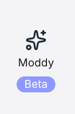

import Tabs from '@theme/Tabs';
import TabItem from '@theme/TabItem';

# Configure an agent with Moddy support

This guide will walk you through how to configure the Moderne agent to enable support for [Moddy](https://www.moderne.ai/blog/introducing-moderne-multi-repo-ai-agent-for-transforming-code-at-scale), Moderne's multi-repo AI agent. Moddy employs a bring-your-own model (BYOM) approach, which allows you to connect any large language model (LLM) that has been approved for use within your company.

## Prerequisites

* You will need an API key from your chosen LLM provider (OpenAI, Anthropic, Google, or Mistral)

## Supported LLM providers

The Moderne agent currently supports the following LLM providers:

| Provider      | Model Used            | API Endpoint                                       |
|---------------|-----------------------|----------------------------------------------------|
| OpenAI        | gpt-4o                | `https://api.openai.com/v1`                        |
| Anthropic     | Claude 3.5 Sonnet     | `https://api.anthropic.com/v1`                     |
| Google Gemini | Gemini 2.5 Flash-Lite | `https://generativelanguage.googleapis.com/v1beta` |
| Mistral       | Mistral Small Latest  | `https://api.mistral.ai/v1`                        |

If you need a model or LLM provider that isn't listed here, please contact Moderne support.

## Configuring the Moderne agent

The following table contains all of the variables/arguments you need to add to your Moderne agent run command in order to enable Moddy. Please note that these variables/arguments must be combined with ones found in other steps in the [Configuring the Moderne agent guide](./agent-config.md).

<Tabs groupId="agent-type">
<TabItem value="oci-container" label="OCI Container">

**Environment variables:**

| Variable Name                      | Required | Default | Description                                                                     |
|------------------------------------|----------|-------------------------------------------------------------------------------------------|
| `MODERNE_AGENT_LLM_PROVIDER`       | `true`   |         | The LLM provider to use. Options: `OPEN_AI`, `ANTHROPIC`, `GEMINI`, `MISTRAL`   |
| `MODERNE_AGENT_LLM_APIKEY`         | `true`   |         | The API key for the specified LLM provider                                      |
| `MODERNE_AGENT_LLM_PROXY_URL`      | `false`  |         | Proxy URL if the LLM API needs to be accessed through a proxy                   |
| `MODERNE_AGENT_LLM_PROXY_USERNAME` | `false`  |         | Username for proxy authentication                                               |
| `MODERNE_AGENT_LLM_PROXY_PASSWORD` | `false`  |         | Password for proxy authentication                                               |
| `MODERNE_AGENT_LLM_ADMINONLY`      | `false`  | `false` | If `true`, only admins will see Moddy in the UI and be able to chat with Moddy. | 

**Example:**

```bash
export MODERNE_AGENT_LLM_APIKEY=...

docker run \
# ... other configuration ...
-e MODERNE_AGENT_LLM_PROVIDER=ANTHROPIC \
-e MODERNE_AGENT_LLM_APIKEY \
# ... rest of configuration ...
moderne-agent:latest
```

</TabItem>

<TabItem value="executable-jar" label="Executable JAR">

**Arguments:**

| Argument Name                        | Required | Default | Description                                                                     |
|--------------------------------------|----------|-------------------------------------------------------------------------------------------|
| `--moderne.agent.llm.provider`       | `true`   |         | The LLM provider to use. Options: `OPEN_AI`, `ANTHROPIC`, `GEMINI`, `MISTRAL`   |
| `--moderne.agent.llm.apiKey`         | `true`   |         | The API key for the specified LLM provider                                      |
| `--moderne.agent.llm.proxy.url`      | `false`  |         | Proxy URL if the LLM API needs to be accessed through a proxy                   |
| `--moderne.agent.llm.proxy.username` | `false`  |         | Username for proxy authentication                                               |
| `--moderne.agent.llm.proxy.password` | `false`  |         | Password for proxy authentication                                               |
| `--moderne.agent.llm.adminOnly`      | `false`  | `false` | If `true`, only admins will see Moddy in the UI and be able to chat with Moddy. |

**Example:**

```bash
export MODERNE_AGENT_LLM_APIKEY=...

java -jar moderne-agent-{version}.jar \
# ... other configuration ...
--moderne.agent.llm.provider=ANTHROPIC \
--moderne.agent.llm.apiKey=$MODERNE_AGENT_LLM_APIKEY \
# ... rest of configuration ...
```

</TabItem>
</Tabs>

## Provider-specific examples

### OpenAI

<Tabs groupId="agent-type">
<TabItem value="oci-container" label="OCI Container">

```bash
export MODERNE_AGENT_LLM_APIKEY=...

docker run \
# ... other required agent configuration ...
-e MODERNE_AGENT_LLM_PROVIDER=OPEN_AI \
-e MODERNE_AGENT_LLM_APIKEY \
# ... rest of configuration ...
moderne-agent:latest
```

</TabItem>
<TabItem value="executable-jar" label="Executable JAR">

```bash
export MODERNE_AGENT_LLM_APIKEY=...

java -jar moderne-agent-{version}.jar \
# ... other required agent configuration ...
--moderne.agent.llm.provider=OPEN_AI \
--moderne.agent.llm.apiKey=$MODERNE_AGENT_LLM_APIKEY \
# ... rest of configuration ...
```

</TabItem>
</Tabs>

### Anthropic (Claude)

<Tabs groupId="agent-type">
<TabItem value="oci-container" label="OCI Container">

```bash
export MODERNE_AGENT_LLM_APIKEY=...

docker run \
# ... other required agent configuration ...
-e MODERNE_AGENT_LLM_PROVIDER=ANTHROPIC \
-e MODERNE_AGENT_LLM_APIKEY \
# ... rest of configuration ...
moderne-agent:latest
```

</TabItem>
<TabItem value="executable-jar" label="Executable JAR">

```bash
export MODERNE_AGENT_LLM_APIKEY=...

java -jar moderne-agent-{version}.jar \
# ... other required agent configuration ...
--moderne.agent.llm.provider=ANTHROPIC \
--moderne.agent.llm.apiKey=$MODERNE_AGENT_LLM_APIKEY \
# ... rest of configuration ...
```

</TabItem>
</Tabs>

### Google Gemini

<Tabs groupId="agent-type">
<TabItem value="oci-container" label="OCI Container">

```bash
export MODERNE_AGENT_LLM_APIKEY=...

docker run \
# ... other required agent configuration ...
-e MODERNE_AGENT_LLM_PROVIDER=GEMINI \
-e MODERNE_AGENT_LLM_APIKEY \
# ... rest of configuration ...
moderne-agent:latest
```

</TabItem>
<TabItem value="executable-jar" label="Executable JAR">

```bash
export MODERNE_AGENT_LLM_APIKEY=...

java -jar moderne-agent-{version}.jar \
# ... other required agent configuration ...
--moderne.agent.llm.provider=GEMINI \
--moderne.agent.llm.apiKey=$MODERNE_AGENT_LLM_APIKEY \
# ... rest of configuration ...
```

</TabItem>
</Tabs>

### Mistral

<Tabs groupId="agent-type">
<TabItem value="oci-container" label="OCI Container">

```bash
export MODERNE_AGENT_LLM_APIKEY=...

docker run \
# ... other required agent configuration ...
-e MODERNE_AGENT_LLM_PROVIDER=MISTRAL \
-e MODERNE_AGENT_LLM_APIKEY \
# ... rest of configuration ...
moderne-agent:latest
```

</TabItem>
<TabItem value="executable-jar" label="Executable JAR">

```bash
export MODERNE_AGENT_LLM_APIKEY=...

java -jar moderne-agent-{version}.jar \
# ... other required agent configuration ...
--moderne.agent.llm.provider=MISTRAL \
--moderne.agent.llm.apiKey=$MODERNE_AGENT_LLM_APIKEY \
# ... rest of configuration ...
```

</TabItem>
</Tabs>

## Proxy configuration

If your organization requires LLM API access through a proxy:

<Tabs groupId="agent-type">
<TabItem value="oci-container" label="OCI Container">

```bash
export MODERNE_AGENT_LLM_APIKEY=...
export MODERNE_AGENT_LLM_PROXY_PASSWORD=...

docker run \
# ... other required agent configuration ...
-e MODERNE_AGENT_LLM_PROVIDER=ANTHROPIC \
-e MODERNE_AGENT_LLM_APIKEY \
-e MODERNE_AGENT_LLM_PROXY_URL=http://proxy.company.com:8080 \
-e MODERNE_AGENT_LLM_PROXY_USERNAME=proxyuser \
-e MODERNE_AGENT_LLM_PROXY_PASSWORD \
# ... rest of configuration ...
moderne-agent:latest
```

</TabItem>
<TabItem value="executable-jar" label="Executable JAR">

```bash
export MODERNE_AGENT_LLM_APIKEY=...
export MODERNE_AGENT_LLM_PROXY_PASSWORD=...

java -jar moderne-agent-{version}.jar \
# ... other required agent configuration ...
--moderne.agent.llm.provider=ANTHROPIC \
--moderne.agent.llm.apiKey=$MODERNE_AGENT_LLM_APIKEY \
--moderne.agent.llm.proxy.url=http://proxy.company.com:8080 \
--moderne.agent.llm.proxy.username=proxyuser \
--moderne.agent.llm.proxy.password=$MODERNE_AGENT_LLM_PROXY_PASSWORD \
# ... rest of configuration ...
```

</TabItem>
</Tabs>

## Complete example with multiple configurations

Here's a complete example showing an agent configured with GitHub, Artifactory, and Moddy support:

<Tabs groupId="agent-type">
<TabItem value="oci-container" label="OCI Container">

```bash
export MODERNE_AGENT_CRYPTO_SYMMETRICKEY=...
export MODERNE_AGENT_TOKEN=...
export MODERNE_AGENT_GITHUB_0_OAUTH_CLIENTID=...
export MODERNE_AGENT_GITHUB_0_OAUTH_CLIENTSECRET=...
export MODERNE_AGENT_ARTIFACTORY_0_USERNAME=...
export MODERNE_AGENT_ARTIFACTORY_0_PASSWORD=...
export MODERNE_AGENT_LLM_APIKEY=...

docker run \
-e MODERNE_AGENT_APIGATEWAYRSOCKETURI=https://api.tenant.moderne.io/rsocket \
-e MODERNE_AGENT_CRYPTO_SYMMETRICKEY \
-e MODERNE_AGENT_NICKNAME=prod-1 \
-e MODERNE_AGENT_TOKEN \
-e MODERNE_AGENT_GITHUB_0_OAUTH_CLIENTID \
-e MODERNE_AGENT_GITHUB_0_OAUTH_CLIENTSECRET \
-e MODERNE_AGENT_GITHUB_0_URL=https://myorg.github.com \
-e MODERNE_AGENT_GITHUB_0_ALLOWABLE_ORGANIZATIONS_0=moderne \
-e MODERNE_AGENT_GITHUB_0_OAUTH_INCLUDEPRIVATEREPOS=true \
-e MODERNE_AGENT_ARTIFACTORY_0_URL=https://myartifactory.example.com/artifactory/ \
-e MODERNE_AGENT_ARTIFACTORY_0_USERNAME \
-e MODERNE_AGENT_ARTIFACTORY_0_PASSWORD \
-e MODERNE_AGENT_ARTIFACTORY_0_ASTQUERYFILTERS_0='"name":{"$match":"*-ast.jar"}' \
-e MODERNE_AGENT_LLM_PROVIDER=ANTHROPIC \
-e MODERNE_AGENT_LLM_APIKEY \
-p 8080:8080 \
moderne-agent:latest
```

</TabItem>
<TabItem value="executable-jar" label="Executable JAR">

```bash
export MODERNE_AGENT_CRYPTO_SYMMETRICKEY=...
export MODERNE_AGENT_TOKEN=...
export MODERNE_AGENT_GITHUB_0_OAUTH_CLIENTID=...
export MODERNE_AGENT_GITHUB_0_OAUTH_CLIENTSECRET=...
export MODERNE_AGENT_ARTIFACTORY_0_USERNAME=...
export MODERNE_AGENT_ARTIFACTORY_0_PASSWORD=...
export MODERNE_AGENT_LLM_APIKEY=...

java -jar moderne-agent-{version}.jar \
--moderne.agent.apiGatewayRsocketUri=https://api.tenant.moderne.io/rsocket \
--moderne.agent.nickname=prod-1 \
--moderne.agent.github[0].url=https://myorg.github.com \
--moderne.agent.github[0].allowableOrganizations[0]=moderne \
--moderne.agent.github[0].oauth.includePrivateRepos=true \
--moderne.agent.artifactory[0].url=https://myartifactory.example.com/artifactory/ \
--moderne.agent.artifactory[0].astQueryFilters[0]='{"name":{"$match":"*-ast.jar"}}' \
--moderne.agent.llm.provider=ANTHROPIC \
--moderne.agent.llm.apiKey=$MODERNE_AGENT_LLM_APIKEY
```

</TabItem>
</Tabs>

## Verifying the configuration

After starting the agent with the new configuration, "Moddy" will be displayed in the navigation bar in the Moderne SaaS UI:

<figure>
  
  <figcaption>"Moddy" displayed in the nav bar</figcaption>
</figure>

You can then click "Moddy" and begin asking it questions about your codebase.
