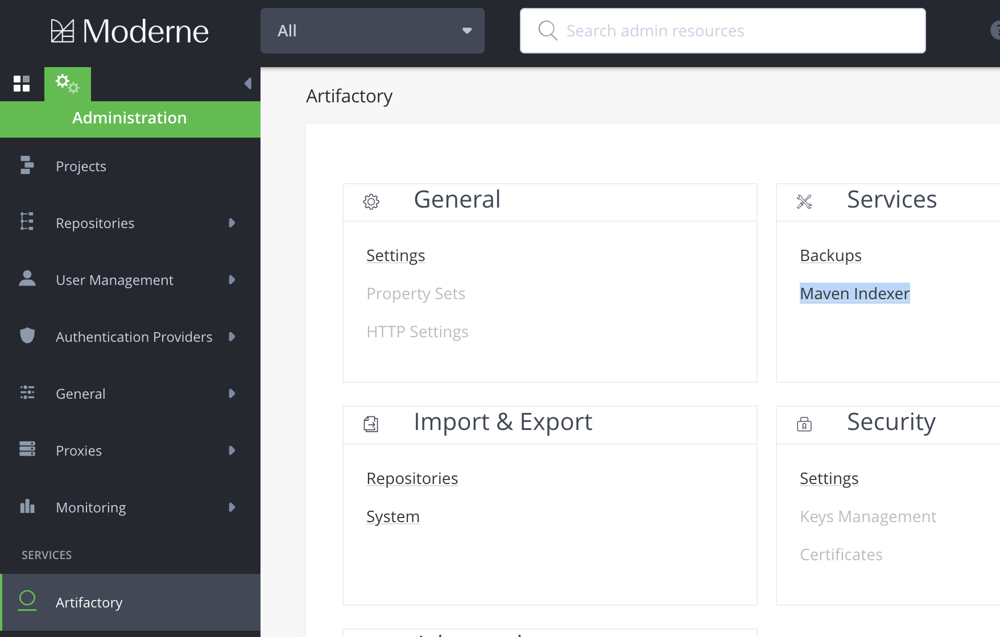
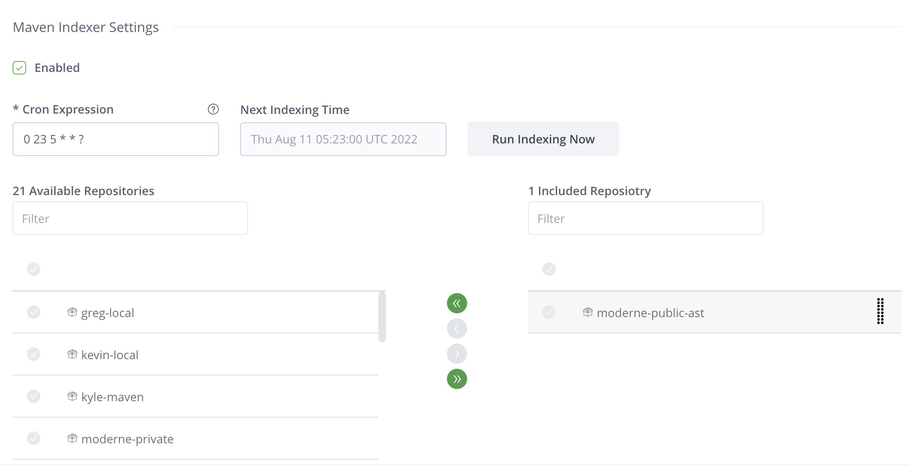
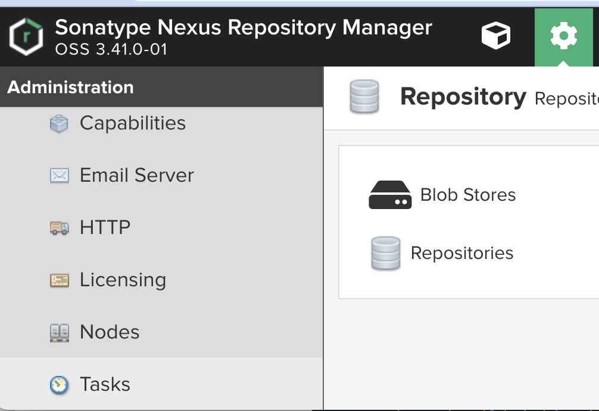
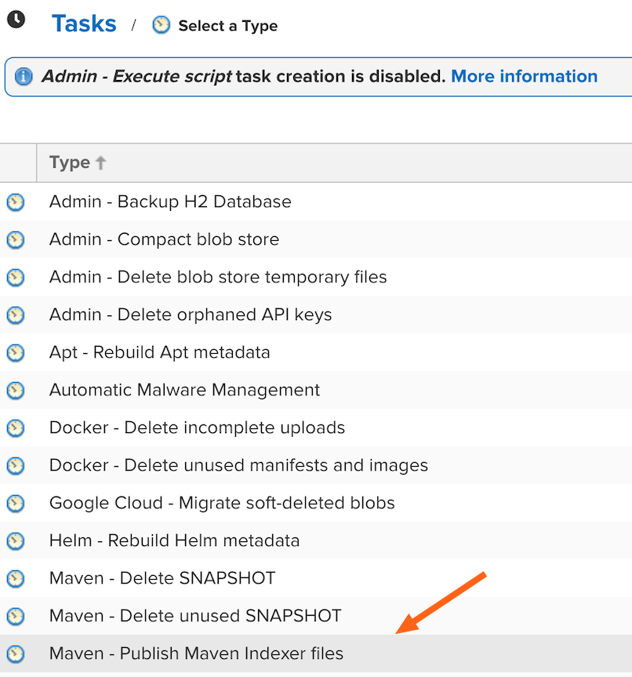
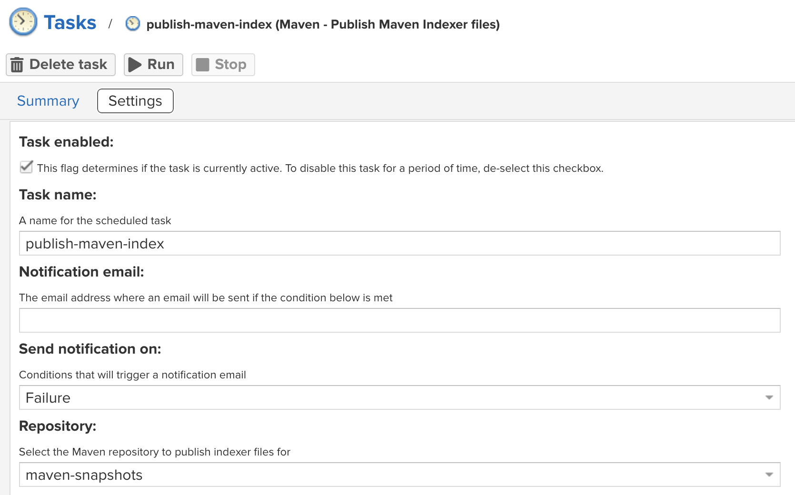

import Tabs from '@theme/Tabs';
import TabItem from '@theme/TabItem';
import VersionBanner from '@site/src/components/VersionBanner';

<VersionBanner version="v2" linkPath="/administrator-documentation/moderne-platform-v1/how-to-guides/agent-configuration/configure-an-agent-with-maven-repository-access" />

# Configure a Connector with Maven repository access

This guide explains how to configure the Moderne Connector to talk to a Maven-formatted artifact repository (Artifactory, Nexus, etc.) so the Connector can discover and download your LST artifacts.

When your [repository CSV](./agent-config.md#step-5-configure-the-connector-to-find-your-repositories-and-their-lsts) does not include `publishUri` values, the Connector uses the [Maven Indexer](https://maven.apache.org/maven-indexer/) to discover LST locations. Note that there will be a delay between when an LST is published and when it shows up in Moderne, controlled by a batch index-update process. Even when your CSV already includes `publishUri` values, the credentials you configure here are still used to fetch LSTs from the repository. This connection also allows Moderne to look up dependency versions to determine if a new version is available.

:::note
This page covers Maven repositories used to serve **LST artifacts** for code analysis. If you're looking to configure repositories for **recipe artifacts** (Maven, NPM, NuGet, or PyPI), see [Recipe marketplace repositories](./configure-recipe-marketplace-repositories.md) instead.
:::

There are a variety of services that support Maven-formatted artifact repositories. Some examples include [JFrog Artifactory](https://jfrog.com/artifactory/), [Sonatype Nexus](https://www.sonatype.com/products/nexus-repository), and [Azure Artifacts](https://azure.microsoft.com/en-us/services/devops/artifacts/).

This guide will explain how to:

* [Configure your artifact service to support LST artifacts](#publishing-lst-artifacts)
* [Configure the Moderne Connector to connect to any service that supports Maven-formatted repositories](#configuring-the-moderne-connector)

#### Prerequisites

* You might need a username and password for a user that is allowed to resolve artifacts.

:::info
In many organizations, artifact resolution is unauthenticated while artifact publishing is authenticated. If artifact resolution is unauthenticated, you may omit the username/password configuration in the [Configuration step](#configuring-the-moderne-connector).
:::

## Publishing LST artifacts

### Configure the Maven Indexer

In order to publish LST artifacts, the artifact registry must be regularly updated with an index in the [Maven Indexer](https://maven.apache.org/maven-indexer/) format. The frequency with which the index is updated is an approximation of the time it will take for an LST that is published to your artifact repository to show up in Moderne. You will need to decide where the border is between faster publishing and the load required on your Artifactory instance.

Please follow the below instructions to configure the indexer for your Maven formatted repository:

<Tabs>
<TabItem value="artifactory" label="Artifactory">

:::warning
If you are using Artifactory to publish LST artifacts, it is _highly_ recommended that you follow the instructions in the [configuring a Connector with Artifactory doc](./configure-an-agent-with-artifactory-access.md) instead as that will result in faster artifact consumption while also avoiding substantial load on your Artifactory instance. The following instructions should only be followed if you can not use [AQL](https://www.jfrog.com/confluence/display/JFROG/Artifactory+Query+Language) for some reason.
:::

In Artifactory, select the `Artifactory` link on the left nav and then select `Maven Indexer` under Services:



For a repository to be a source of LSTs, it must be included in the list of repositories that are indexed:


</TabItem>

<TabItem value="nexus-repository" label="Nexus Repository">

:::warning
If you are using Nexus 3 for LST storage with [mass ingest](../mass-ingest.md), the repository **must** be created as a **maven2 (hosted)** repository with **layout policy set to Permissive**. Mass ingest uploads build logs alongside LSTs using paths that do not follow Maven coordinate structure, and Nexus will reject these uploads with HTTP 400 if the layout policy is set to Strict.

If the repository already exists with strict layout, you can change this without recreating it: **Repository settings** > **Maven 2** > **Layout policy** > `Permissive`.
:::

Under the administration view, select `Settings` --> `System` --> `Tasks` on the left nav:



Select **Create task** and create a `Maven - Publish Maven Indexer files` task:



Select the repository that will serve LST artifacts and specify a frequency with which this index should be updated:


</TabItem>
</Tabs>

## Configuring the Moderne Connector

The following table contains all of the variables/arguments you need to add to your Moderne Connector run command in order for it to get LST artifacts from your Maven formatted repository. Please note that these variables/arguments must be combined with ones found in other steps in the [Configuring the Moderne Connector guide](./agent-config.md).

You can configure multiple Maven formatted repositories by including multiple entries, each with a different `{index}`.

<Tabs groupId="agent-type">
<TabItem value="oci-container" label="OCI Container">

**Environment variables:**

| Variable Name                                                                | Required | Default            | Description                                                                                                                                                                                                                                                                                                                                          |
|------------------------------------------------------------------------------|----------|--------------------|------------------------------------------------------------------------------------------------------------------------------------------------------------------------------------------------------------------------------------------------------------------------------------------------------------------------------------------------------|
| `MODERNE_CONNECTOR_ORGANIZATION_POLL_MAVEN_{index}_URI`                      | `true`   |                    | The URL of your Maven repository.                                                                                                                                                                                                                                                                                                                    |
| `MODERNE_CONNECTOR_ORGANIZATION_POLL_MAVEN_{index}_LOCALREPOSITORY`          | `false`  | `~/.moderne-maven` | The path on disk where LST artifacts and Maven index files will be downloaded to. This is on the disk where the Connector is being run and **not** on the Maven instance. <br/><br/> LST artifacts are deleted from this location after they are transmitted to Moderne. Index files will remain behind to be used to detect diffs in the artifacts. |
| `MODERNE_CONNECTOR_ORGANIZATION_POLL_MAVEN_{index}_USERNAME`                 | `false`  | `null`             | The username used to resolve artifacts.                                                                                                                                                                                                                                                                                                              |
| `MODERNE_CONNECTOR_ORGANIZATION_POLL_MAVEN_{index}_PASSWORD`                 | `false`  | `null`             | The password used to resolve artifacts.                                                                                                                                                                                                                                                                                                              |
| `MODERNE_CONNECTOR_ORGANIZATION_POLL_MAVEN_{index}_RELEASES`                 | `false`  | `true`             | Specifies whether or not this repository should be searched for releases.                                                                                                                                                                                                                                                                            |
| `MODERNE_CONNECTOR_ORGANIZATION_POLL_MAVEN_{index}_SNAPSHOTS`                | `false`  | `true`             | Specifies whether or not this repository should be searched for snapshots.                                                                                                                                                                                                                                                                           |
| `MODERNE_CONNECTOR_ORGANIZATION_POLL_MAVEN_{index}_SKIPSSL`                  | `false`  | `false`            | Whether or not to skip SSL/TLS verification for calls from the Connector to this Maven repository. This must be set to `true` if you use a self-signed SSL/TLS certificate.                                                                                                                                                                          |
| `MODERNE_CONNECTOR_ORGANIZATION_POLL_MAVEN_{index}_SKIPVALIDATECONNECTIVITY` | `false`  | `false`            | By default, on Connector startup, we will validate that we can connect to this Maven repository, and fail to start up the Connector if we cannot. Set this to `true` to skip this validation.                                                                                                                                                        |
| `MODERNE_CONNECTOR_ORGANIZATION_POLL_MAVEN_{index}_PROXY_HOST`               | `false`  |                    | The hostname of a proxy server to use for connections to this Maven repository.                                                                                                                                                                                                                                                                      |
| `MODERNE_CONNECTOR_ORGANIZATION_POLL_MAVEN_{index}_PROXY_PORT`               | `false`  |                    | The port of the proxy server to use for connections to this Maven repository.                                                                                                                                                                                                                                                                        |
| `MODERNE_CONNECTOR_ORGANIZATION_POLL_MAVEN_{index}_CONNECTTIMEOUT`           | `false`  | `30s`              | Timeout for the connection to be established (and the first data received). Specified as a duration (e.g., `30s`, `1m`).                                                                                                                                                                                                                             |
| `MODERNE_CONNECTOR_ORGANIZATION_POLL_MAVEN_{index}_READTIMEOUT`              | `false`  | `60s`              | Timeout for reading the response body from the Maven repository. Specified as a duration (e.g., `60s`, `5m`).                                                                                                                                                                                                                                        |

**Example:**

```bash
docker run \
# ... Existing variables
-e MODERNE_CONNECTOR_ORGANIZATION_POLL_MAVEN_0_URI=https://myartifactory.example.com/artifactory/libs-releases-local \
-e MODERNE_CONNECTOR_ORGANIZATION_POLL_MAVEN_0_USERNAME=admin \
-e MODERNE_CONNECTOR_ORGANIZATION_POLL_MAVEN_0_PASSWORD=password \
# ... Additional variables
```
</TabItem>

<TabItem value="executable-jar" label="Executable JAR">

**Arguments:**

| Argument Name                                                                   | Required | Default            | Description                                                                                                                                                                                                                                                                                                                                          |
|---------------------------------------------------------------------------------|----------|--------------------|------------------------------------------------------------------------------------------------------------------------------------------------------------------------------------------------------------------------------------------------------------------------------------------------------------------------------------------------------|
| `--moderne.connector.organization.poll.maven[{index}].uri`                      | `true`   |                    | The URL of your Maven repository.                                                                                                                                                                                                                                                                                                                    |
| `--moderne.connector.organization.poll.maven[{index}].localRepository`          | `false`  | `~/.moderne-maven` | The path on disk where LST artifacts and Maven index files will be downloaded to. This is on the disk where the Connector is being run and **not** on the Maven instance. <br/><br/> LST artifacts are deleted from this location after they are transmitted to Moderne. Index files will remain behind to be used to detect diffs in the artifacts. |
| `--moderne.connector.organization.poll.maven[{index}].username`                 | `false`  | `null`             | The username used to resolve artifacts.                                                                                                                                                                                                                                                                                                              |
| `--moderne.connector.organization.poll.maven[{index}].password`                 | `false`  | `null`             | The password used to resolve artifacts.                                                                                                                                                                                                                                                                                                              |
| `--moderne.connector.organization.poll.maven[{index}].releases`                 | `false`  | `true`             | Specifies whether or not this repository should be searched for releases.                                                                                                                                                                                                                                                                            |
| `--moderne.connector.organization.poll.maven[{index}].snapshots`                | `false`  | `true`             | Specifies whether or not this repository should be searched for snapshots.                                                                                                                                                                                                                                                                           |
| `--moderne.connector.organization.poll.maven[{index}].skipSsl`                  | `false`  | `false`            | Whether or not to skip SSL/TLS verification for calls from the Connector to this Maven repository. This must be set to `true` if you use a self-signed SSL/TLS certificate.                                                                                                                                                                          |
| `--moderne.connector.organization.poll.maven[{index}].skipValidateConnectivity` | `false`  | `false`            | By default, on Connector startup, we will validate that we can connect to this Maven repository, and fail to start up the Connector if we cannot. Set this to `true` to skip this validation.                                                                                                                                                        |
| `--moderne.connector.organization.poll.maven[{index}].proxy.host`               | `false`  |                    | The hostname of a proxy server to use for connections to this Maven repository.                                                                                                                                                                                                                                                                      |
| `--moderne.connector.organization.poll.maven[{index}].proxy.port`               | `false`  |                    | The port of the proxy server to use for connections to this Maven repository.                                                                                                                                                                                                                                                                        |
| `--moderne.connector.organization.poll.maven[{index}].connectTimeout`           | `false`  | `30s`              | Timeout for the connection to be established (and the first data received). Specified as a duration (e.g., `30s`, `1m`).                                                                                                                                                                                                                             |
| `--moderne.connector.organization.poll.maven[{index}].readTimeout`              | `false`  | `60s`              | Timeout for reading the response body from the Maven repository. Specified as a duration (e.g., `60s`, `5m`).                                                                                                                                                                                                                                        |

**Example:**

```bash
java -jar connector-{version}.jar \
# ... Existing arguments
--moderne.connector.organization.poll.maven[0].uri=https://myartifactory.example.com/artifactory/libs-releases-local \
--moderne.connector.organization.poll.maven[0].username=admin \
--moderne.connector.organization.poll.maven[0].password=password \
# ... Additional arguments
```
</TabItem>
</Tabs>
