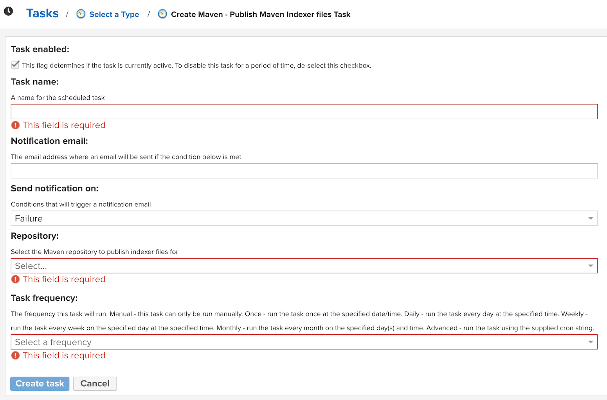

import Tabs from '@theme/Tabs';
import TabItem from '@theme/TabItem';

# Configure an agent with Maven repository access

In order for Moderne to retrieve your [Lossless Semantic Tree](../../references/lossless-semantic-trees.md) (LST) or recipe artifacts, the agent needs to be configured to talk to your Maven-formatted artifact repositories. This connection also allows Moderne to lookup dependency versions to determine if a new version is available.

There are a variety of services that support Maven-formatted artifact repositories. Some examples include [JFrog Artifactory](https://jfrog.com/artifactory/), [Sonatype Nexus](https://www.sonatype.com/products/nexus-repository), and [Azure Artifacts](https://azure.microsoft.com/en-us/services/devops/artifacts/).

:::info
If your company has a rule that any externally-hosted JARs (e.g., Maven Central) be brought into an internal Maven repository (e.g., Artifactory) and scanned before being used, the instructions in this doc **must** be followed. Furthermore, [please ensure that you point the agent to your internal Maven repository and that the OpenRewrite JARs and dependencies are included in said repository](./configure-an-agent-with-strict-recipe-sources.md).
:::

This guide will explain how to:

* [Configure your artifact service to support LST and recipes artifacts](#publishing-lst-artifacts)
* [Configure the Moderne agent to connect to any service that supports Maven-formatted repositories](#configuring-the-moderne-agent)

#### Prerequisites

* You might need a username and password for a user that is allowed to resolve artifacts.

:::info
In many organizations, artifact resolution is unauthenticated while artifact publishing is authenticated. If artifact resolution is unauthenticated, you may omit the username/password configuration in the [Configuration step](#configuring-the-moderne-agent).
:::

## Publishing LST artifacts

### Configure the Maven Indexer

In order to publish LST artifacts, the artifact registry must be regularly updated with an index in the [Maven Indexer](https://maven.apache.org/maven-indexer/) format. The frequency with which the index is updated is an approximation of the time it will take for an LST that is published to your artifact repository to show up in Moderne. You will need to decide where the border is between faster publishing and the load required on your Artifactory instance.

Please follow the below instructions to configure the indexer for your Maven formatted repository:

<Tabs>
<TabItem value="artifactory" label="Artifactory">

:::warning
If you are using Artifactory to publish LST artifacts, it is _highly_ recommended that you follow the instructions in the [configuring an agent with Artifactory doc](configure-an-agent-with-artifactory-access.md) instead as that will result in faster artifact consumption while also avoiding substantial load on your Artifactory instance. The following instructions should only be followed if you can not use [AQL](https://www.jfrog.com/confluence/display/JFROG/Artifactory+Query+Language) for some reason.
:::

In Artifactory, select the `Artifactory` link on the left nav and then select `Maven Indexer` under Services:


For a repository to be a source of LSTs, it must be included in the list of repositories that are indexed:


</TabItem>

<TabItem value="nexus-repository" label="Nexus Repository">

Under the administration view, select `Settings` --> `System` --> `Tasks` on the left nav:


Select `Create task` and create a `Maven - Publish Maven Indexer files` task:


Select the repository that will serve LST artifacts and specify a frequency with which this index should be updated:


</TabItem>
</Tabs>

## Publishing recipe artifacts

Recipe artifacts will automatically be picked up by Moderne so long as you set the recipe source flag to true in the below [configuration step](#configuring-the-moderne-agent). These artifacts will be immediately available for [deployment to Moderne](../importing-external-recipes.md) upon being published.

## Configuring the Moderne agent

The following table contains all of the variables/arguments you need to add to your Moderne agent run command in order for it to get LST and recipe artifacts from your Maven formatted repository. Please note that these variables/arguments must be combined with ones found in other steps in the [Configuring the Moderne agent guide](./agent-config.md).

You can configure multiple Maven formatted repositories by including multiple entries, each with a different `{index}`.

<Tabs groupId="agent-type">
<TabItem value="oci-container" label="OCI Container">

**Environment variables:**

| Variable Name                                 | Required                                              | Default            | Description                                                                                                                                                           |
|-----------------------------------------------|-------------------------------------------------------|--------------------|-----------------------------------------------------------------------------------------------------------------------------------------------------------------------|
| `MODERNE_AGENT_MAVEN_{index}_URL`             | `true`                                                |                    | The URL of your Maven repository.                                                                                                                                     |
| `MODERNE_AGENT_MAVEN_{index}_LOCALREPOSITORY` | `true`                                                | `~/.moderne-maven` | The path on disk where LST artifacts and Maven index files will be downloaded to. This is on the disk where the agent is being run and **not** on the Maven instance. <br/><br/> LST artifacts are deleted from this location after they are transmitted to Moderne. Index files will remain behind to be used to detect diffs in the artifacts. <br/><br/> If multiple Maven repositories are configured on the agent, they **must** have different local repositories configured. |
| `MODERNE_AGENT_MAVEN_{index}_USERNAME`        | `false`                                               | `null`             | The username used to resolve artifacts.                                                                                                                               |
| `MODERNE_AGENT_MAVEN_{index}_PASSWORD`        | `false`                                               | `null`             | The password used to resolve artifacts.                                                                                                                               |
| `MODERNE_AGENT_MAVEN_{index}_RELEASES`        | `false`                                               | `true`             | Specifies whether or not this repository should be searched for releases.                                                                                             |
| `MODERNE_AGENT_MAVEN_{index}_SNAPSHOTS`       | `false`                                               | `true`             | Specifies whether or not this repository should be searched for snapshots.                                                                                            |
| `MODERNE_AGENT_MAVEN_{index}_ASTSOURCE`       | `false`                                               | `true`             | Specifies whether or not this repository should be searched for LST artifacts (Note: LSTs used to be called ASTs).                                                    |
| `MODERNE_AGENT_MAVEN_{index}_RECIPESOURCE`    | `false`                                               | `true`             | Specifies whether or not this repository should be searched for recipe jars.                                                                                          |
| `MODERNE_AGENT_MAVEN_{index}_SKIPSSL`         | `true` (If you use a self-signed SSL/TLS certificate) | `false`            | Whether or not to skip SSL/TLS verification for calls from the agent to this Maven repository.                                                                        |
| `MODERNE_AGENT_MAVEN_{index}_CONNECTTIMEOUT`  | `false`                                               | `30s`              | Timeout for the connection to be established (and the first data received). Specified as a duration (e.g., `30s`, `1m`).          |
| `MODERNE_AGENT_MAVEN_{index}_READTIMEOUT`     | `false`                                               | `60s`              | Timeout for reading the response body from the Maven repository. Specified as a duration (e.g., `60s`, `5m`).                                                         |

:::warning
If you want to configure a [Moderne DevCenter](../creating-a-devcenter-recipe.md), you will need to ensure that you have exactly one Maven repository configured with `RECIPESOURCE` set to `true`. (It is fine to have this same Maven repository configured in multiple agents.)
:::

**Example:**

```bash
docker run \
# ... Existing variables
-e MODERNE_AGENT_MAVEN_0_URL=https://myartifactory.example.com/artifactory/libs-releases-local \
-e MODERNE_AGENT_MAVEN_0_LOCALREPOSITORY=${user.home}/.moderne-maven \
-e MODERNE_AGENT_MAVEN_0_USERNAME=admin \
-e MODERNE_AGENT_MAVEN_0_PASSWORD=password \
# ... Additional variables
```
</TabItem>

<TabItem value="executable-jar" label="Executable JAR">

**Arguments:**

| Argument Name                                    | Required                                              | Default            | Description                                                                                                                                                           |
|--------------------------------------------------|-------------------------------------------------------|--------------------|-----------------------------------------------------------------------------------------------------------------------------------------------------------------------|
|`--moderne.agent.maven[{index}].url`              | `true`                                                |                    | The URL of your Maven repository.                                                                                                                                     |
| `--moderne.agent.maven[{index}].localRepository` | `true`                                                | `${user.home}/.moderne-maven` | The path on disk where LST artifacts and Maven index files will be downloaded to. This is on the disk where the agent is being run and **not** on the Maven instance. <br/><br/> LST artifacts are deleted from this location after they are transmitted to Moderne. Index files will remain behind to be used to detect diffs in the artifacts. <br/><br/> If multiple Maven repositories are configured on the agent, they **must** have different local repositories configured. |
| `--moderne.agent.maven[{index}].username`        | `false`                                               | `null`             | The username used to resolve artifacts.                                                                                                                               |
| `--moderne.agent.maven[{index}].password`        | `false`                                               | `null`             | The password used to resolve artifacts.                                                                                                                               |
| `--moderne.agent.maven[{index}].releases`        | `false`                                               | `true`             | Specifies whether or not this repository should be searched for releases.                                                                                             |
| `--moderne.agent.maven[{index}].snapshots`       | `false`                                               | `true`             | Specifies whether or not this repository should be searched for snapshots.                                                                                            |
| `--moderne.agent.maven[{index}].astSource`       | `false`                                               | `true`             | Specifies whether or not this repository should be searched for LST artifacts (Note: LSTs used to be called ASTs).                                                    |
| `--moderne.agent.maven[{index}].recipeSource`    | `false`                                               | `true`             | Specifies whether or not this repository should be searched for recipe jars.                                                                                          |
| `--moderne.agent.maven[{index}].skipSsl`         | `true` (If you use a self-signed SSL/TLS certificate) | `false`            | Whether or not to skip SSL/TLS verification for calls from the agent to this Maven repository.                                                                        |
| `--moderne.agent.maven[{index}].connectTimeout`  | `false`                                               | `30s`              | Timeout for the connection to be established (and the first data received). Specified as a duration (e.g., `30s`, `1m`).          |
| `--moderne.agent.maven[{index}].readTimeout`     | `false`                                               | `60s`              | Timeout for reading the response body from the Maven repository. Specified as a duration (e.g., `60s`, `5m`).                                                         |

:::warning
If you want to configure a [Moderne DevCenter](../creating-a-devcenter-recipe.md), you will need to ensure that you have exactly one Maven repository configured with `recipeSource` set to `true`. (It is fine to have this same Maven repository configured in multiple agents.)
:::

**Example:**

```bash
java -jar moderne-agent-{version}.jar \
# ... Existing arguments
--moderne.agent.maven[0].url=https://myartifactory.example.com/artifactory/libs-releases-local \
--moderne.agent.maven[0].localRepository=${user.home}/.moderne-maven \
--moderne.agent.maven[0].username=admin \
--moderne.agent.maven[0].password=password \
# ... Additional arguments
```
</TabItem>
</Tabs>
