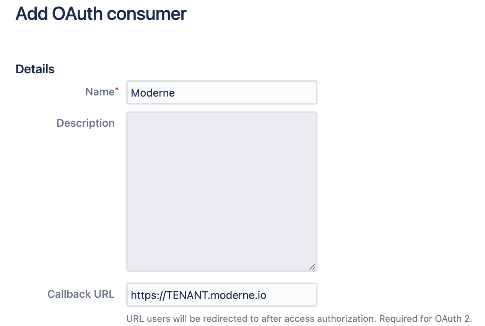
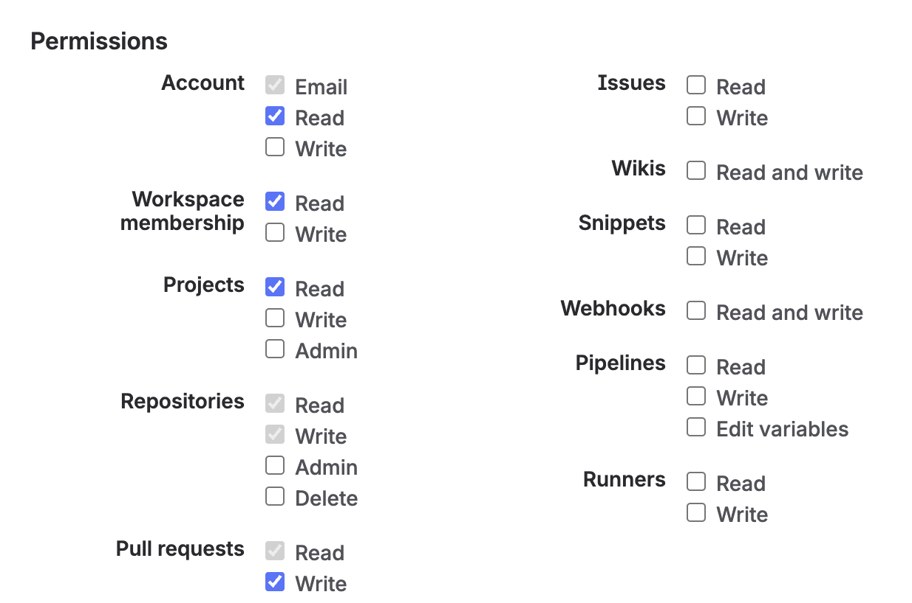
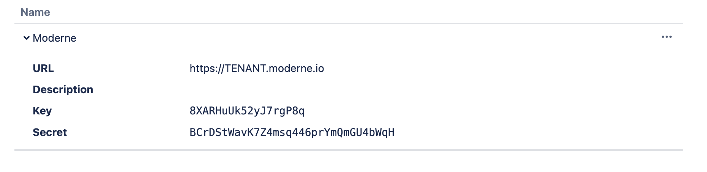

import Tabs from '@theme/Tabs';
import TabItem from '@theme/TabItem';

# Configure an agent with Bitbucket Cloud access

In order to view recipe results and commit changes from a recipe back to Bitbucket, you'll need to create an application link in Bitbucket and configure the Moderne agent with the appropriate variables.

To assist with that, this guide will:

* [Walk you through how to configure your Bitbucket Cloud instance to support the agent](#step-1-create-a-bitbucket-oauth-consumer)
* [Provide you with a list of necessary variables the agent needs to communicate with your Bitbucket instance](#step-2-configure-the-moderne-agent)

## Prerequisites

* You will need access to create a Bitbucket OAuth Consumer

## Bitbucket configuration

### Step 1: Create a Bitbucket OAuth Consumer

Follow [this Atlassian guide](https://support.atlassian.com/bitbucket-cloud/docs/use-oauth-on-bitbucket-cloud/) to create an OAuth Consumer.

Once that's done, configure the callback URL to point at your Moderne tenant:

<figure>
  
  <figcaption></figcaption>
</figure>

The consumer should have these permissions:

<figure>
  
  <figcaption></figcaption>
</figure>

* Projects - Read
* Repositories - Write
* Pull requests - Write

Once your consumer has been created, you should see a `key` and a `secret`:

<figure>
  
  <figcaption></figcaption>
</figure>

Please save those for use in [Step 2](#step-2-configure-the-moderne-agent).

## Agent configuration

### Step 2: Configure the Moderne agent

The following table contains all of the variables/arguments you need to add to your Moderne agent run command in order for it to work with your Bitbucket instance. Please note that these variables/arguments must be combined with ones found in other steps in the [Configuring the Moderne agent guide](./agent-config.md).

<Tabs>
<TabItem value="oci-container" label="OCI Container">

**Environment variables:**

| Variable Name                                 | Required | Default | Description                                            |
|-----------------------------------------------|----------|---------|--------------------------------------------------------|
| `MODERNE_AGENT_BITBUCKET_CLOUD_OAUTH_KEY`     | `true`   |         | The key specified in your Bitbucket OAuth consumer.    |
| `MODERNE_AGENT_BITBUCKET_CLOUD_OAUTH_SECRET`  | `true`   |         | The secret specified in your Bitbucket OAuth consumer. |

**Example:**

```bash
docker run \
# ... Existing variables
-e MODERNE_AGENT_BITBUCKET_CLOUD_OAUTH_KEY=yourOAuthKey \
-e MODERNE_AGENT_BITBUCKET_CLOUD_OAUTH_SECRET=yourSecretKey \
# ... Additional variables
```
</TabItem>

<TabItem value="executable-jar" label="Executable JAR">

**Arguments:**

| Argument Name                                 | Required | Default | Description                                            |
|-----------------------------------------------|----------|---------|--------------------------------------------------------|
| `--moderne.agent.bitbucket.cloud.oauthKey`    | `true`   |         | The key specified in your Bitbucket OAuth consumer.    |
| `--moderne.agent.bitbucket.cloud.oauthSecret` | `true`   |         | The secret specified in your Bitbucket OAuth consumer. |

**Example:**

```bash
java -jar moderne-agent-{version}.jar \
# ... Existing arguments
--moderne.agent.bitbucket.cloud.oauthKey=yourOAuthKey \
--moderne.agent.bitbucket.cloud.oauthSecret=yourSecretKey \
# ... Additional arguments
```
</TabItem>
</Tabs>
