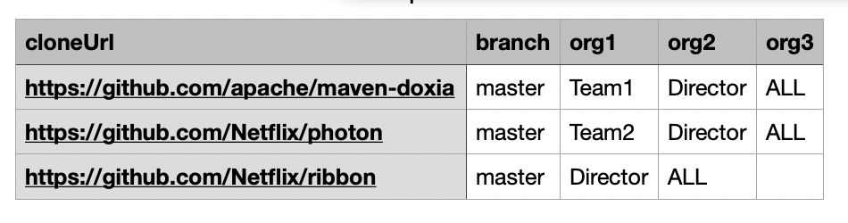

import Tabs from '@theme/Tabs';
import TabItem from '@theme/TabItem';


# Configure the organizational hierarchy

## What is the organizational hierarchy?

In Moderne, an _organization_ is a collection of related repositories. The organizational hierarchy defines how these organizations are structured and related to one another.

A pre-configured organization hierarchy streamlines work on the Moderne platform by enabling operations to target well-defined groups of repositories. For example, if Team 1 wants to run a migration on only their own repositories, they can select their team’s organization. Meanwhile, a manager overseeing both Team 1 and Team 2 could select the parent organization to run operations across both teams’ repositories.

```
ALL
├── VP
    └── Director
        └── Manager
           ├── Team 1
           └── Team 2
```


There are no strict requirements for how the organizational hierarchy must be structured. However, customers often model it after their internal reporting hierarchy.

## Is the organization hierarchy mandatory?

No. If no organization hierarchy is configured, all repositories will default to the `All` organization. This setup can be suitable when managing a relatively small number of repositories. However, as your repository count grows, we recommend establishing an organization hierarchy to improve structure and scalability.

## How is the organization hierarchy defined?

Organizational structure is a configured via a `repos.csv` file, accessible to the Agent via the file system or network. Depending on your deployment configuration, this may be done by placing the file in the same host as the agent or by using a file/network mount. The Agent can also be configured with an unauthenticated HTTP/s URI that serves the aforementioned `repos.csv`.

This configuration is best explained with an example. Consider an organization that consists of two teams and two directors:  

```
All
├── Director A
|       └── Team 1
|       └── Team 2
├── Director B

```

The following CSV file would represent this organizational structure:

```bash showLineNumbers
cloneUrl,branch,org1,org2,org3
"https://github.com/apache/maven-doxia","master","Team 1","Director A","ALL"
"https://github.com/Netflix/photon","main","Team 2","Director A","ALL"
"https://github.com/Netflix/ribbon","master","Director A","ALL"
"https://github.com/apache/maven-doxia","master","Director B","ALL"
```

In the above file, we define 5 organizations (ALL, Director A, Director B, Team 1, and Team 2) and 3 repositories. Notice that one repository can be defined multiple times if you want two distinct organizations to have access to it. 

Also note that organizations on the left are children of organizations on the right. For instance, `Team 1` is a child of `Director A` which is a child of `ALL`.

:::tip
Comma-separated files (CSV) are best manipulated using a dedicated editor such as Microsoft Excel, Google Sheets, or Apple Numbers. Here is what the above CSV would look like on Apple Numbers:


:::
    
## Expected format for `repos.csv` 

- Use quotation marks around each value to help differentiate between the different columns.
- A single row may not have more columns than what is defined in the first row.
- A single repository may be associated with multiple organizations by being referenced in multiple rows. In the above example, `maven-doxia` is associated with both `Director B` and `Team 1`.
- Repositories can be associated with any organization down the tree, not just the leaves. See line 4 in the `csv` file for an example.


:::warning
Org columns must start immediately after the branch column. Likewise, they must be contiguous. **Do not** try and add empty orgs so that the orgs line up with one another.

<Tabs>
<TabItem value="not-this" label="Don't do this">
```bash {showLineNumbers}
cloneUrl,branch,org1,org2,org3,org4
"https://github.com/apache/maven-doxia","master","Team 1","Director A","ALL"
# Non-contiguous series of orgs 👇 
"https://github.com/Netflix/photon","main","Team 2","","Director B","ALL"
# First org does not start immediately after the branch column 👇 
"https://github.com/Netflix/ribbon","master","","Director A","ALL"
```
</TabItem>

<TabItem value="do-this" label="Do this">
```bash {showLineNumbers}
cloneUrl,branch,org1,org2,org3,org4
"https://github.com/apache/maven-doxia","master","Team 1","Director A","ALL"
"https://github.com/Netflix/photon","main","Team 2","Director B","ALL"
"https://github.com/Netflix/ribbon","master","Director A","ALL"
```
</TabItem>
</Tabs>
:::

## Agent configuration

The `repos.csv` source location is configured via the `moderne.agent.organization.repoCsv` variable. Its value may be a local path or an unauthenticated HTTP URI. You can also configure how often the agent looks for changes to this file (by default it's every 10 minutes).

<Tabs groupId="agent-type">
<TabItem value="oci-container" label="OCI Container">

**Environment variables:**

| Environment variable | Required | Default | Description |
|----------------------|----------|---------|-------------|
| `MODERNE_AGENT_ORGANIZATION_REPOSCSV`  | `true` |  | The path to the `repos.csv` file that defines your organizational structure. |
| `MODERNE_AGENT_ORGANIZATION_SERVICE_UPDATE_INTERVAL_SECONDS` | `false` | 600 | The number of seconds that the agent should wait before it checks for an update to your `repos.csv` file. |

**Example:**

```bash
docker run \
# ... Existing variables
-e MODERNE_AGENT_ORGANIZATION_REPOSCSV=/Users/MY_USER/Documents/repos.csv \
# ... Additional variables
```

</TabItem>

<TabItem value="executable-jar" label="Executable JAR">

**Arguments:**

| Argument name | Required | Default | Description |
|----------------------|----------|---------|-------------|
| `--moderne.agent.organization.reposCsv`  | `true` |  | The path to the `repos.csv` file that defines your organizational structure. |
| `--moderne.agent.organization.service.update.interval.seconds` | `false` | 600 | The number of seconds that the agent should wait before it checks for an update to your `repos.csv` file. |

**Example:**

```bash
java -jar moderne-agent-{version}.jar \
# ... Existing arguments
--moderne.agent.organization.reposCsv=/Users/MY_USER/Documents/repos.csv \
# ... Additional arguments
```

</TabItem>
</Tabs>