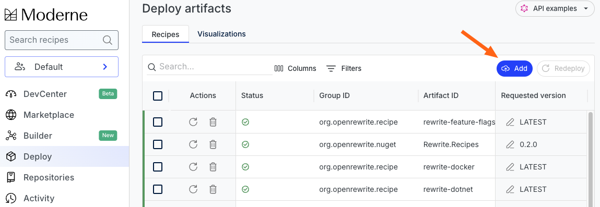
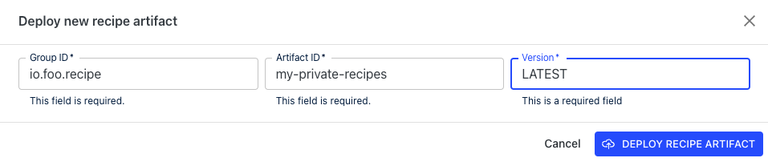

import Tabs from '@theme/Tabs';
import TabItem from '@theme/TabItem';

# Multi-tenant private recipes

:::warning
The instructions on this page will only apply to you if:

* Your company is using the [app.moderne.io](https://app.moderne.io/getting-started) tenant AND
* You want to upload and deploy your own company-specific recipes that nobody else can, but your team should be able to see or run

If your company has your own private tenant (e.g., `<tenant>.moderne.io`), then this page **does not** apply to you.
:::

### Configuration

When you log in to Moderne, you can either log in with GitHub or BitBucket Cloud.

In order for this feature to work, everyone at your company who logs in to Moderne will need to use the same SCM to log in, and they must have the same email domain for their primary email address in said SCM.

In other words, if you worked at `Foo` and you used GitHub to log in to [app.moderne.io](https://app.moderne.io/getting-started), everyone at your company would need to have their primary GitHub email address be set to their `Foo` email address (e.g., `<someone>@foo.io`).

Once that's true, you will need to grab the email domain (`foo.io`) and:

<Tabs groupId="agent-type">
<TabItem value="oci-container" label="OCI Container">

Set the `MODERNE_AGENT_TENANTDOMAIN` property in your agent configuration to the domain name from above.
</TabItem>

<TabItem value="executable-jar" label="Executable JAR">

Set the `moderne.agent.tenantDomain` property in your agent configuration to the domain name from above.
</TabItem>
</Tabs>

### Deploying private recipes

Anyone with an email address that matches the `tenantDomain` is allowed to both upload and use recipes for that domain.

:::danger
All recipes that should be private to your company **must** start with the reverse of your email domain name (e.g., if your domain is `foo.io`, then all recipes must start with `io.foo`).
:::

1. Navigate to the [Moderne deploy page](https://app.moderne.io/recipes/deploy) and press the `Add` button:

<figure>
  
  <figcaption></figcaption>
</figure>

2. Fill in the recipe artifact information and press "deploy recipe artifact".

<figure>
  
  <figcaption></figcaption>
</figure>

:::tip
You can use `LATEST` as the version so that the recipe will pick up the latest snapshot or release version.\
:::

### Using private recipes

Anyone logged in with the correct email domain will automatically see their company's private recipes in the marketplace. They can use them just like any other (public) recipe.

### Troubleshooting

> _You cannot upload a tenant private recipe with a groupId that does not start with the reverse domain name_.

This warning will appear when your recipe does not start with the reverse of your email domain. For example, if your email domain was `foo.io` and you tried to upload a recipe that was `bar.io`.

> _Unable to deploy as a private recipe, `io.foo` is not a known tenant domain._

This warning will appear if you try to upload a private recipe and your email domain is not a known/configured tenant domain.
