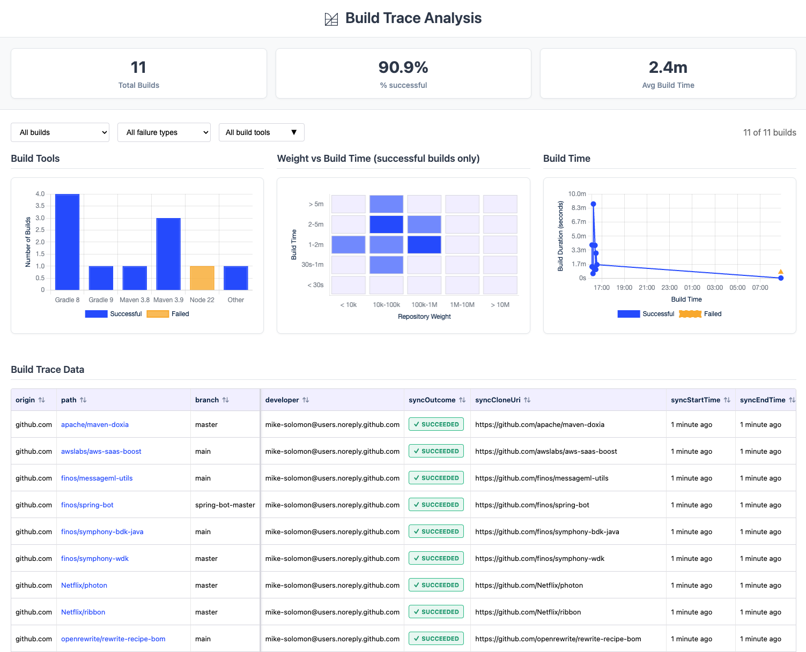
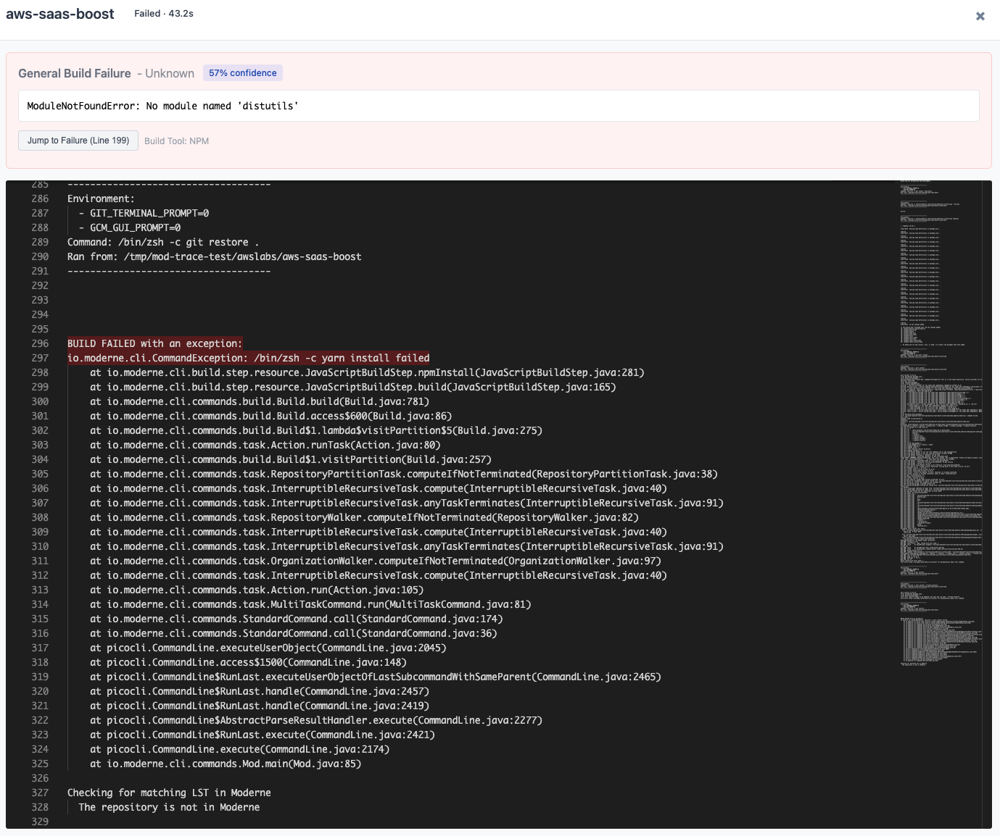

# Analyzing build failures with mod trace

When building [Lossless Semantic Trees (LSTs)](../references/lossless-semantic-trees.md) across many repositories, some builds will inevitably fail due to missing dependencies, compilation errors, or infrastructure issues. If you are managing a handful of repositories, you can probably dig through logs one at a time.

But what if you are working with dozens or hundreds of repos? You will need a way to step back and see the bigger picture: Which failures are related? What are the most common root causes? Where should you focus your effort first?

Fortunately, the Moderne CLI offers a solution to this: the `mod trace builds analyze` command. With it, you can launch an interactive dashboard that reads your build trace data, automatically classifies failures, and groups similar issues together so you can triage them in bulk instead of repo by repo.

In this guide, we will walk you through how to launch the analyzer, how to interpret its output, and how to use it to prioritize fixes across your organization.

## Prerequisites

This guide assumes that you have:

* [Moderne CLI](../../../user-documentation/moderne-cli/getting-started/cli-intro.md) version 3.45.0 or later
* [Node.js](https://nodejs.org/) installed (required to run the dashboard)

## Launching the build trace analyzer

After running `mod build` against a workspace, you can launch the analyzer. This starts a local web server and opens the dashboard in your browser automatically.

To analyze the most recent build:

```bash
mod trace builds analyze /path/to/workspace --last-build
```

To target a specific build by ID:

```bash
mod trace builds analyze /path/to/workspace --build <buildId>
```

:::tip
If you have aggregated build logs into a zip file (using `mod log builds add`), you can analyze the zip directly:

```bash
mod trace builds analyze /path/to/ingest-log.zip
```

This is useful when collecting build results from multiple machines or CI runs.
:::

## Understanding the dashboard

Once the dashboard opens, you will see four areas: summary statistics at the top, filter controls, charts, and a detailed build table at the bottom.

<figure>
  
  <figcaption>_The build trace analysis dashboard showing summary statistics, charts, and the build table_</figcaption>
</figure>

### Summary statistics

At the top of the dashboard, three metrics give you an at-a-glance view of the build:

* **Total Builds** - the number of repositories that were built
* **% successful** - the overall success rate
* **Avg Build Time** - the mean build duration across all repositories

### Filter controls

Below the statistics, three dropdowns let you narrow the view:

* **Build status** - show all builds, only successful builds, or only failed builds
* **Failure type** - filter by failure classification (Dependency, Build, or Other)
* **Build tools** - filter by build tool (Gradle, Maven, npm, etc.)

### Charts

Below the filters, three charts help you spot patterns across the build:

* **Build Tools** - a bar chart showing the distribution of build tools (Gradle, Maven, etc.) with success and failure counts for each
* **Weight vs Build Time** - a scatter plot of successful builds showing repository size against build duration, useful for spotting unusually slow builds
* **Build Time** - a timeline of build durations, helpful for identifying timeouts or infrastructure slowdowns

### Build table

The main table shows one row per repository with columns including path, branch, build outcome, failure type, build duration, and build tool version. The origin, path, and branch columns stay frozen on the left while you scroll horizontally to see the remaining columns.

<figure>
  
  <figcaption>_Scrolling right in the table reveals the build outcome and failure type columns_</figcaption>
</figure>

To view the log for any build, click on the **path** column value (e.g., `awslabs/aws-saas-boost`). The path appears as a clickable link when a build log is available.

## Understanding failure classifications

The analyzer automatically reads each failed build log and classifies the failure into one of three broad categories:

* **Dependency** - the build could not resolve one or more dependencies. Sub-groups include:
  * `resolution` - generic resolution failures ("could not resolve", "resolve failed")
  * `missing-artifact` - a specific artifact was not found
  * `network` - connection timeouts or refused connections
  * `auth` - authentication or credential failures

* **Build** - the build failed during compilation or execution. Sub-groups include:
  * `memory` - out of memory or heap space errors
  * `symbols` - cannot find symbol or missing class errors
  * `syntax` - syntax or compilation errors
  * `timeout` - build killed due to timeout
  * `permissions` - file or directory access denied

* **Other** - failures that do not match a known pattern

Similar failures within each category are clustered together and labeled with a number (e.g., "Dependency #1", "Dependency #2"). Repositories that share the same cluster likely have the same root cause, which helps you fix issues in batches rather than one at a time.

## Viewing build logs

When you click a repository's path in the table, a modal opens showing the full build log. For failed builds, the modal also includes a failure analysis summary at the top with:

* The classified failure type and confidence level
* The most relevant error lines extracted from the log
* A **Jump to Failure** button that scrolls directly to the problem area in the log

The failure analysis highlights the actual exception or error message while filtering out noise like stack trace lines, generic status messages, and build tool boilerplate.

<figure>
  
  <figcaption>_The log viewer modal showing failure analysis at the top and the full build log below_</figcaption>
</figure>

## Common troubleshooting workflows

### Triaging a large batch of failures

1. Launch the analyzer and note the overall success rate
2. Use the **Failure type** filter to group failures by category
3. Start with the largest failure group (e.g., "Dependency #1" affecting 15 repos)
4. Click the path of one representative failure to open its log and identify the root cause
5. Fix the underlying issue (e.g., add a missing repository to your artifact manager)
6. Re-run `mod build` and re-analyze to confirm the fix

### Identifying dependency issues

Filter to **Dependency** failures. Common causes include:

* Internal artifacts not published to your artifact manager
* Network policies blocking access to external repositories
* Expired or missing credentials for private repositories

### Investigating slow builds

Use the **Weight vs Build Time** scatter plot to find outliers. Click the path of any slow build to check its log for issues like excessive test execution or resource contention.

## Analyzing recipe runs and syncs

The `mod trace` command is not limited to builds. The CLI also provides analyzers for recipe runs and repository syncs:

```bash
mod trace runs analyze /path/to/workspace --last-run
mod trace syncs analyze /path/to/workspace --last-sync
```

These dashboards follow the same layout but show metrics relevant to their operation (e.g., files changed and recipe distribution for runs, or clone outcomes for syncs).

## Aggregating logs across machines

If builds are distributed across multiple machines or CI pipelines, you can aggregate logs into a zip file before analyzing. Run this on each machine after building:

```bash
mod log builds add /path/to/workspace aggregate.zip --last-build
```

Then analyze the aggregated zip:

```bash
mod trace builds analyze aggregate.zip
```

This gives you a single dashboard view across your entire build fleet.
