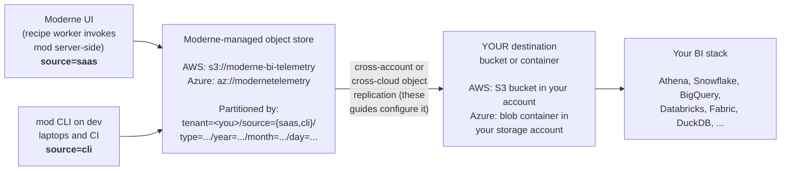

# Configuring telemetry exports and reports

{/*
DRAFT REVIEWER NOTES (remove before publishing):

1. Replication-role ARN naming: the doc uses arn:aws:iam::297794628946:role/moderne-bi-telemetry-replication-role-<your-tenant> per the planned per-tenant role layout (Ken, 2026-05-21). The infra work to actually create these per-tenant roles is in flight (CLI-telemetry and S3-replication PRs still open as of 2026-05-20). Confirm the AWS account ID and the exact role-name pattern once infra ships before publishing. Per Olga (2026-05-20): destination KMS/CMK guidance was intentionally removed. The bucket-level SSE-S3 default plus HTTPS-in-transit are sufficient; do not reintroduce a CMK setup path.

2. Azure source identity: the doc reflects the planned per-tenant UAMI model (`moderne-bi-telemetry-replication-uami-<your-tenant>`) attached to the shared `modernetelemetry` storage account. This was a deliberate architectural choice (Ken, 2026-05-21) to keep the customer-side flow on Azure as close to AWS as possible: one tenant-specific write grant to one destination container on either cloud. The object ID stays a CSM-handoff value because Azure assigns the GUID at UAMI creation time. Confirm with infra that the per-tenant UAMI naming and attachment landed as planned before publishing.

3. Tenant prefix scoping: the source side filters replication to tenant=tenantName/ (with trailing slash). Confirm with infra that the actual replication rule filter exactly matches this prefix string.

4. Publish stage: mod publish gained trace.csv support in CLI #3650 (2026-04-10) and was extended in #3713 to embed sync + build columns. The moderne-bi-templates data dictionary linked from this page does not yet enumerate the publishOutcome / publishStartTime / publishEndTime / publishId / publishUri columns — open a follow-up on moderne-bi-templates to extend it.
*/}

Moderne emits structured usage telemetry for every recipe run, build, and commit produced through the platform or the CLI. This set of guides walks platform administrators through:

1. What telemetry Moderne collects and where it lands by default (this page).
2. How to receive a continuous copy of *your tenant's* telemetry in a bucket or storage account you own, via cross-account or cross-cloud object replication. Pick the page for your cloud:
   * [AWS replication setup](./aws-replication.md)
   * [Azure replication setup](./azure-replication.md)
3. How to query that data and build reports. See [Querying and BI](./querying-and-bi.md).

:::info
**Availability.** The platform-native telemetry described here ships with **Moderne SaaS v2 tenants**. If you are still on v1, the [CLI wrapper-script approach](https://docs.moderne.io/user-documentation/moderne-cli/how-to-guides/cli-telemetry-s3-export) remains supported in parallel and stays the right path for CLI-only deployments not connected to a Moderne tenant.
:::

## What gets collected

Moderne produces a single, uniform trace schema regardless of where the command ran. Each completed command writes one row to a `trace.csv`. Rows include only command metadata: repository identifiers, timings, tool versions, outcomes, and the user's git email. No source code, no recipe output, no secrets, and no LST contents are emitted.

There are two **sources** that produce this telemetry:

| Source        | What it represents                                                                                                                                                                                                   | When you'll see rows                                                                |
|---------------|----------------------------------------------------------------------------------------------------------------------------------------------------------------------------------------------------------------------|-------------------------------------------------------------------------------------|
| `source=saas` | Recipe runs, builds, and commits originated from the Moderne web UI. The recipe worker fleet invokes the same CLI server-side and uploads the resulting `trace.csv`.                                                 | Any user clicking "Run recipe" or "Commit changes" in the UI.                       |
| `source=cli`  | Commands run by developers (or CI jobs) on their own machines using `mod`, signed into your tenant. The CLI queues each trace locally and pushes it to your tenant gateway when it next refreshes its license lease. | Anyone running `mod build`, `mod run`, `mod git commit`, etc., against your tenant. |

Both sources land in the same place, with the same partition layout, so queries can analyze them together or filter to one source as needed.

### Schema reference

The CSV schema is hierarchical: each command embeds rows from prior pipeline stages. There are two pipelines, sharing the early stages:

* **Recipe pipeline**: sync → build → run → apply → add → commit → push.
* **Publish pipeline**: sync → build → publish (the LST publication path used by [mass ingest](../mass-ingest.md) and CI).

The full column-by-column reference lives in the BI-templates repo:

* [trace.csv data dictionary](https://github.com/moderneinc/moderne-bi-templates/blob/main/data-dictionary/trace-csv.md)

A quick orientation:

| Stage                       | Representative columns                                                            | Populated after                                                |
|-----------------------------|-----------------------------------------------------------------------------------|----------------------------------------------------------------|
| Common                      | `origin`, `path`, `branch`, `developer`                                           | always                                                         |
| Sync                        | `syncOutcome`, `syncChangeset`, `syncElapsedTimeMs`                               | `mod git sync`                                                 |
| Build                       | `buildOutcome`, `buildCliVersion`, `buildLineCount`, build-tool versions          | `mod build`                                                    |
| Run                         | `runRecipe`, `runOutcome`, `runResultsCount`, `runElapsedTimeMs`                  | `mod run`                                                      |
| Apply / Add / Commit / Push | per-stage outcomes and identifiers                                                | corresponding `mod git ...`                                    |
| Publish                     | `publishOutcome`, `publishStartTime`, `publishEndTime`, `publishId`, `publishUri` | `mod publish` (LST publication; used by mass-ingest pipelines) |
| Organization                | `organization` (column 74)                                                        | when run within a Moderne organization context                 |

## How telemetry flows into your environment



### Object key layout

Every trace lands at:

```
tenant=<your-tenant>/source={saas|cli}/type=<command>/year=YYYY/month=MM/day=DD/<command-id>.csv
```

The Hive-style partition keys (`tenant=`, `source=`, `type=`, `year=`, `month=`, `day=`) are recognized by every major query engine for partition pruning. A query that filters on, say, `day = '15' AND month = '03'` will read only those keys, not the full bucket.

Object access inside the Moderne-managed bucket is scoped per-tenant: your tenant's IAM/RBAC only grants access to the `tenant=<your-tenant>/` prefix. The replication rules described in the cloud-specific guides preserve that scoping by only replicating keys under your tenant's prefix into your destination.

## Customer checklist

The cloud-specific guides below walk through each step in detail. At a glance, you'll need to:

* [ ] Pick your destination cloud and region.
* [ ] Create the destination bucket / storage account and container.
* [ ] Enable versioning (and change feed, on Azure).
* [ ] Apply the bucket policy / role assignment (copy-paste templates in the cloud-specific guide).
* [ ] Send your CSM: tenant name, destination ARN / resource ID, and region.
* [ ] Wait for Moderne to confirm replication is live (~1 business day).
* [ ] Register the schema in your BI / query engine and start querying.

## Continue

Pick the next page based on your environment:

* **AWS tenant or destination** → [AWS replication setup](./aws-replication.md)
* **Azure tenant or destination** → [Azure replication setup](./azure-replication.md)
* **Already replicating** → [Querying and BI](./querying-and-bi.md)

For questions or to kick off replication setup, contact your CSM or [support@moderne.io](mailto:support@moderne.io).
