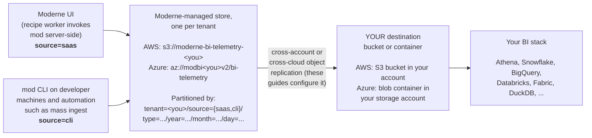

# Configuring telemetry exports and reports

Moderne emits structured usage telemetry for every recipe run, build, and commit produced through the platform or the CLI. This set of guides covers:

1. What telemetry Moderne collects and where it lands by default.
2. How to receive a continuous copy of *your tenant's* telemetry in a bucket or storage account you own, with separate setup paths for [AWS](./aws-replication.md) and [Azure](./azure-replication.md).
3. How to [query that data and build reports](./querying-and-bi.md).

## What gets collected

Moderne produces a single, uniform trace schema regardless of where the command ran. Each completed command writes one row to a `trace.csv`. Rows include only command metadata: repository identifiers, timings, tool versions, outcomes, and the user's git email. No source code, no recipe output, and no LST contents are emitted.

One exception is worth knowing about: `mod exec` records the command line it ran (`execCommand`) and the directory it ran in (`execExecutionDirectory`). Pass credentials to `mod exec` through environment variables rather than as command arguments, so they are not captured in telemetry.

There are two **sources** that produce this telemetry:

| Source        | What it represents                                                                                                                                                                                                                                                                             | When you'll see rows                                                                      |
|---------------|------------------------------------------------------------------------------------------------------------------------------------------------------------------------------------------------------------------------------------------------------------------------------------------------|-------------------------------------------------------------------------------------------|
| `source=saas` | Recipe runs, builds, and commits originated from the Moderne web UI. The recipe worker fleet invokes the same CLI server-side and uploads the resulting `trace.csv`.                                                                                                                           | Any user clicking "Run recipe" or "Commit changes" in the UI.                             |
| `source=cli`  | Everything run with `mod` outside the web UI, signed into your tenant. That covers developer machines and any automation you run, including [mass ingest](../mass-ingest.md). The CLI queues each trace locally and pushes it to your tenant gateway when it next refreshes its license lease. | Anyone running `mod build`, `mod run`, `mod git commit`, etc., and every mass-ingest run. |

Both sources land in the same place, with the same partition layout, so queries can analyze them together or filter to one source as needed.

### How and when CLI telemetry is pushed

A signed-in CLI queues each trace locally and auto-pushes queued telemetry to your tenant gateway when it refreshes its license lease, which happens at most once every three days.

If the default cadence isn't frequent enough for your reporting, add `mod telemetry publish` to your customized [`modw` wrapper](../../../../user-documentation/moderne-cli/how-to-guides/cli-wrapper.md) with no other change to how the CLI is used.

### Schema reference

The CSV schema is hierarchical: each command embeds rows from prior stages of the workflow it belongs to.

* **Recipe workflow**: sync → *build (optional)* → run → apply → add → commit → push.
* **Publish workflow**: sync → build → publish (the LST publication path used by [mass ingest](../mass-ingest.md)).

Build is optional because `mod git sync` can download a prebuilt LST instead of source, in which case `mod run` follows sync directly without a local build. Expect this wherever a central team runs [mass ingest](../mass-ingest.md) and everyone else runs recipes against the published LSTs, as in [mass run](../../../moderne-dx/how-to-guides/mass-run-dx.md). You will still see local builds alongside it, since developers build branches the central team doesn't ingest.

The build columns are populated either way. Each LST carries a record of the build that produced it, so a downloaded LST contributes that original build's values to the trace. See [build columns and prebuilt LSTs](../../../../user-documentation/moderne-cli/references/trace-csv.md#build-columns-and-prebuilt-lsts).

In addition, `mod exec` (`type=exec`) and MCP server tool calls (`type=mcp`) emit standalone traces that are not part of either workflow chain.

The full column-by-column reference is the [trace.csv reference](../../../../user-documentation/moderne-cli/references/trace-csv.md).

A quick orientation:

| Stage                       | Representative columns                                                            | Populated after                                                |
|-----------------------------|-----------------------------------------------------------------------------------|----------------------------------------------------------------|
| Common                      | `origin`, `path`, `branch`, `developer`                                           | always                                                         |
| Sync                        | `syncOutcome`, `syncChangeset`, `syncElapsedTimeMs`                               | `mod git sync`                                                 |
| Build                       | `buildOutcome`, `buildCliVersion`, `buildLineCount`, build-tool versions          | `mod build`, or carried from a downloaded LST's own record     |
| Run                         | `runRecipeId`, `runOutcome`, `runFilesWithFixResults`, `runElapsedTimeMs`         | `mod run`                                                      |
| Apply / Add / Commit / Push | per-stage outcomes and identifiers                                                | corresponding `mod git ...`                                    |
| Publish                     | `publishOutcome`, `publishStartTime`, `publishEndTime`, `publishId`, `publishUri` | `mod publish` (LST publication; used by mass-ingest pipelines) |
| Exec                        | `execCommand`, `execExitCode`, `execExecutionDirectory`, `execElapsedTimeMs`      | `mod exec`                                                     |
| MCP                         | `mcpToolName`, `mcpOutcome`, `mcpMatchCount`, `mcpElapsedTimeMs`                  | MCP server tool calls                                          |
| Organization                | `organization`                                                                    | when run within a Moderne organization context                 |

## How telemetry flows into your environment


```mermaid
flowchart LR
    UI["Moderne UI<br/>(recipe worker invokes<br/>mod server-side)<br/><b>source=saas</b>"]
    CLI["mod CLI on developer<br/>machines and automation<br/>such as mass ingest<br/><b>source=cli</b>"]
    Store["Moderne-managed store,<br/>one per tenant<br/><br/>AWS: s3://moderne-bi-telemetry-&lt;you&gt;<br/>Azure: az://modbi&lt;you&gt;v2/bi-telemetry<br/><br/>Partitioned by:<br/>tenant=&lt;you&gt;/source={saas,cli}/<br/>type=.../year=.../month=.../day=..."]
    Dest["YOUR destination<br/>bucket or container<br/><br/>AWS: S3 bucket in your account<br/>Azure: blob container in<br/>your storage account"]
    BI["Your BI stack<br/><br/>Athena, Snowflake, BigQuery,<br/>Databricks, Fabric, DuckDB, ..."]

    UI --> Store
    CLI --> Store
    Store -- "cross-account or<br/>cross-cloud object<br/>replication (these<br/>guides configure it)" --> Dest
    Dest --> BI
```

### Object key layout

Every trace lands at:

```
tenant=<your-tenant>/source={saas|cli}/type=<command>/year=YYYY/month=MM/day=DD/<command-id>.csv
```

The Hive-style partition keys (`tenant=`, `source=`, `type=`, `year=`, `month=`, `day=`) are recognized by every major query engine for partition pruning. A query that filters on, say, `day = '15' AND month = '03'` will read only those keys, not the full bucket.

Telemetry is isolated by storage account rather than by prefix: each tenant writes to its own Moderne-managed bucket or container, and the delivery described in the cloud-specific guides reads from that one. No tenant's data passes through a store another tenant can reach.

## Customer checklist

The cloud-specific guides below walk through each step in detail. At a glance, you'll need to:

* Pick your destination cloud and region.
* Create the destination bucket / storage account and container.
* Enable versioning (and change feed, on Azure).
* Apply the access grant from the cloud-specific guide: a Moderne-provided bucket policy on AWS, or a role-assignment command on Azure.
* Send your CSM: tenant name, destination ARN / resource ID, and region.
* Wait for Moderne to confirm replication is live (~1 business day).
* Register the schema in your BI / query engine and start querying.

## Continue

Pick the next page based on your environment:

* **AWS tenant or destination** → [AWS replication setup](./aws-replication.md)
* **Azure tenant or destination** → [Azure replication setup](./azure-replication.md)
* **Already replicating** → [Querying and BI](./querying-and-bi.md)

For questions or to kick off replication setup, contact your CSM or [support@moderne.io](mailto:support@moderne.io).
