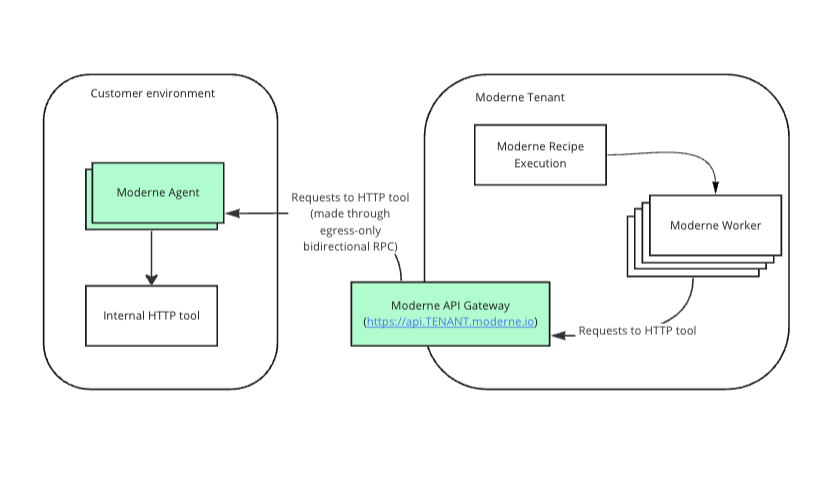

import Tabs from '@theme/Tabs';
import TabItem from '@theme/TabItem';

# Configure a Connector with generic HTTP tools for use in recipes

You have internal services within your enterprise that you may want to use within your recipes. Some possible examples follow:

* Launch Darkly - I want to use a recipe to identify code paths that can no longer be hit due to a Launch Darkly flag that has been turned on for a long time.
* Security advisory database - I have a security advisory database internally, and I want to use a recipe to identify when my dependencies match a security advisory in my internal database.
* NPM registries - I want to run a recipe that reads package metadata from a private npm registry.

Setting up a generic HTTP tool will allow you to use `org.openrewrite.ipc.http.HttpSender` from your internal recipes to call tools inside your environment. [Example usage of HttpSender](https://github.com/openrewrite/rewrite-generative-ai/blob/357d5f39f22cf47f4d5df417c1ddb6c883dd5c24/src/main/java/org/openrewrite/ai/model/GenerativeCodeEditor.java#L48-L57).

:::info
NodeJS dependency recipes no longer run `npm install`. Lock files are regenerated by an in-process engine in `rewrite-javascript` that reads package metadata from the registry over HTTP, and `org.openrewrite.nodejs.NpmExecutor` has been removed. Registries and credentials are now supplied through `org.openrewrite.javascript.NodeExecutionContextView`, or discovered from `.npmrc`, `.yarnrc.yml`, and pnpm configuration in the repository.
:::

<figure>
  
  <figcaption></figcaption>
</figure>

## Connector configuration

The following table contains all the variables/arguments you need to add to your Moderne Connector run command to work with your HTTP tool. Please note that these variables/arguments must be combined with ones found in other steps in the [Configuring the Moderne Connector guide](./connector-config.md).

You can configure multiple generic HTTP tools by including multiple entries, each with a different `{index}`.

Properties are listed by their canonical name. For how to supply each one as an environment variable or a JAR argument, please see [Property naming](./connector-property-naming.md).

| Property                                                          | Required | Default | Description                                                                                                                                                                                                              |
|-------------------------------------------------------------------|----------|---------|--------------------------------------------------------------------------------------------------------------------------------------------------------------------------------------------------------------------------|
| `moderne.connector.http-tool[{index}].uri`                        | `true`   |         | Fully qualified URL to your HTTP tool.                                                                                                                                                                                   |
| `moderne.connector.http-tool[{index}].username`                   | `false`  |         | Username used to authenticate to HTTP tool. <br/><br/>**Note:** Only one of basic auth (username+password) and bearer token can be used. If username and password are specified, `bearer-token` must not be provided.    |
| `moderne.connector.http-tool[{index}].password`                   | `false`  |         | Password used to authenticate to HTTP tool. <br/><br/>**Note:** Only one of basic auth (username+password) and bearer token can be used. If username and password are specified, `bearer-token` must not be provided.    |
| `moderne.connector.http-tool[{index}].bearer-token`               | `false`  |         | Bearer token used to authenticate to HTTP tool. <br/><br/>**Note:** Only one of basic auth (username+password) and bearer token can be used. If `bearer-token` is specified, username and password must not be provided. |
| `moderne.connector.http-tool[{index}].skip-ssl`                   | `false`  | `false` | Specifies whether or not to skip SSL validation for HTTP connections to this HTTP tool. This must be set to `true` if you use a self-signed SSL/TLS certificate.                                                         |
| `moderne.connector.http-tool[{index}].skip-validate-connectivity` | `false`  | `false` | By default, on Connector startup, we will validate that we can connect to this HTTP tool, and fail to start up the Connector if we cannot. Set this to `true` to skip this validation.                                   |
| `moderne.connector.http-tool[{index}].proxy.host`                 | `false`  |         | The hostname of a proxy server to use for connections to this HTTP tool.                                                                                                                                                 |
| `moderne.connector.http-tool[{index}].proxy.port`                 | `false`  |         | The port of the proxy server to use for connections to this HTTP tool.                                                                                                                                                   |
| `moderne.connector.http-tool[{index}].connect-timeout`            | `false`  | `30s`   | Timeout for the connection to be established (and the first data received). Specified as a duration (e.g., `30s`, `1m`).                                                                                                 |
| `moderne.connector.http-tool[{index}].read-timeout`               | `false`  | `60s`   | Timeout for reading the response body from the HTTP tool. Specified as a duration (e.g., `60s`, `5m`).                                                                                                                   |

<Tabs groupId="agent-type">
<TabItem value="oci-container" label="OCI Container">

**Example:**

```bash
docker run \
# ... Existing variables
-e MODERNE_CONNECTOR_HTTPTOOL_0_URI=https://launchdarkly.mycompany.com \
-e MODERNE_CONNECTOR_HTTPTOOL_0_USERNAME=myUser \
-e MODERNE_CONNECTOR_HTTPTOOL_0_PASSWORD=${SECRET_NAME} \
# ... Additional variables
```
</TabItem>

<TabItem value="executable-jar" label="Executable JAR">

**Example:**

```bash
java -jar connector-{version}.jar \
# ... Existing arguments
--moderne.connector.http-tool[0].uri=https://launchdarkly.mycompany.com \
--moderne.connector.http-tool[0].username=myUser \
--moderne.connector.http-tool[0].password=${SECRET_NAME} \
# ... Additional arguments
```
</TabItem>

</Tabs>
