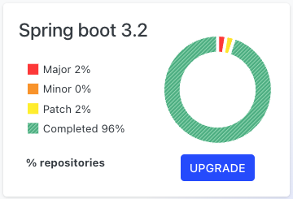
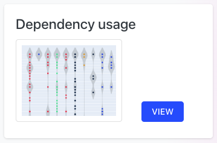
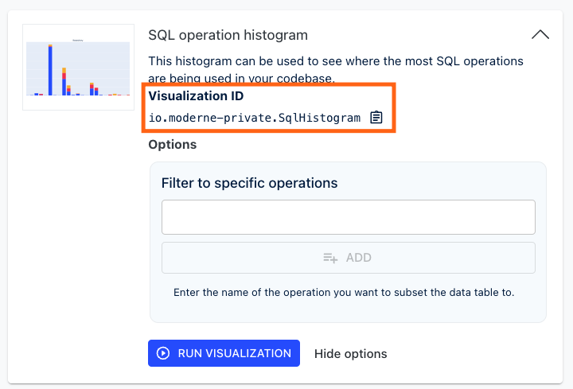
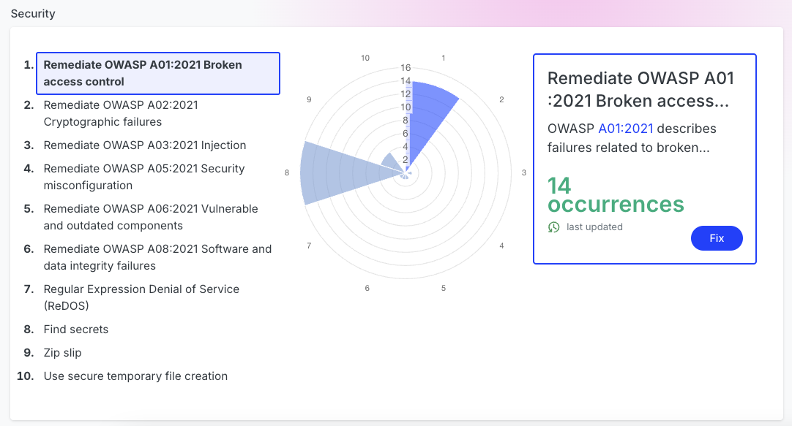

import Tabs from '@theme/Tabs';
import TabItem from '@theme/TabItem';

# Configuring the DevCenter

The Moderne DevCenter is the mission-control dashboard of the Moderne Platform. It provides you with high-level details about the state of all of your repositories. Using it, you can track the progress of upgrades, migrations, and security vulnerabilities. You can also use it to view [key visualizations](../../../user-documentation/moderne-platform/getting-started/visualizations.md) you care about – such as a dependency graph or a SQL operation usage chart.

In this doc, we'll walk you through everything you need to know to configure your own DevCenter.

## Prerequisites

In order to configure any DevCenters, there are two things you must have already done (which we'll touch upon below):

1. You must have configured an [organizational structure](agent-configuration/configure-organizations-hierarchy.md). 
2. You must ensure that the [Moderne agent Maven configuration](./agent-configuration/configure-an-agent-with-maven-repository-access.md) only has **one** entry where the recipe source is set to `true`. (Note: this does not apply to one Maven repository configured identically in multiple agents. Only that you cannot have two distinct Maven repositories configured where recipe source is set to `true`.)

### Moderne agent Maven configuration

In order for the DevCenter to function correctly, the agent needs to be configured with details about a Maven repository it can use to store and access recipe JARs from.

If you have not configured the Moderne agent with Maven repository access before, please follow [the instructions in our Moderne agent Maven configuration documentation](./agent-configuration/configure-an-agent-with-maven-repository-access.md) to add **one** entry with recipe source set to `true`.

If you have already configured the Moderne agent with Maven repository access, then you need to ensure that only _one_ has the configuration of `MODERNE_AGENT_MAVEN_{index}_RECIPESOURCE` / `moderne.agent.maven[{index}].recipeSource` set to `true`.

If you have multiple locations where recipes are stored, you will need to create a virtual repository that wraps all of the locations where recipes can be stored. You will also need to ensure that the virtual repository points to the following four repositories (alongside the other repositories where recipe artifacts are stored):

1. `https://oss.sonatype.org/content/repositories/snapshots/`
2. `https://s01.oss.sonatype.org/content/repositories/snapshots/`
3. `https://repo.maven.apache.org/maven2`
4. `https://repo1.maven.org/maven2/`

## DevCenter configuration

### Step 1: Create a `devcenter.json` file

The `devcenter.json` file is where all of the configuration lies for DevCenters. In this file, you can configure things like which organizations should have a DevCenter, what cards should appear on said DevCenter, and what the keys should be on the cards. 

For more details about each component that makes up this file, please see the [components of a DevCenter section at the bottom of this guide](#components-of-a-devcenter). You can also take a look at our `moderne-organizations` repository to [find a full example of this file](https://github.com/moderneinc/moderne-organizations/blob/main/src/main/resources/devcenter.json).

This `devcenter.json` file must follow [the GraphQL schema included in our moderne-organizations repository](https://github.com/moderneinc/moderne-organizations/blob/main/src/main/resources/schema/organizations.graphqls#L131-L150).


<details>
  <summary>
    Below you can find an example of what this file might look like:
  </summary>

  ```json title="devcenter.json"
  [
    {
      "devCenter": {
        "version" : 1,
        "upgradesAndMigrations": [
          {
            "title": "Spring boot",
            "measures": [
              {
                "name": "Major",
                "recipe": {
                  "recipeId": "org.openrewrite.java.dependencies.search.FindMinimumDependencyVersion",
                  "options": [
                    {
                      "name": "groupIdPattern",
                      "value": "org.springframework.boot"
                    },
                    {
                      "name": "artifactIdPattern",
                      "value": "spring-boot"
                    },
                    {
                      "name": "version",
                      "value": "1-2.999"
                    }
                  ]
                }
              },
              {
                "name": "Minor",
                "recipe": {
                  "recipeId": "org.openrewrite.java.dependencies.search.FindMinimumDependencyVersion",
                  "options": [
                    {
                      "name": "groupIdPattern",
                      "value": "org.springframework.boot"
                    },
                    {
                      "name": "artifactIdPattern",
                      "value": "spring-boot"
                    },
                    {
                      "name": "version",
                      "value": "3-3.2.999"
                    }
                  ]
                }
              },
              {
                "name": "Patch",
                "recipe": {
                  "recipeId": "org.openrewrite.java.dependencies.search.FindMinimumDependencyVersion",
                  "options": [
                    {
                      "name": "groupIdPattern",
                      "value": "org.springframework.boot"
                    },
                    {
                      "name": "artifactIdPattern",
                      "value": "spring-boot"
                    },
                    {
                      "name": "version",
                      "value": "3.3-3.3.2"
                    }
                  ]
                }
              },
              {
                "name": "Completed",
                "recipe": {
                  "recipeId": "org.openrewrite.java.dependencies.search.FindMinimumDependencyVersion",
                  "options": [
                    {
                      "name": "groupIdPattern",
                      "value": "org.springframework.boot"
                    },
                    {
                      "name": "artifactIdPattern",
                      "value": "spring-boot"
                    },
                    {
                      "name": "version",
                      "value": "3.3.3-3.999"
                    }
                  ]
                }
              }
            ],
            "fix": {
              "recipeId": "org.openrewrite.java.spring.boot3.UpgradeSpringBoot_3_2"
            }
          },
          {
            "title": "Java 21",
            "measures": [
              {
                "name": "Java 8+",
                "recipe": {
                  "recipeId": "org.openrewrite.java.search.HasMinimumJavaVersion",
                  "options": [
                    {
                      "name": "version",
                      "value": "8-10"
                    }
                  ]
                }
              },
              {
                "name": "Java 11+",
                "recipe": {
                  "recipeId": "org.openrewrite.java.search.HasMinimumJavaVersion",
                  "options": [
                    {
                      "name": "version",
                      "value": "11-16"
                    }
                  ]
                }
              },
              {
                "name": "Java 17+",
                "recipe": {
                  "recipeId": "org.openrewrite.java.search.HasMinimumJavaVersion",
                  "options": [
                    {
                      "name": "version",
                      "value": "17-20"
                    }
                  ]
                }
              },
              {
                "name": "Java 21+",
                "recipe": {
                  "recipeId": "org.openrewrite.java.search.HasMinimumJavaVersion",
                  "options": [
                    {
                      "name": "version",
                      "value": "21-100"
                    }
                  ]
                }
              }
            ],
            "fix": {
              "recipeId": "org.openrewrite.java.migrate.UpgradeToJava21"
            }
          },
          {
            "title": "JUnit 5",
            "measures": [
              {
                "name": "JUnit 4",
                "recipe": {
                  "recipeId": "org.openrewrite.java.search.FindAnnotations",
                  "options": [
                    {
                      "name": "annotationPattern",
                      "value": "@org.junit.Test"
                    }
                  ]
                }
              },
              {
                "name": "JUnit 5",
                "recipe": {
                  "recipeId": "org.openrewrite.java.search.FindAnnotations",
                  "options": [
                    {
                      "name": "annotationPattern",
                      "value": "@org.junit.jupiter.api.Test"
                    }
                  ]
                }
              }
            ],
            "fix": {
              "recipeId": "org.openrewrite.java.testing.junit5.JUnit4to5Migration"
            }
          }
        ],
        "visualizations": [
          {
            "visualizationId": "io.moderne.DependencyUsageViolin"
          },
          {
            "visualizationId": "io.moderne.LanguageComposition"
          },
          {
            "visualizationId": "io.moderne.SqlCrud"
          }
        ],
        "security": [
          { "recipeId": "org.openrewrite.java.security.OwaspA01" },
          { "recipeId": "org.openrewrite.java.security.OwaspA02" },
          { "recipeId": "org.openrewrite.java.security.OwaspA03" },
          { "recipeId": "org.openrewrite.java.security.OwaspA05" },
          { "recipeId": "org.openrewrite.java.security.OwaspA06" },
          { "recipeId": "org.openrewrite.java.security.OwaspA08" },
          {
            "recipeId": "org.openrewrite.java.security.RegularExpressionDenialOfService"
          },
          { "recipeId": "org.openrewrite.java.security.secrets.FindSecrets" },
          { "recipeId": "org.openrewrite.java.security.ZipSlip" },
          { "recipeId": "org.openrewrite.java.security.SecureTempFileCreation" }
        ]
      },
      "organizations": ["Default"]
    },
  ]
  ```
</details>

:::tip
When creating a DevCenter for the first time, we **strongly recommend** that you only create a DevCenter for a few key organizations. This will allow you to get data into the platform faster and ensure that you've configured everything correctly. Once everything is working as expected, you can then add more DevCenters as desired.
:::

### Step 2: Configure your agent or DX

Now that you have you a `devcenter.json` file, please place this file in a location were your agent or DX has access to. Next, please direct your agent to said `devcenter.json` file by providing the argument shown below:

<Tabs groupId="source">
<TabItem value="agent" label="Agent">

<Tabs groupId="agent-type">
<TabItem value="oci-container" label="OCI Container">

**Environment variables:**

| Argument Name                                       | Required | Description                                                                                                  |
|-----------------------------------------------------|----------|--------------------------------------------------------------------------------------------------------------|
| `MODERNE_AGENT_ORGANIZATION_FILE_DEVCENTERPATH`     | `false`  | The file path to a JSON file which outlines the DevCenter for specific organizations.                        |

**Example:**

```bash
docker run \
# ... Existing variables
-e MODERNE_AGENT_ORGANIZATION_FILE_REPOSCSVPATH=/Users/MY_USER/Documents/repos.csv \
# ... Additional variables
```

</TabItem>

<TabItem value="executable-jar" label="Executable JAR">

**Arguments:**

| Argument Name                                         | Required | Description                                                                                                  |
|-------------------------------------------------------|----------|--------------------------------------------------------------------------------------------------------------|
| `--moderne.agent.organization.file.devCenterPath`     | `false`  | The file path to a JSON file which outlines the DevCenter for specific organizations.                        |

**Example:**

```bash
java -jar moderne-agent-{version}.jar \
# ... Existing arguments
--moderne.agent.organization.file.reposCsvPath=/Users/MY_USER/Documents/repos.csv \
# ... Additional arguments
```

</TabItem>
</Tabs>
</TabItem>
<TabItem value="dx" label="DX">

<Tabs groupId="type">
<TabItem value="oci-container" label="OCI Container">

**Environment variables:**

| Argument Name                           | Required | Description                                                                           |
|-----------------------------------------|----------|---------------------------------------------------------------------------------------|
| `MODERNE_DX_ORGANIZATION_DEVCENTERJSON` | `false`  | The file path to a JSON file which outlines the DevCenter for specific organizations. |

**Example:**

```bash
docker run \
# ... Existing variables
-e MODERNE_DX_ORGANIZATION_DEVCENTERJSON=/Users/MY_USER/Documents/repos.csv \
# ... Additional variables
```

</TabItem>

<TabItem value="executable-jar" label="Executable JAR">

**Arguments:**

| Argument Name                               | Required                                                                              | Description |
|---------------------------------------------|---------------------------------------------------------------------------------------|-------------|
| `--moderne.dx.organization.devCenterJsonse` | The file path to a JSON file which outlines the DevCenter for specific organizations. |

**Example:**

```bash
java -jar moderne-dx-{version}.jar  \
# ... Existing arguments
--moderne.dx.organization.devCenterJson=/Users/MY_USER/Documents/repos.csv \
# ... Additional arguments
```

</TabItem>
</Tabs>
</TabItem>
</Tabs>

After you have updated your agent configuration, please restart your agent or DX.

## Components of a DevCenter

### Frameworks and migration cards

Framework and migration cards allow you to see things like what Java version your repositories use, what version of Spring Boot they're on, or what JUnit version they use:

<figure>
  
  <figcaption></figcaption>
</figure>

To create these cards, you will need three things:

1. [A relevant title for the card](https://github.com/moderneinc/moderne-organizations/blob/main/src/main/resources/devcenter.json#L7) (e.g., `Spring Boot 3.2`)
2. [A recipe that can be run to fix the core issue the card is highlighting](https://github.com/moderneinc/moderne-organizations/blob/main/src/main/resources/devcenter.json#L11) (e.g., `org.openrewrite.java.spring.boot3.UpgradeSpringBoot_3_2`)
3. [Some measures that break up the card into key categories and help your users determine a level of urgency](https://github.com/moderneinc/moderne-organizations/blob/main/src/main/resources/devcenter.json#L12-L26).

#### Measures

Each measure consists of a name and a recipe that can be used to determine whether or not a repository falls into said measure. We do not recommend that this recipe be the same recipe as the one used to "fix" the card. For instance, in a `Spring Boot 3.2` card, one measure might have a name of `Major` – which represents all repositories that are one or more major versions behind. The corresponding recipe would be `org.openrewrite.java.dependencies.DependencyInsight` and it would include the options of `1-2`. This would mark all repositories that use Spring Boot version `1.x` or `2.x` as being a major version or more behind.

:::danger
You must ensure that the measure recipes return disjointed results (i.e., the same repository **can not** be returned by multiple recipes).

For example, if you were tracking Java versions, you may have a repository that contains some code that uses Java 8, 11, and 17. However, you should ensure that your measure recipes only return this repository once.
:::

Each card can have up to **three measures**. These measures should be returned in a specific order; with the most urgent being returned first and the least urgent being returned last. 
In the `Spring Boot 3.2` example, you might have: `Major`, `Minor` and `Completed` returned in that specific order.

:::warning
If you change any part of any measure on a card (such as the name of the measure or what recipe it should run), you will lose all results for the card until the next rebuild of the DevCenter.
:::

#### Example

<details>

<summary>Below is an example of an upgradesAndMigrations section for a Spring Boot 3.2 card:</summary>

```json
[
  {
    "devCenter": {
      "version": 1,
      "upgradesAndMigrations": [
        {
          "title": "Spring boot 3.2",
          "measures": [
            {
              "name": "Major",
              "recipe": {
                "recipeId": "org.openrewrite.java.dependencies.DependencyInsight",
                "options": [
                  {
                    "name": "groupIdPattern",
                    "value": "org.springframework.boot"
                  },
                  {
                    "name": "artifactIdPattern",
                    "value": "spring-boot-starter"
                  },
                  {
                    "name": "version",
                    "value": "1-2"
                  }
                ]
              }
            },
            {
              "name": "Minor",
              "recipe": {
                "recipeId": "org.openrewrite.java.dependencies.DependencyInsight",
                "options": [
                  {
                    "name": "groupIdPattern",
                    "value": "org.springframework.boot"
                  },
                  {
                    "name": "artifactIdPattern",
                    "value": "spring-boot-starter"
                  },
                  {
                    "name": "version",
                    "value": "3-3.1"
                  }
                ]
              }
            },
            {
              "name": "Completed",
              "recipe": {
                "recipeId": "org.openrewrite.java.dependencies.DependencyInsight",
                "options": [
                  {
                    "name": "groupIdPattern",
                    "value": "org.springframework.boot"
                  },
                  {
                    "name": "artifactIdPattern",
                    "value": "spring-boot-starter"
                  },
                  {
                    "name": "version",
                    "value": "3.2-3.2.2"
                  }
                ]
              }
            }
          ],
          "fix": {
            "recipeId": "org.openrewrite.java.spring.boot3.UpgradeSpringBoot_3_2"
          }
        },
        {
          "title": "Java 21",
          "measures": [
            {
              "name": "Java 8+",
              "recipe": {
                "recipeId": "org.openrewrite.java.search.HasJavaVersion",
                "options": [
                  {
                    "name": "version",
                    "value": "8-10"
                  }
                ]
              }
            },
            {
              "name": "Java 11+",
              "recipe": {
                "recipeId": "org.openrewrite.java.search.HasJavaVersion",
                "options": [
                  {
                    "name": "version",
                    "value": "11-16"
                  }
                ]
              }
            },
            {
              "name": "Java 17+",
              "recipe": {
                "recipeId": "org.openrewrite.java.search.HasJavaVersion",
                "options": [
                  {
                    "name": "version",
                    "value": "17-20"
                  }
                ]
              }
            },
            {
              "name": "Completed",
              "recipe": {
                "recipeId": "org.openrewrite.java.search.HasJavaVersion",
                "options": [
                  {
                    "name": "version",
                    "value": "21-100"
                  }
                ]
              }
            }
          ],
          "fix": {
            "recipeId": "org.openrewrite.java.migrate.UpgradeToJava21"
          }
        },
        {
          "title": "JUnit 5",
          "measures": [
            {
              "name": "JUnit 4",
              "recipe": {
                "recipeId": "org.openrewrite.java.search.FindAnnotations",
                "options": [
                  {
                    "name": "annotationPattern",
                    "value": "@org.junit.Test"
                  }
                ]
              }
            },
            {
              "name": "Completed",
              "recipe": {
                "recipeId": "org.openrewrite.java.search.FindAnnotations",
                "options": [
                  {
                    "name": "annotationPattern",
                    "value": "@org.junit.jupiter.api.Test"
                  }
                ]
              }
            }
          ],
          "fix": {
            "recipeId": "org.openrewrite.java.testing.junit5.JUnit4to5Migration"
          }
        }
      ],

      // Other things
  }
]
```

</details>

### Visualization cards

If there are some visualizations you find particularly important for your organization, you can add them to your DevCenter so that you can quickly view and share them with others.

<figure>
  
  <figcaption></figcaption>
</figure>

To create these cards you need two things:

1. A `visualizationId` that identifies which visualization you want to include (e.g., `io.moderne.DependencyUsageViolin`).
2. Options for the visualization (if any exist).

The `visualizationId` can be found on any visualization card you run in the Moderne Platform:

<figure>
  
  <figcaption></figcaption>
</figure>

#### Example

<details>

<summary>Below is an example of a visualizations section you might have in your DevCenter:</summary>

```json
"visualizations": [
    {
        "visualizationId": "io.moderne.DependencyUsageViolin",
    },
    {
        "visualizationId": "io.moderne.LanguageComposition"
    },
    {
        "visualizationId": "io.moderne-private.SqlHistogram"
    }
],
```

</details>

### Security cards

Security cards give your team a high-level overview of what security issues your repositories have or have not resolved.

Security cards are composed of a list of recipes that fix security issues you care about. You should include no more than 10 security recipes on one DevCenter.

<figure>
  
  <figcaption></figcaption>
</figure>

#### Example

<details>

<summary>Below is an example of a security section you might have in your DevCenter:</summary>

```json
"security": [
    {"recipeId": "org.openrewrite.java.security.OwaspA01"},
    {"recipeId": "org.openrewrite.java.security.OwaspA02"},
    {"recipeId": "org.openrewrite.java.security.OwaspA03"},
    {"recipeId": "org.openrewrite.java.security.OwaspA05"},
    {"recipeId": "org.openrewrite.java.security.OwaspA06"},
    {"recipeId": "org.openrewrite.java.security.OwaspA08"},
    {"recipeId": "org.openrewrite.java.security.RegularExpressionDenialOfService"},
    {"recipeId": "org.openrewrite.java.security.SecureRandom"},
    {"recipeId": "org.openrewrite.java.security.ZipSlip"},
    {"recipeId": "org.openrewrite.java.security.XmlParserXXEVulnerability"}
]
```

</details>

## Next steps

Once you've configured a DevCenter, you will need to wait for data to propagate to it. This can take a considerable amount of time depending on how many repositories and recipes you've configured. Please wait at least 24 hours for data to flow in.
