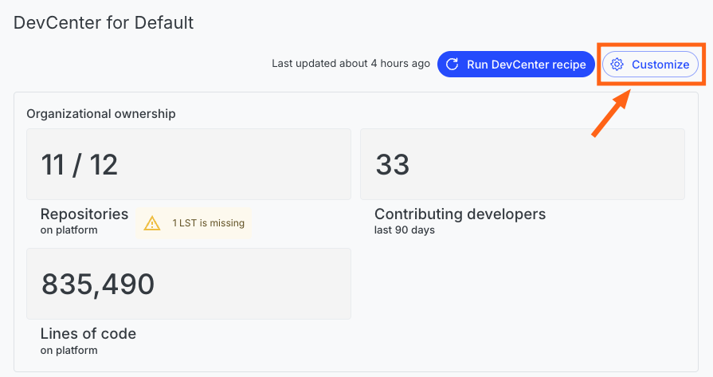
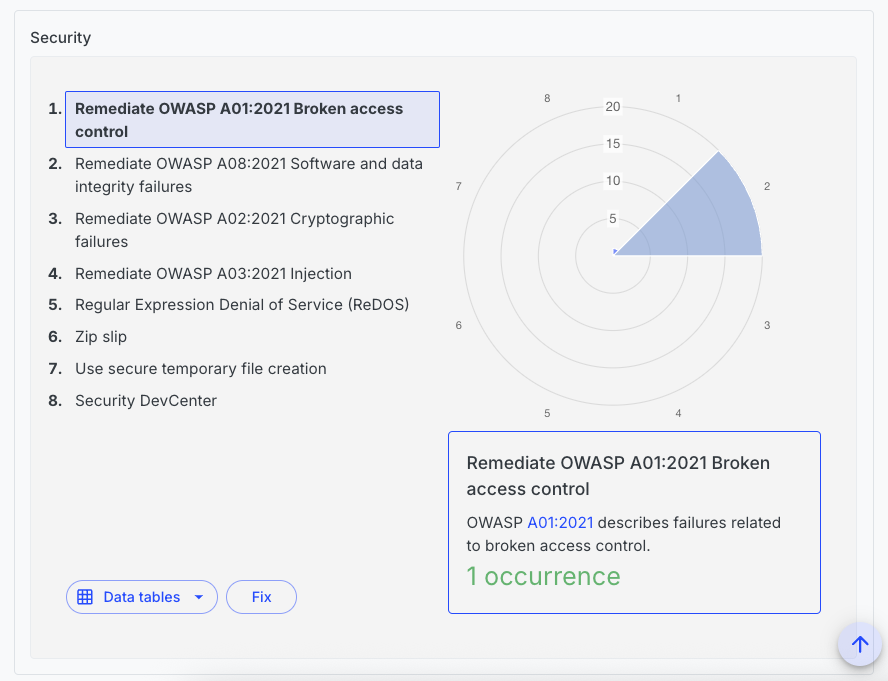

# How to create and run custom DevCenter recipes

The Moderne DevCenter is the mission-control dashboard of the Moderne Platform. It provides you with high-level details about the state of all of your repositories. Using it, you can track the progress of upgrades, migrations, and security vulnerabilities.

A DevCenter is generated from a recipe that you create and configure. In this doc, we'll walk you through everything you need to know about this process.

We'll start by showing you how to create, deploy, and run a DevCenter recipe. After that, we'll walk you through an example DevCenter recipe and provide you with useful context so you can create your own.

## Prerequisites

This guide assumes that:

* You've already configured an [organizational structure](./agent-configuration/configure-organizations-hierarchy.md).
* You have a basic understanding of what [declarative YAML recipes](https://docs.openrewrite.org/reference/yaml-format-reference) look like and how to work with them.

## Creating and deploying a DevCenter recipe

### Step 1: Create a new recipe repository

The first thing you need to do is to create a new recipe repository using either the [rewrite-recipe-starter](https://github.com/moderneinc/rewrite-recipe-starter) or your own internal recipe starter template. This repository is where you'll create all of the DevCenter recipes you'd like to use.

### Step 2: Add the devcenter dependency

Once you've created your recipe repository, you will need to update your `build.gradle` or `pom.xml` file to include a dependency on [io.moderne.recipe:rewrite-devcenter](https://central.sonatype.com/artifact/io.moderne.recipe/rewrite-devcenter). This will give you access to key components you need to create and run DevCenter recipes.

### Step 3: Create a declarative DevCenter recipe

We've provided a [devcenter-starter recipe](https://github.com/moderneinc/rewrite-devcenter/blob/main/src/main/resources/META-INF/rewrite/devcenter-starter.yml) that you can copy to your own repository to get started. You can also create your own if you desire. [Later on in this doc, we'll walk through a DevCenter recipe](#understanding-how-a-devcenter-recipe-works) so that you can understand how they work.

The [rewrite-devcenter repository](https://github.com/moderneinc/rewrite-devcenter) contains common card recipe that you may want to use or modify such as the [LibraryUpgrade card recipe](https://github.com/moderneinc/rewrite-devcenter/blob/main/src/main/java/io/moderne/devcenter/LibraryUpgrade.java).

### Step 4: Deploy the recipe artifact

Once you're satisfied with your recipe(s), you will need to [deploy them to your tenant](./importing-external-recipes.md).

## Executing a DevCenter recipe

### Step 1: Select which recipe to run

After you've deployed DevCenter recipes to your tenant, you can select which DevCenter recipe should be run for an organization by navigating to the DevCenter page and clicking on the `Customize` button in the top-right hand corner of the screen:

<figure>
  
  <figcaption></figcaption>
</figure>

You will then be taken to a page that lists out all of the recipes you can run:

<figure>
  
  <figcaption></figcaption>
</figure>

Click on the one you want and press `Save`.

### Step 2: Run the DevCenter recipe

After you selected the recipe you want, click on the `Run DevCenter` button and the recipe will be executed. After it finishes running, your DevCenter will be updated to reflect the current state of your repositories.

You are free to re-run this recipe whenever you want to get the latest data by clicking on the `Run DevCenter recipe` button – which is next to the `Customize` button you clicked on earlier.

## Understanding how a DevCenter recipe works

In order to help you get a better understanding of how DevCenter recipes work, let's walk through the [DevCenter starter recipe](https://github.com/moderneinc/rewrite-devcenter/blob/main/src/main/resources/META-INF/rewrite/devcenter-starter.yml). By the end, you should have a good idea of what makes up a DevCenter recipe and how you can create your own.

### Metadata

The top of this recipe begins with standard metadata (e.g., `name` and `description`) that you would find in any declarative YAML recipe:

```yaml
type: specs.openrewrite.org/v1beta/recipe
name: io.moderne.devcenter.DevCenterStarter
displayName: DevCenter
description: >-
  This is a default DevCenter configuration that can be used as a starting point for your own DevCenter configuration.
  It includes a combination of upgrades, migrations, and security fixes.
  You can customize this configuration to suit your needs.
  
  For more information on how to customize your DevCenter configuration, see the [DevCenter documentation](https://docs.moderne.io/user-documentation/moderne-platform/getting-started/dev-center/).
```

### Recipe list

After that, it lists out the recipes that will be run to build the DevCenter dashboard. Each of these recipes will turn into a card in your DevCenter:

```yaml
recipeList:
  - io.moderne.devcenter.LibraryUpgrade:
      cardName: Move to Spring Boot 3.5.0
      groupIdPattern: org.springframework.boot
      artifactIdPattern: '*'
      version: 3.5.0
      upgradeRecipe: io.moderne.java.spring.boot3.UpgradeSpringBoot_3_5
  - io.moderne.devcenter.JavaVersionUpgrade:
      majorVersion: 21
      upgradeRecipe: org.openrewrite.java.migrate.UpgradeToJava21
  - io.moderne.devcenter.JUnitJupiterUpgrade:
      upgradeRecipe: org.openrewrite.java.testing.junit5.JUnit4to5Migration
  - io.moderne.devcenter.SecurityStarter
```

These recipes have some properties you probably haven't seen before. Specifically:

* `cardName` is a property that allows you to customize what the name of the card should be. Not all recipes have a `cardName` property. For instance, the [LibaryUpgrade recipe](https://github.com/moderneinc/rewrite-devcenter/blob/main/src/main/java/io/moderne/devcenter/LibraryUpgrade.java#L35-L38) has a `cardName` property – whereas the [JavaVersionUpgrade recipe](https://github.com/moderneinc/rewrite-devcenter/blob/main/src/main/java/io/moderne/devcenter/JavaVersionUpgrade.java) does not.
* `upgradeRecipe` is a property that defines the recipe that should be run to upgrade your repositories. It is the recipe that will get executed when you press the `Upgrade` button on a card.

<figure>
  
  <figcaption>_An example of a DevCenter card._</figcaption>
</figure>

### Security card

It's also possible to create recipes in your `devcenter.yml` file. For instance, at the bottom of our example, you will find a recipe that is used to create a security card in the DevCenter:

```yaml
---
type: specs.openrewrite.org/v1beta/recipe
name: io.moderne.devcenter.SecurityStarter
displayName: OWASP top ten
description: >-
  This recipe is a starter card to reveal common OWASP Top 10 issues in your source code.
  You can customize this configuration to suit your needs.
  
  For more information on how to customize your DevCenter configuration, see the [DevCenter documentation](https://docs.moderne.io/user-documentation/moderne-platform/getting-started/dev-center/).
recipeList:
  - org.openrewrite.java.security.OwaspA01
  - org.openrewrite.java.security.OwaspA02
  - org.openrewrite.java.security.OwaspA03
  - org.openrewrite.java.security.OwaspA08
  - org.openrewrite.java.security.RegularExpressionDenialOfService
  - org.openrewrite.java.security.ZipSlip
  - org.openrewrite.java.security.SecureTempFileCreation
  # Changes made by recipes above this one in the recipe list are reported as occurrences
  # in the Security DevCenter card.
  - io.moderne.devcenter.ReportAsSecurityIssues:
      fixRecipe: org.openrewrite.java.security.OwaspTopTen
```

This security recipe differs slightly from a traditional YAML recipe. In the recipe list, there is a specical recipe called `io.moderne.devcenter.ReportAsSecurityIssues`. By adding that recipe to the list, it will detect the number of issues found in the above recipes and generate a card that display them all.

This recipe takes in a `fixRecipe` property that defines the recipe that can be run to fix the issues reported by the above security recipes.

<figure>
  
  <figcaption>_An example of a security section in a DevCenter._</figcaption>
</figure>

## Examples of customizations

To help you get a better idea of how you can customize this to meet your own needs, let's walk through a few more examples.

### Quarkus example

```yaml
# An example DevCenter configuration for a Quarkus application.
# Includes a named custom upgrade recipe.
type: specs.openrewrite.org/v1beta/recipe
name: io.moderne.devcenter.DevCenterQuarkus
displayName: DevCenter
description: >-
  DevCenter for organizations that use Quarkus.
  Also includes Java and JUnit upgrades and security findings.
recipeList:
  - io.moderne.devcenter.LibraryUpgrade:
      cardName: Move to Quarkus 3.23.0
      groupIdPattern: io.quarkus
      artifactIdPattern: '*'
      version: 3.23.0
      upgradeRecipe: io.moderne.devcenter.UpgradeQuarkus
  - io.moderne.devcenter.JavaVersionUpgrade:
      majorVersion: 21
      upgradeRecipe: org.openrewrite.java.migrate.UpgradeToJava21
  - io.moderne.devcenter.JUnitJupiterUpgrade:
      upgradeRecipe: org.openrewrite.java.testing.junit5.JUnit4to5Migration
  - io.moderne.devcenter.SecurityStarter
---
type: specs.openrewrite.org/v1beta/recipe
name: io.moderne.devcenter.UpgradeQuarkus
displayName: DevCenter
description: >-
  This recipe upgrades all Quarkus dependencies to the latest 3.23 version.
recipeList:
  - org.openrewrite.java.dependencies.UpgradeDependencyVersion:
      groupId: io.quarkus
      artifactId: '*'
      newVersion: 3.23.x
```
* The `LibraryUpgrade` recipe was adjusted to target `io.quarkus` dependencies instead of `org.springframework.boot`.
* As a generic `UpgradeQuarkus` recipe doesn't exist yet, a new `UpgradeQuarkus` recipe was created to upgrade all Quarkus dependencies to the latest version.

:::tip
Additional recipes do not have to be in the same file or even the same module.
:::

### Custom parent example

```yaml
# An example DevCenter tracking Parent POM versions, illustrated by using the Apache Maven parent POM
type: specs.openrewrite.org/v1beta/recipe
name: io.moderne.devcenter.DevCenterApacheParent
displayName: DevCenter
description: >-
  DevCenter for organizations that use the apache maven parent.
  Also includes Java and JUnit upgrades and security findings.
recipeList:
  - io.moderne.devcenter.ParentPomUpgrade:
      cardName: Move to the latest Apache Maven parent POM
      groupIdPattern: org.apache.maven
      artifactIdPattern: maven-parent
      version: x
      upgradeRecipe: io.moderne.devcenter.UpgradeApacheMavenParent
  - io.moderne.devcenter.JavaVersionUpgrade:
      majorVersion: 21
      upgradeRecipe: org.openrewrite.java.migrate.UpgradeToJava21
  - io.moderne.devcenter.JUnitJupiterUpgrade:
      upgradeRecipe: org.openrewrite.java.testing.junit5.JUnit4to5Migration
  - io.moderne.devcenter.SecurityStarter
---
type: specs.openrewrite.org/v1beta/recipe
name: io.moderne.devcenter.UpgradeApacheMavenParent
displayName: Upgrade Apache Maven Parent
description: >-
  Upgrades the Apache Maven parent POM to the latest version.
recipeList:
  - org.openrewrite.maven.UpgradeParentVersion:
      groupId: org.apache.maven
      artifactId: maven-parent
      newVersion: x
```
* Instead of the `LibraryUpgrade` recipe seen previously, this example uses a `ParentPomUpgrade` recipe to target the Apache Maven parent POM.
* A generic recipe to upgrade parent versions does exist, but to fill its parameters in a DevCenter recipe, you need to create a custom recipe that specifies the `groupId` and `artifactId` of the parent POM you want to upgrade.