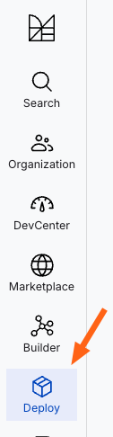
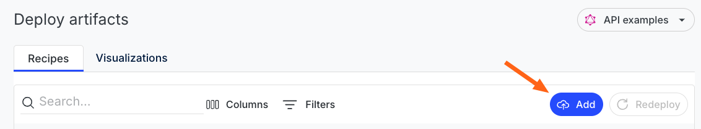
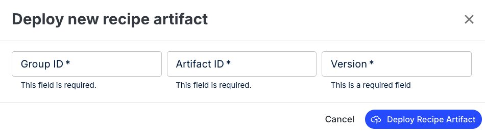

# Importing external recipes

External recipes can be imported into Moderne for use by your organization.

:::tip
It is the responsibility of the administrator configuring this to ensure that the recipe JARs and versions are up-to-date. It is also their responsibility to select/curate the recipe JARs that should be uploaded.
:::

### Prerequisites

* If you are a **single-tenant** user, you will need an Administrator-level account in your Moderne tenant to upload new recipe artifacts.
* If you are a **multi-tenant** user, anyone with an `@mycompany.com` email can deploy a recipe artifact if said artifact has a `groupId` that starts with `com.mycompany` (the `tenantDomain` inverted).

## Importing recipes from the Moderne Platform

### Step 1: Load the recipes

From your Moderne tenant, click on _Deploy_ in the left-hand menu:

<figure>
  
  <figcaption></figcaption>
</figure>

### Step 2: Upload the recipe artifacts

1. Click `Add` to open the form to import a recipe:

<figure>
  
  <figcaption></figcaption>
</figure>

2. Provide the `Group ID`, `Artifact ID`, and `Version` for the published artifact:

:::info
If you are a multi-tenant customer, you must ensure that your artifact's `groupId` starts with `com.mycompany` (the `tenantDomain` inverted). You also must ensure that your account has an `@mycompany.com` email address.
:::

<figure>
  
  <figcaption></figcaption>
</figure>

3. Click _deploy recipe artifact_ to deploy it.

The artifact information will appear in the table if Moderne successfully locates the requested artifact.

**Note:** If you have an [on-premise agent](./agent-configuration/agent-config.md) connected to an Artifactory instance that has been configured to serve recipes, we will look up recipes in your Artifactory repositories in addition to [Nexus](https://oss.sonatype.org/) and [Maven Central](https://search.maven.org/).

### Step 3: View recipes in the catalog

Your custom recipes will appear in the Marketplace, and they will be discoverable through search once they have been successfully deployed.

## Importing recipes via a GraphQL API call

You can also use the GraphQL API to automate importing external recipes:

```graphql
mutation loadRecipe($loadGroupId: String!, $loadArtifactId: String!, $loadVersion: String!, $loadDatedSnapshotVersion: String) {
  loadRecipesAsync(
    groupId: $loadGroupId
    artifactId: $loadArtifactId
    version: $loadVersion
    datedSnapshotVersion: $loadDatedSnapshotVersion
  ) {
    id
  }
}
```

Query variables:

```json
{
  "loadGroupId": "io.moderne.recipe",
  "loadArtifactId": "rewrite-devcenter",
  "loadVersion": "LATEST"
}
```

## Importing recipes via the CLI

You can also import recipes via CLI calls. 

First, you have to install the recipe artifacts into your local CLI recipe marketplace (below is an example of installing `rewrite-spring` from a pre-configured list of artifact repositories):

```bash
mod config recipes jar install org.openrewrite.recipe:rewrite-spring:LATEST
```

Next, you can upload all of these recipe artifacts from your local CLI marketplace to the Moderne Platform by running the following command:

```bash
mod config recipes moderne push
```