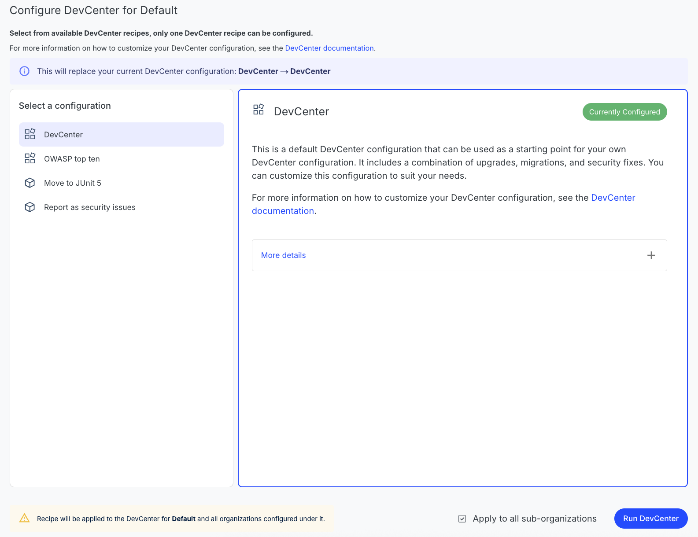
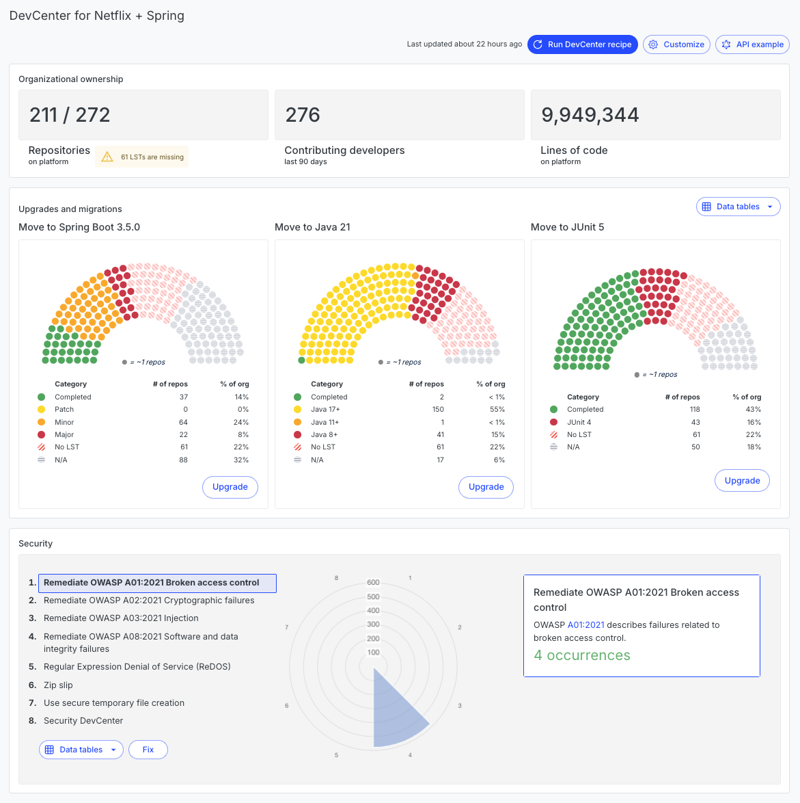

import Tabs from '@theme/Tabs';
import TabItem from '@theme/TabItem';

# Configuring a recipe-based DevCenter (Beta)

The Moderne DevCenter is the mission-control dashboard of the Moderne Platform. It provides you with high-level details about the state of all of your repositories. Using it, you can track the progress of upgrades, migrations, and security vulnerabilities.

While you can [still define a DevCenter via JSON](./dev-center.md), we'd encourage you to [generate DevCenters from recipes instead](./creating-a-devcenter-recipe-beta.md). 

In this doc, we'll walk you through how to configure a recipe-based DevCenter. By the end, you should know how to access this new UI and have a recipe-based DevCenter up and running.

## Prerequisites

This guide assumes that you have already [created and deployed a DevCenter recipe to your tenant](./creating-a-devcenter-recipe-beta.md).

## Configuring and executing a DevCenter recipe

### Step 1: Navigate to the recipe-based DevCenter

In the navigation bar on the left-side of your screen, click on the `DevCenter (Beta)` icon.

You will arrive at a page asking you to configure a DevCenter (presuming nobody else in your company has already configured a DevCenter for the organization you've selected):

<figure>
  
  <figcaption></figcaption>
</figure>

### Step 2: Examine the available DevCenter recipes

Click on the `Configure DevCenter` button. You will be taken to a page that lists out all of the DevCenter recipes deployed to your Moderne instance. If you [followed the instructions to create and deploy a DevCenter recipe](./creating-a-devcenter-recipe-beta.md), you should see your recipe in this list.

<figure>
  
  <figcaption></figcaption>
</figure>

You can click on the `More details` link to be taken to a recipe page that provides more details on what the DevCenter recipe will do.

### Step 3: Select which recipe should be associated with the organization

When you've decided on which DevCenter recipe you want to use, you will need to decide if you want to apply it to all sub organizations **before** you press the `Use this` button. Applying the recipe to all sub organizations will result in DevCenters being generated for all of those organizations whenever you generate the current (parent) DevCenter.

Once you've decided which DevCenter recipe you want associated with your organization (or sub organizations), press the `Use this` button. Then, press the `Run DevCenter` button that becomes clickable.

<figure>
  
  <figcaption></figcaption>
</figure>

This will take you to the new DevCenter page and begin running a recipe to populate the DevCenter with data.

Below is an example of what this might look like:

<figure>
  
  <figcaption></figcaption>
</figure>

