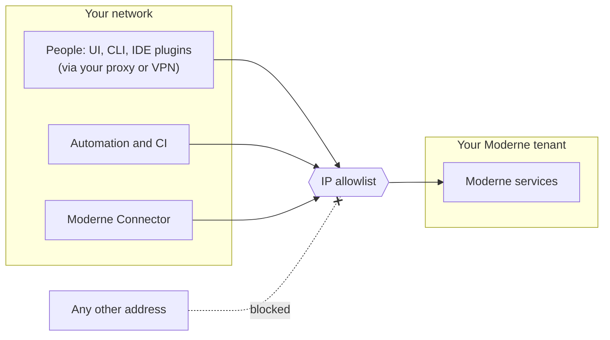

# Restricting network access to your tenant

By default, your tenant's public endpoints accept HTTPS connections from any IP address. That being said, if your security policy requires that your tenant is only reachable from inside your network, Moderne can restrict it to an allowlist of IP ranges that you provide. This restriction is available on **SaaS v2** tenants.

In this guide, we will walk you through everything you need to know to set up this restriction.

## Understanding what the restriction covers

The allowlist only filters connections made to your tenant. Moderne's services communicate with each other inside the tenant, so your list only needs your own ranges.

Keep the following in mind before building your list:

* The restriction applies to the whole tenant: the UI, the GraphQL API, login, the CLI download, and the endpoint the Connector connects to. It cannot be scoped to only one of them.
* To a client outside the list, the tenant looks down. Hostnames resolve, but connections time out instead of returning an error page.
* Only the source IP address is checked. If your traffic leaves through a shared cloud proxy without dedicated egress addresses, listing the proxy's ranges also admits the proxy vendor's other customers. Restrictions on specific users or devices belong in your identity provider.

## Collecting your egress ranges

You will need the public egress range of everything that reaches your tenant:

* Your corporate proxy and VPN, used by people working in the Moderne UI, the Moderne CLI, or the IDE plugins
* Every Moderne Connector you run
* Any automation or CI pipeline that calls the Moderne API with an access token

Cloud-hosted CI runners, such as GitHub-hosted runners or Microsoft-hosted Azure DevOps agents, use large and changing address ranges that cannot realistically be listed. Run automation that calls the Moderne API from runners inside your network instead.

## Requesting the restriction

Send your tenant name and the full list of ranges, in CIDR notation, to your CSM or [support@moderne.io](mailto:support@moderne.io). Moderne applies the restriction at a time agreed with you. The change needs no redeploy and causes no downtime. Once it is in place, your team confirms that access still works. To change the list later, send the updated list the same way.
