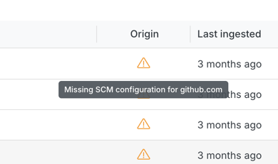
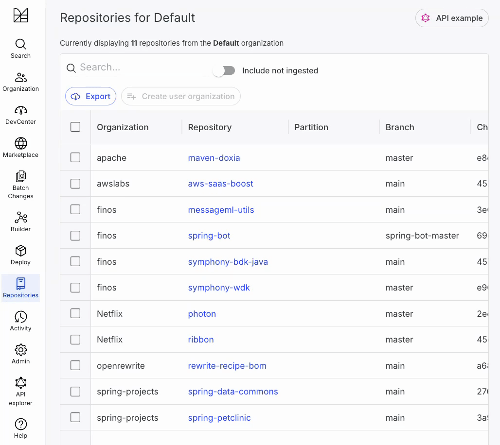

# Troubleshooting LST issues

This guide will help you diagnose and resolve common issues with Lossless Semantic Trees (LSTs) in the Moderne platform.

## LST built but not showing up in an organization

### Common root causes

When an LST is missing from your organization, the issue is typically caused by:

* **Origin mismatch**: The repository's `origin` doesn't match your version control system (VCS) configuration.
* **Path/branch mismatch**: The repository's `path` or `branch` doesn't match what's defined in your organization hierarchy.

### Troubleshooting steps

#### Step 1: Determine your organization setup

Does your company provide an [organizational hierarchy to Moderne](./agent-configuration/configure-organizations-hierarchy.md)? If so, jump to [Step 2b](#step-2b-organizational-hierarchy-provided). If not, proceed to [Step 2a](#step-2a-no-organizational-hierarchy-provided).

#### Step 2a: No organizational hierarchy provided

If your company **does not** provide an organizational hierarchy to Moderne, then your issue is an `origin` mismatch.

#### To diagnose:

1. Navigate to the repositories list located at `https://TENANT.moderne.io/organizations` (replace `TENANT` in the URL with your company's Moderne tenant)
2. Search for the repository whose LST is missing
3. You should see a warning icon in the `origin` column. If you mouse over it, you will see a warning about a "Missing SCM info for <some VCS>". Remember that VCS for the next step.

<figure>
  
  <figcaption>_An example of what a repo with a missing SCM configuration looks like_</figcaption>
</figure>

#### To fix:

Check your VCS URL in your Agent configuration. For example, if this is a GitHub repo, check that `MODERNE_AGENT_GITHUB_0_URL` is `https://github.com` (or the base URL of your on-prem GitHub instance).

If your VCS is Bitbucket Server or Bitbucket Data Center, and you use a non-standard SSH port or a different URL, make sure that you have an alternate URL defined via `MODERNE_AGENT_BITBUCKET_0_ALTERNATEURLS_0`.

#### Step 2b: Organizational hierarchy provided

If your company **does** provide an organizational hierarchy, the issue could be either an `origin` mismatch or a `path`/`branch` mismatch.

#### To diagnose:

1. Navigate to the GraphQL API explorer located at `https://TENANT.moderne.io/graphql` (replace `TENANT` in the URL with your company's Moderne tenant)
2. Run the following GraphQL query:

```graphql
query organizationlessRepositories {
  organizationlessRepositories {
    count
    pageInfo {
      hasNextPage
      startCursor
      endCursor
    }
    edges {
      node {
        origin
        path
        branch
      }
    }
  }
}
```

:::info
 The `organizationlessRepositories` query returns a paginated list of repositories that are not part of any organization. By default, it returns up to 100 results at a time.

 To retrieve additional results, use the `after` cursor from the `pageInfo.endCursor` field in a subsequent request.

 Example query:

 ```graphql
query {
  organizationlessRepositories(first: 100, after: "END_CURSOR_HERE") {
    edges {
      node {
        origin
        path
        branch
      }
    }
    pageInfo {
      endCursor
      hasNextPage
    }
  }
}
```
:::

3. Look through the results and see if your repository is listed there.
  * **If found**: Your repository exists, but doesn't match the `origin`, `path`, or `branch` defined in your organizational hierarchy. [See the fix below](#to-fix-1).
  * **If not found**: Proceed to [check for an `origin` mismatch](#check-for-an-origin-mismatch) (the next section). 

#### To fix: 

Update your `repos.csv` file to ensure the `origin`, `path`, and `branch` values match your repository _exactly_. 

#### Check for an `origin` mismatch

#### To diagnose:

1. Navigate to `https://TENANT.moderne.io/organizations` (replace `TENANT` in the URL with your company's Moderne tenant)
2. Click `Organization` in the left nav and select the organization you expect this repository to appear in:

<figure>
  
  <figcaption>_An example of selecting the OpenRewrite organization._</figcaption>
</figure>

3. Search for the repository in question
4. You should see a warning icon in the `origin` column. If you mouse over it, you will see a warning about a "Missing SCM info for <some VCS>". Remember that VCS for the next step.

<figure>
  
  <figcaption>_An example of what a repo with a missing SCM configuration looks like_</figcaption>
</figure>

#### To fix:

Check your VCS URL in your Agent configuration. For example, if this is a GitHub repo, check that `MODERNE_AGENT_GITHUB_0_URL` is `https://github.com` (or the base URL of your on-prem GitHub instance).

If your VCS is Bitbucket Server or Bitbucket Data Center, and you use a non-standard SSH port or a different URL, make sure that you have an alternate URL defined via `MODERNE_AGENT_BITBUCKET_0_ALTERNATEURLS_0`.
