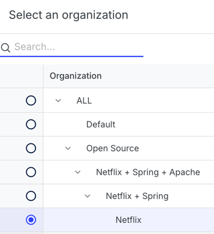

# Troubleshooting LST issues

## My LST is built but not showing up in my organization

If you have built an LST for a repository, but it is not showing up in your organization, it is likely be caused by one of the following:

1. The `origin` does not correctly match one of your version control systems (e.g. GitHub, GitLab) defined in your agent (hereafter, **version control system** will be abbreviated as **VCS**. VCS and SCM—source code management—are used interchangeably throughout Moderne's docs and platform).
2. The `path` or `branch` does not correctly match the `path` or `branch` provided by your organization hierarchy.

### My company doesn't provide an organization hierarchy to Moderne

If your company does not provide an organization hierarchy to Moderne, then this can only be caused by a mismatch in `origin` from your version control system.

Follow these steps to see what `origin` was detected:

1. Navigate to https://TENANT.moderne.io/organizations (replace `TENANT` in the URL with your company's Moderne tenant)
2. Search for the repository in question
3. You'll see "Missing SCM info". Take a note of the `origin` value shown there.


4. Check the URL of your VCS in your Agent configuration. For example, if this is a GitHub repo, check that `MODERNE_AGENT_GITHUB_0_URL` is https://github.com (or the base URL of your on-prem GitHub instance).
5. If your VCS is Bitbucket Server or Bitbucket Data Center, and you use a non-standard SSH port or a different URL, make sure that you have an alternate URL defined via `MODERNE_AGENT_BITBUCKET_0_ALTERNATEURLS_0`.


### My company provides an organization hierarchy to Moderne

If your company provides an organization hierarchy to Moderne, then this can be caused by either a mismatch in `origin` or a mismatch in `path` or `branch`.

#### Check if repo matches origin, path, and branch from `repos.csv`

First, let's check if your repo exists but doesn't match an `origin`, `path`, or `branch` in your organization hierarchy:

1. Navigate to https://TENANT.moderne.io/graphql (replace `TENANT` in the URL with your company's Moderne tenant)
2. Enter the following query:
```graphql
query organizationlessRepositories {
  organizationlessRepositories {
    count
    pageInfo {
      hasNextPage
      startCursor
      endCursor
    }
    edges {
      node {
        origin
        path
        branch
      }
    }
  }
}
```
3. Look through the results and see if your repository is listed there. If it is, then it means that your repository exists but does not match any `origin`, `path`, or `branch` in your organization hierarchy. Please go correct your `repos.csv` to ensure that the `origin`, `path`, and `branch` match your repository.

> ℹ️ **Note:** The `organizationlessRepositories` query returns a paginated list of repositories that are not part of any organization. By default, it returns up to 100 results at a time.  
> To retrieve additional results, use the `after` cursor from the `pageInfo.endCursor` field in a subsequent request.  
> Example:
>
> ```graphql
> query {
>   organizationlessRepositories(first: 100, after: "END_CURSOR_HERE") {
>     edges {
>       node {
>         origin
>         path
>         branch
>       }
>     }
>     pageInfo {
>       endCursor
>       hasNextPage
>     }
>   }
> }
> ```

#### Check if repo matches `origin` from VCS configuration in Agent

Follow these steps to see what `origin` was detected:

1. Navigate to https://TENANT.moderne.io/organizations (replace `TENANT` in the URL with your company's Moderne tenant)
2. Click "Organization" in the left nav and select the organization you expect this repository to appear in



3. Search for the repository in question
4. You'll see "Missing SCM info". Take a note of the `origin` value shown there.


5. Check the URL of your VCS in your Agent configuration. For example, if this is a GitHub repo, check that `MODERNE_AGENT_GITHUB_0_URL` is https://github.com (or the base URL of your on-prem GitHub instance).
6. If your VCS is Bitbucket Server or Bitbucket Data Center, and you use a non-standard SSH port or a different URL, make sure that you have an alternate URL defined via `MODERNE_AGENT_BITBUCKET_0_ALTERNATEURLS_0`.
