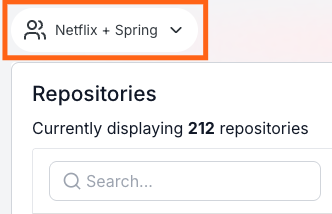
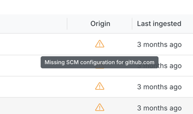

import VersionBanner from '@site/src/components/VersionBanner';

<VersionBanner version="v2" linkPath="/administrator-documentation/moderne-platform-v1/how-to-guides/troubleshooting-lst-issues" />

# Troubleshooting LST issues

This guide will help you diagnose and resolve common issues with Lossless Semantic Trees (LSTs) in the Moderne platform.

## LST built but not showing up in an organization

### Common root causes

When an LST is missing from your organization, the issue is typically caused by:

* **Origin mismatch**: The repository's `origin` doesn't match your version control system (VCS) configuration.
* **Path/branch mismatch**: The repository's `path` or `branch` doesn't match what's defined in your organization hierarchy.

### Troubleshooting steps

Use the [Lost and Found GraphQL query](#using-the-lost-and-found-query) to check if your repository is listed.

* **If found**: Your repository exists but has issues that prevent it from being usable. This could be due to:
  - Missing from organizational hierarchy (doesn't match the `origin`, `path`, or `branch` defined in your organizational hierarchy)
  - SCM configuration mismatch (orphaned repository with no connected Connector)
  - [See the fix below](#to-fix-1).
* **If not found**: Proceed to [check for an `origin` mismatch](#check-for-an-origin-mismatch) (the next section). 

#### To fix: 

Update your `repos.csv` file to ensure the `origin`, `path`, and `branch` values match your repository _exactly_. 

#### Check for an `origin` mismatch

#### To diagnose:

1. Navigate to `https://TENANT.moderne.io/organizations` (replace `TENANT` in the URL with your company's Moderne tenant)
2. Click on the organization selector at the top of your screen and select the organization you expect this repository to appear in:

<figure>
  
  <figcaption>_Selecting an organization_</figcaption>
</figure>

3. Search for the repository in question
4. You should see a warning icon in the `origin` column. If you mouse over it, you will see a warning about a "Missing SCM info for &lt;some VCS&gt;". Remember that VCS for the next step.

<figure>
  
  <figcaption>_An example of what a repo with a missing SCM configuration looks like_</figcaption>
</figure>

#### To fix:

Check your VCS URL in your Connector configuration. For example, if this is a GitHub repo, check that `MODERNE_SCM_GITHUB_0_URI` is `https://github.com` (or the base URL of your on-prem GitHub instance).

## Using the Lost and Found query

The Lost and Found feature provides a comprehensive view of all repositories that are not usable in the Moderne platform for various reasons. Use this query when troubleshooting repository visibility issues.

### Running the query

1. Navigate to the GraphQL API explorer at `https://TENANT.moderne.io/graphql` (replace `TENANT` with your company's Moderne tenant)
2. Run this query to see all repositories with issues:

```graphql
query lostAndFoundRepositories {
  lostAndFound {
    repositories {
      count
      pageInfo {
        hasNextPage
        startCursor
        endCursor
      }
      edges {
        node {
          origin
          path
          branch
        }
      }
    }
  }
}
```

:::info
The Lost and Found query returns a list of repositories that we've ingested into the platform, but that we can't find in your `repos.csv` file. This could be because you've misspelled something or you've forgotten to put them in your `repos.csv` file.

Returns up to 100 results at a time by default.
:::

### Advanced usage

**Pagination:**

```graphql
query paginatedResults {
  lostAndFound {
    repositories(first: 100, after: "CURSOR_HERE") {
      edges { node { origin path branch } }
      pageInfo { endCursor hasNextPage }
    }
  }
}
```

**Filtering and sorting:**

```graphql
query sortedResults {
  lostAndFound {
    repositories(filter: { sortBy: PATH, sortOrder: ASC }) {
      edges { node { origin path branch } }
    }
  }
}
```

Sort options: `PATH`, `ORIGIN`, `BRANCH` | Sort orders: `ASC`, `DESC`

## LSTs not being ingested after upgrading from Nexus 2 to 3

When migrating from Nexus 2 to 3, the default URL path changes and that may result in errors ingesting. Please double-check that the [URLs have been configured correctly](https://support.sonatype.com/hc/en-us/articles/39325029843219-Repository-How-to-enable-Nexus-2-URL-paths-in-Nexus-3).