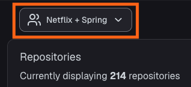
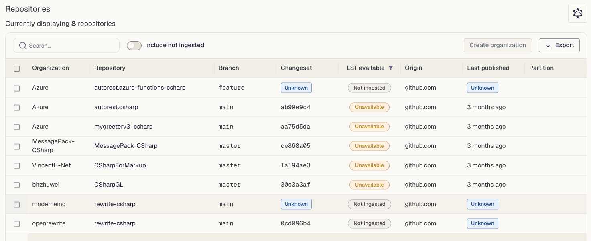

import VersionBanner from '@site/src/components/VersionBanner';

<VersionBanner version="v2" linkPath="/administrator-documentation/moderne-platform-v1/how-to-guides/troubleshooting-lst-issues" />

# Troubleshooting LST issues

This guide will help you diagnose and resolve common issues with Lossless Semantic Trees (LSTs) in the Moderne platform.

## LST built but not showing up in an organization

### Common root causes

When an LST is missing from your organization, the issue is typically caused by:

* **Origin mismatch**: The repository's `origin` doesn't match your version control system (VCS) configuration.
* **Path/branch mismatch**: The repository's `path` or `branch` doesn't match what's defined in your organization hierarchy.
* **No usable LST**: The repository is in your organization hierarchy, but either no LST has ever been published for it, or the LST that was published can no longer be reached.

### Checking the repository's LST status

Every repository carries its own LST status, which you can read from the repositories table:

1. Navigate to `https://TENANT.moderne.io/organizations` (replace `TENANT` in the URL with your company's Moderne tenant)
2. Click on the organization selector at the top of your screen and select the organization you expect this repository to appear in:

<figure>
  
  <figcaption>_Selecting an organization_</figcaption>
</figure>

3. Turn on the **Show all repositories** toggle in the toolbar
4. Search for the repository in question and read its **LST available** column

<figure>
  
  <figcaption>_Repositories that were never ingested appear once **Show all repositories** is turned on_</figcaption>
</figure>

:::warning
The table is filtered by default. With **Show all repositories** turned off, it lists only repositories whose LST is available, which hides the `Unavailable` state as well as repositories that were never ingested. The count above the toolbar reports how many repositories are currently displayed rather than how many the organization contains, so the repository you are troubleshooting can be absent from both the table and that count until you turn the toggle on.
:::

The **LST available** column reports one of three states:

| State          | What it means                                                                                                        | Where to go next                                                                                                                                                                         |
|:---------------|:---------------------------------------------------------------------------------------------------------------------|:-----------------------------------------------------------------------------------------------------------------------------------------------------------------------------------------|
| `Available`    | An LST has been published and is reachable for recipe runs.                                                          | The LST itself is fine. If the repository isn't appearing in the organization you expected, check that your organization hierarchy places it there.                                      |
| `Unavailable`  | An LST was published previously, and the **Last published** column shows when, but it can't be reached now. If the Connector recorded why, the pill carries that reason. | Most often the LST was purged from storage and the repository hasn't been re-published since. See [Failed to enrich RepoKey after LST purge](#failed-to-enrich-repokey-after-lst-purge). |
| `Not ingested` | No LST has ever been published for this repository. The **Changeset** and **Last published** columns show `Unknown`. | Check whether the repository is building and publishing at all. See [Analyzing build failures](./analyzing-build-failures.md).                                                           |

If the repository doesn't appear in the table at all, even with **Show all repositories** turned on, then it isn't in your organization hierarchy. Update your `repos.csv` file so that the `origin`, `path`, and `branch` values match your repository _exactly_, then check for an [`origin` mismatch](#checking-for-an-origin-mismatch).

### Checking for an `origin` mismatch

The **Origin** column shows the VCS host that Moderne recorded for the repository, such as `github.com`. An `origin` mismatch happens when that value doesn't correspond to any SCM you've configured on the Connector, which leaves the repository without a usable SCM connection.

Compare the value in the **Origin** column against the SCM URIs in your Connector configuration. For example, if this is a GitHub repository, check that `MODERNE_SCM_GITHUB_0_URI` is `https://github.com` (or the base URL of your on-prem GitHub instance). The host in that URI needs to match the origin shown in the table.

## Finding repositories without a usable LST

The repositories table is the quickest way to check a single repository. To audit a whole organization, or to see why an LST became unavailable, query the API instead.

1. Navigate to the GraphQL API explorer at `https://TENANT.moderne.io/graphql` (replace `TENANT` with your company's Moderne tenant)
2. Run this query to list every repository in an organization that has no usable LST:

```graphql
query repositoriesWithoutLst($organizationId: ID!, $first: Int, $after: String) {
  organization(id: $organizationId) {
    name
    repositories(
      first: $first
      after: $after
      where: { lstArtifact: { available: { _eq: false } } }
      orderBy: [{ field: LST_ARTIFACT_PUBLISHED, direction: DESC }]
    ) {
      count
      pageInfo {
        hasNextPage
        endCursor
      }
      edges {
        node {
          origin
          path
          branch
          lstArtifact {
            published
            available
            enrichFailedReason
          }
        }
      }
    }
  }
}
```

Query variables:

```json
{
  "organizationId": "Gradle",
  "first": 100
}
```

The organization ID is the name of the organization as it appears in the organization selector. To page through more than `first` results, pass the `endCursor` from `pageInfo` back as `after`. To narrow the query to a single repository, add a `path` condition alongside the existing `lstArtifact` condition, such as `where: { path: { _eq: "openrewrite/rewrite" }, lstArtifact: { available: { _eq: false } } }`.

Every repository this query returns lacks a usable LST, and the `published` field tells you which of the two states it's in, the same way the repositories table does:

* `published` is `null`: no LST has ever been published, matching the `Not ingested` state in the table.
* `published` has a timestamp: an LST was published at that time, but `available` is `false`, matching the `Unavailable` state.

The `enrichFailedReason` field records why the Connector failed to enrich a repository, which usually explains an `Unavailable` LST directly. The repositories table surfaces the same reason on the `Unavailable` pill, so what the API adds is the ability to collect it for every affected repository at once instead of inspecting them one by one. For the most common reason, see [Failed to enrich RepoKey after LST purge](#failed-to-enrich-repokey-after-lst-purge).

:::info[Coming from v1 and looking for Lost and Found?]
The v1 `lostAndFound` query has been removed, and this query is not a replacement for it. Lost and Found answered the opposite question: which repositories had been ingested into the platform that your `repos.csv` file did not mention. SaaS v2 has no equivalent, because your organization hierarchy now defines the set of repositories the platform knows about. There is no separate pool of ingested-but-unrecognized repositories left to report on, so LST problems are found per repository, within the organization the repository belongs to.
:::

## LSTs not being ingested after upgrading from Nexus 2 to 3

When migrating from Nexus 2 to 3, the default URL path changes and that may result in errors ingesting. Please double-check that the [URLs have been configured correctly](https://support.sonatype.com/hc/en-us/articles/39325029843219-Repository-How-to-enable-Nexus-2-URL-paths-in-Nexus-3).

## Failed to enrich RepoKey after LST purge

If you see log lines like the following on the Connector, it usually means `repos-lock.csv` still references an LST that has been purged from S3 by a lifecycle policy, and the repository has not been re-published since (typically because the repo's build has been failing):

```text
Failed to enrich RepoKey[...] from s3://.../repos-lock.csv: The specified key does not exist
```

The Connector is attempting to enrich the stale entry against an S3 object that no longer exists.

These messages are logged at `WARN`, not `ERROR`, because they are not fatal to the Connector. Treat them as a signal to investigate the build failure on the affected repository — see [Analyzing build failures](./analyzing-build-failures.md) for diagnosis steps.

:::info
As of Connector `0.148.100`, the Connector no longer attempts enrichment until it has actually connected to the API gateway. This makes upstream gateway misconfigurations much easier to spot in logs.
:::