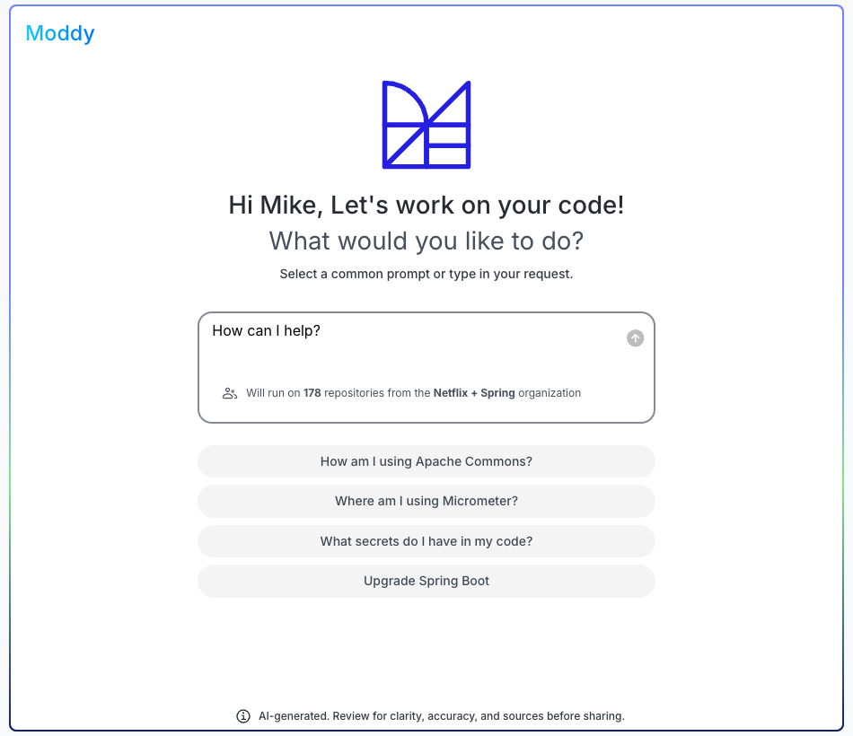
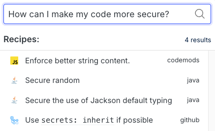
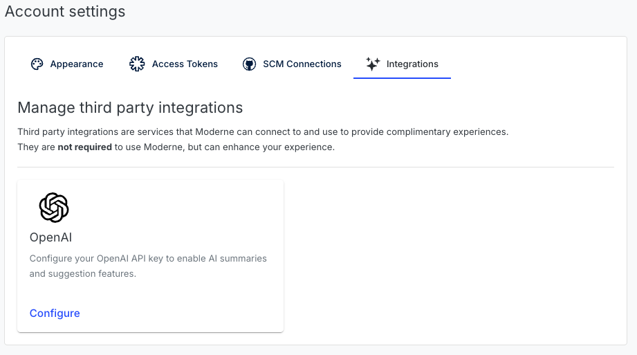

# AI architecture

Moderne offers a variety of features and recipes that utilize AI to enhance your experience. All of these are highly customizable so that you can choose to only enable or use the ones you're comfortable with.

In this guide, we'll walk you through all of the AI functionality we offer. For each component, we'll explain what it is, how it's deployed, what AI models are used, and how state is stored. You can then use this knowledge to decide what you want to enable or disable.

:::warning
All AI tools and features may produce incorrect or incomplete results. Please ensure that you thoroughly review any results for clarity and accuracy before sharing or using.

**Note**: Our general philosophy is to create AI tools that help you _find_ and _discover_ things. However, we ensure that the core recipes themselves don't use AI unless explicitly described as such, so we can guarantee deterministic, consistent, and reliable changes.
:::

## AI components

### Moddy (chatbot) - restricted beta

Moddy is an AI chatbot that can search for OpenRewrite recipes and execute them within the Moderne Platform.

<figure>
  
  <figcaption>_A preview of Moddy_</figcaption>
</figure>

#### Deployment

Deployed as part of the Moderne Platform. Moderne customers can choose whether or not to enable this chatbot in their tenants.

#### AI models

Uses a bring-your-own-model (BYOM) configuration. It supports OpenAI, Gemini, Anthropic, and Ollama.

#### State management

Conversation history is stored locally in the browser (e.g., cookies/local storage). If a user clears their browser data or switches devices, their history is lost.

#### Workflow

<figure>
  
  <figcaption>_AI model interactions_</figcaption>
</figure>

### AI recipe search

Moderne offers users the ability to search for recipes with AI. This can help if you don't remember the name of a recipe or if you don't even know if a recipe exists or not. For more details about AI search, check out our [guide on how to use AI to search for recipe](../../../user-documentation/moderne-platform/how-to-guides/moderne-platform-search.md#ai-search).

<figure>
  
  <figcaption>_Searching for recipes using AI_</figcaption>
</figure>

#### Deployment

Deployed as part of the Moderne Platform. You can [choose whether or not to enable this](../../../user-documentation/moderne-platform/how-to-guides/moderne-platform-search.md#how-to-enable-or-disable-ai-search), though.

#### AI models

We use two BAAI embedding models – one for retrieval and one for reranking. We obtain the models from HuggingFace and deploy them using LangChain.

#### State management

Search results are saved on the worker, similar to any recipe run result. No data is permanently stored.

### AI recipe recommendations

Moderne has created recipes that can look through your code base and offer suggestions of recipes that you should consider running to help modernize or secure your code base. 

Check out the [get recommendations recipe documentation](https://docs.openrewrite.org/recipes/ai/research/getrecommendations#recommendations) for more information into how to use this. You might also find it beneficial to read about [AI embeddings and how we use them](https://www.moderne.ai/blog/what-are-embeddings-and-why-are-they-great-for-code-impact-analysis).

#### Deployment

Exists inside of the `rewrite-ai-search` JAR. Only deployed if you deploy this artifact to your tenant alongside the other recipe artifacts.

#### AI models

Uses [QwenCoder](https://huggingface.co/Qwen/Qwen2.5-Coder-1.5B) for generative recommendations. Uses BAAI embedding models for clustering-based smart sampling and search, with K-means clustering.

#### State management

Recipe recommendation results are stored on the worker, similar to any recipe run. No data is permanently saved.

### Rewrite comprehension

Moderne offers recipes that can read and comprehend your code – and then provide updates to your code or READMEs based on that understanding. 

For instance, if you created or updated a project that didn't have a useful README, you could [run a recipe to generate a useful one](https://github.com/openrewrite/rewrite-docker/pull/10). 

For more details into how to install and run this recipe, check out our [recipe documentation](https://docs.openrewrite.org/recipes/knowledge/docs/updateopenrewritereadme).

#### Deployment

Exists inside of the `rewrite-comprehension` JAR. Only deployed if you deploy this artifact to your tenant alongside the other recipe artifacts.

:::info
While private tenants can technically deploy this and use our key, we expect most, if not all, external calls to Gemini will be blocked. If you're interested in the feature on your private tenant, please talk to us so we can figure something out.
:::

#### AI models

Uses a bring-your-own-model (BYOM) configuration. It supports OpenAI, Gemini, Anthropic, and Ollama.

#### State management

No data is saved – all interactions are stateless. Recipe results are ephemeral, like any non-AI recipe.

### Third party AI integrations (public Moderne Platform only)

The public Moderne Platform offers users the ability to connect to third party services to improve the Moderne experience. For example, you may wish to connect to OpenAI to enable AI summaries and suggestions.

<figure>
  
  <figcaption>_Connecting the Moderne Platform to OpenAI_</figcaption>
</figure>

#### Deployment

This is deployed by default in the public Moderne Platform. It is not available in private Moderne tenants.

#### AI models

Integrates with external AI services. As of February 2025, the only integration available is with OpenAI.

#### State mangement

API keys are stored only on the user's machine (their browser) and are used on demand.

## Configuring and customizing AI features

Moderne customers can choose what AI features they want to enable or disable. For instance, you can:

* Disable AI-powered search and rely on keyword matching only.
* Choose not to import any of the AI-powered recipes.
* Toggle the Moddy chatbot availability.

Furthermore, many of our AI features offer you the flexibility of bringing your own model so that you can ensure that the model you use meets your safety and security standards.
