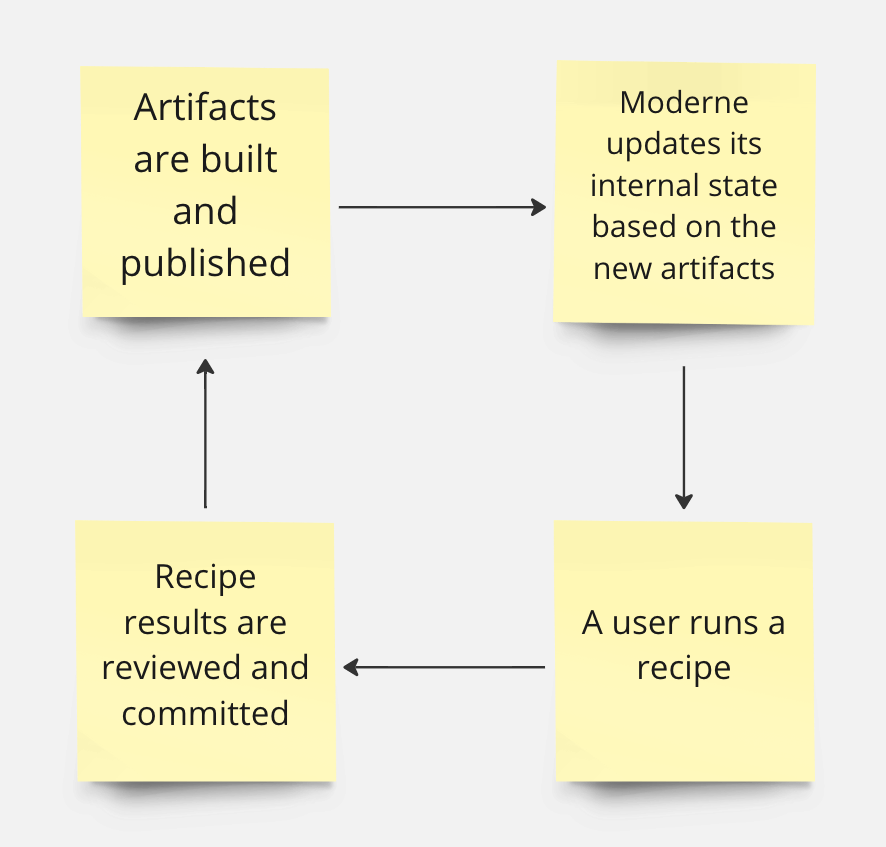
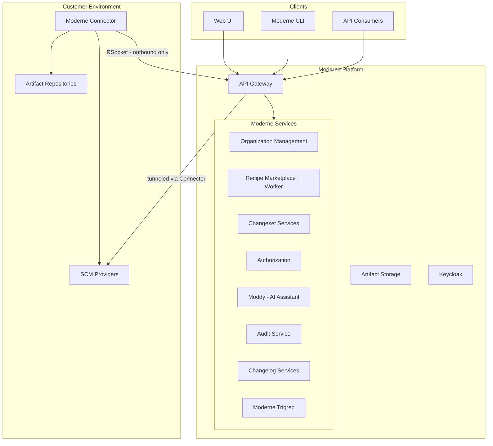

# Moderne architecture

To help you understand how the Moderne Platform works and how it interacts with your environment and services, this document will:

* [Explain how Moderne fits into the typical software development lifecycle](#how-moderne-fits-into-the-software-development-lifecycle)
* [Provide you with an architecture diagram that shows how data flows through the core components in both Moderne's environment and yours](#architecture-diagram)
* [Give you high-level details about each of these core components](#key-components)

## How Moderne fits into the software development lifecycle

Moderne's SaaS allows permitted users to run [recipes](https://docs.openrewrite.org/concepts-and-explanations/recipes) on code in the repositories you've added to the platform. These recipes can yield pull requests (PRs) or commits that transform the code.

Once the artifact is published (typically through [mass ingestion](../how-to-guides/mass-ingest.md)), the Moderne Connector will send the changes to Moderne so that the internal state can be updated. After that happens, new recipes can be run against the new artifacts and the process will repeat.

## Architecture diagram

Below is a high-level architecture diagram that shows the flow of data between Moderne and a typical customer environment. Arrows indicate communication between components. The details of each component can be found in the following sections.

## Key components

### Mass ingest with mod CLI

In order for Moderne to know the current state of your code, artifacts will need to be generated that contain a serialized representation of your code's [LSTs](./lossless-semantic-trees.md). These artifacts must be put inside an artifact repository that the [Moderne Connector](#moderne-connector) has access to.

To do this, you'll want to set up mass ingestion with the Moderne CLI. For instructions on how to do that, please read our [mass ingestion guide](../how-to-guides/mass-ingest.md).

### Moderne Connector

The Moderne Connector is an on-premises agent deployed within your network that bridges your environment with the Moderne Platform. All data that Moderne needs to function will pass over this bridge and flow into the [Moderne API gateway](#moderne-api-gateway). As this data is sent to Moderne, it's encrypted — with the key being kept in your environment. Whenever Moderne needs to access any data, it will request this key and the data will be decrypted for a short time before it's thrown away. If you decide you no longer want Moderne to have access to anything, you can shut off the Connector and all of your data that Moderne has will no longer be decryptable.

There are a variety of tools and services that you can configure the Connector to be connected to based on the needs of your team.

At a minimum, the Connector will need to connect to:

* One or more of your artifact repositories so that changes to the Moderne LST artifacts kept in them can be sent to Moderne
  * This is configured via the [Artifactory Query Language](https://www.jfrog.com/confluence/display/JFROG/Artifactory+Query+Language) or via Maven configuration. Only artifacts that match what you've configured will be sent to Moderne.
* Your SCM(s) so that PRs or commits can be created by approved users in Moderne

Your team may also wish to configure the Connector to:

* Look in your artifact repositories for custom recipe JARs your team creates so that those recipes can be run in the Moderne SaaS
* Proxy requests to LLM providers for AI-powered features like [Moddy](#moddy)

:::info
For more details, see the [Connector configuration documentation](../how-to-guides/agent-configuration/agent-config.md).
:::

**Setup requirements**

You must:

* Deploy a Moderne-provided OCI image adjacent to Artifactory
* Ensure the Connector is able to make an outbound HTTPS request to `https://api.TENANT.moderne.io`
* Ensure the Connector is configured with an Artifactory user that is authorized to make `find` AQL requests against repositories containing LST artifacts
* Ensure the Connector is configured with an Artifactory user capable of making `GET` requests to obtain the above LST artifacts
* Ensure that the deployed image is configured with an encryption key (stored in Hashicorp Vault or some other key management service)
* Ensure the Connector can connect to your SCM(s) to authorize users to see code in the Moderne SaaS and to allow commits on their behalf

:::tip
Multiple Connectors can be configured for high availability or to connect to only some of these services.
:::

#### Connector security

Connectors initiate connections to the [Moderne API gateway](#moderne-api-gateway) via the [RSocket](https://rsocket.io/) protocol. **Moderne will never initiate an API call to the Connector**. Because of that, only egress from your environment needs to be open.

When you set up a Connector, Moderne will share a token with you that you must configure in the Moderne Connectors you create. Moderne will reject any connection attempts from unauthorized Connector instances. In this way, Moderne requires a minimum level of client verification as an extra security precaution.

The connection to Moderne is established over [layer 7](https://www.cloudflare.com/learning/ddos/what-is-layer-7/), so you may choose to route traffic from the Connector through your own layer 7 gateway. This might be chosen to satisfy a desire for [Moderne's API gateway](#moderne-api-gateway) to perform client verification of an inbound Connector connection using a mechanism like X.509 in addition to token-based verification.

These measures act in concert with techniques to limit IP addressability of the Moderne API gateway to enhance the overall security posture.

### Moderne API gateway

The Moderne API gateway serves as the single entry point to the Moderne Platform. It communicates with the [Moderne Connector](#moderne-connector) to get data from your services to Moderne. It is the only component with a public IP address that can communicate with other Moderne services. The [Moderne UI](#moderne-user-interface) and [Keycloak](#keycloak) also have public IP addresses, but they can't communicate with other Moderne services.

The API gateway uses [Apollo Router](https://www.apollographql.com/docs/router/) to compose the GraphQL schemas of Moderne's microservices into a single unified API. All GraphQL requests pass through Apollo Router on their way to the individual service that supports a piece of the schema. This federated approach allows Moderne to deploy and scale services independently while presenting a single, consistent API surface.

The API gateway is responsible for:

* Handling API requests from your developers or your tools
* Handling API requests from the Moderne UI
* Handling encrypted LST artifacts from the Moderne Connector(s)
* Handling encrypted custom recipe artifacts from the Moderne Connector(s)
* Routing GraphQL requests to the appropriate Moderne microservices
* Bridging HTTP and SSH tunnels to the Connector for SCM operations
* Rate limiting as needed to guard Moderne services against overuse by a particular user

Authorized users in your company can access [audit logs](./audit-logging.md) for this gateway via an API.

:::info
The Moderne API gateway is configured with a Moderne-managed SSL certificate.
:::

**Setup requirements**

You must:

* Ensure that `https://api.TENANT.moderne.io` is on the accept list for outbound HTTPS traffic from the Moderne Connector
* Ensure that `https://api.TENANT.moderne.io` is on the accept list for outbound HTTPS traffic from the developer's machines

### Moderne user interface

The Moderne UI provides a browser-based interface for:

* Executing search and transformation recipes across your codebase
* Reviewing and committing code changes produced by recipe runs
* Searching code across all repositories with [Moderne Trigrep](#moderne-trigrep)
* Monitoring upgrade, migration, and security progress via the [DevCenter](#devcenter)
* Conversing with [Moddy](#moddy), the AI assistant, to discover and run recipes
* Building new recipes based on other recipes
* Viewing [audit logs](./audit-logging.md)
* Generating [access tokens](../../../user-documentation/moderne-platform/how-to-guides/create-api-access-tokens.md) for interacting with the Moderne API

The Moderne UI is implemented with client-side Javascript. The Moderne UI is one of three components with a public IP address (the other two being the [Moderne API gateway](#moderne-api-gateway) and [Keycloak](#keycloak)).

**Setup requirements**

You must:

* Ensure that `https://TENANT.moderne.io` is on the accept list for outbound HTTPS traffic from the developer's machines

### Keycloak

[Keycloak](https://www.keycloak.org/) is an open-source identity and access management system. Moderne services request authorization information for a user from Keycloak. Keycloak then calls out to your identity provider (such as LDAP, Okta, or Keycloak) to determine who is authorized for what.

**Setup requirements**

You must:

* Ensure that `https://login.TENANT.moderne.io` is on the accept list for outbound HTTPS traffic from the developer's machines

:::tip
As configuring identity providers between services can be quite complex, the setup for Keycloak is usually done over a Zoom meeting with Moderne and your company.
:::

### Moderne artifact storage

The Moderne artifact storage service is responsible for receiving pre-encrypted LST artifacts and recipe JARs and storing them in a private object store depending on the cloud provider you use ([Azure Blob Storage](https://learn.microsoft.com/en-us/azure/storage/blobs/) or [AWS S3](https://aws.amazon.com/pm/serv-s3/)).

The artifact storage service will also write high-level information about where to find these artifacts and when they were last updated to a relational database so that Moderne services know where to go to obtain the artifacts they need.

**Setup requirements**

* None

### Organization management

The organization management services maintain the hierarchy of repositories that your team has onboarded into Moderne. Organizations provide a logical grouping of repositories that scopes visibility, permissions, and recipe execution targets.

An indexer processes organization data from external sources (such as your Connector or CSV uploads) while a reader serves that data to the rest of the platform. When you run a recipe, you select an organization to run it against — this determines which repositories are included.

**Setup requirements**

* None

### Recipe marketplace and worker

The recipe marketplace manages the catalog of available recipes, including discovery, search, and installation. Recipes can come from the public OpenRewrite marketplace, from custom recipe JARs your team publishes to your artifact repositories, or from inline YAML definitions.

When you run a recipe, the recipe worker picks up the request, executes the recipe against the [LSTs](./lossless-semantic-trees.md) for the target repositories, and produces a changeset of results. Workers decrypt LST and recipe artifacts by requesting a customer-provided symmetric key via the [API gateway](#moderne-api-gateway) from the [Connector](#moderne-connector). Workers discard this key at the end of every request.

Workers also fetch a user's SCM OAuth token via the [API gateway](#moderne-api-gateway) in order to make authorization decisions about which repositories said user is allowed to read from. This ensures Moderne's read access is aligned with a user's SCM access in real-time for every recipe run request.

**Setup requirements**

* None

### Changeset services

The changeset services handle everything that happens after a recipe produces results:

* **Changeset reader** — reads and presents recipe run results, file-level diffs, and data tables for review in the UI
* **Changeset committer** — commits approved changes back to your SCM, creating branches, PRs, or direct commits depending on your configuration. The committer supports all [major SCM providers](./supported-scms.md) with full PR workflows including forking, draft PRs, auto-merge, and reviewer assignment. Requests to your SCM are routed through the [API gateway](#moderne-api-gateway) and [Connector](#moderne-connector).
* **Changeset visualizer** — generates visualizations from recipe run data tables

**Setup requirements**

* None

### Authorization service

The authorization service manages user identity, authentication tokens, and SCM OAuth integration. It handles:

* Creating and managing personal access tokens (PATs) for API access from IDEs and custom tooling
* Coordinating OAuth flows with your SCM providers so that users can authorize Moderne to act on their behalf
* Checking permissions for platform operations

Please see our [token documentation](../../../user-documentation/moderne-platform/how-to-guides/create-api-access-tokens.md) for more information on how to create, work with, and revoke tokens. For details on the authentication model, see the [authentication reference](./authentication.md).

**Setup requirements**

* None

### Moddy

Moddy is Moderne's AI-powered assistant that helps you discover and execute recipes through conversational interaction. Moddy can search the recipe catalog, suggest transformations for your goals, and run recipes on your behalf.

If your organization uses an LLM provider, the [Connector](#moderne-connector) can proxy requests to your LLM endpoint so that Moddy operates within your infrastructure's security boundaries.

For more details, see the [Moddy documentation](../../../user-documentation/moddy/moddy-platform.md) and the [AI architecture reference](./ai-architecture.md).

**Setup requirements**

* None (LLM provider access is optional and configured via the Connector)

### Audit service

The audit service tracks platform events for compliance and operational visibility. Individual Moderne microservices contribute to the audit log when they perform any interaction on behalf of users.

Audit logs can be retrieved via a paginated GraphQL API or via a REST call that responds in the CEF format.

For more details, see the [audit logging reference](./audit-logging.md).

**Setup requirements**

* None

### Changelog

The changelog service ingests commit and pull request activity from your SCM providers to provide an organizational activity feed. It collects changes via webhooks (for near-real-time updates) and periodic polling (for completeness), then presents a unified view of recent code changes across your repositories.

**Setup requirements**

* None (webhook configuration is optional but recommended for lower latency)

### DevCenter

The DevCenter is an organizational dashboard that aggregates recipe run results into actionable metrics. It tracks upgrade, migration, and security progress across all repositories in your organization, helping you understand where your codebase stands and what work remains.

For more details, see the [DevCenter guide](../../../user-documentation/moderne-platform/getting-started/dev-center.md).

**Setup requirements**

* None

### Moderne Trigrep

Moderne Trigrep provides code search across all repositories in your organization. You can search for code patterns, function calls, imports, and other structural elements across your entire codebase without needing to clone repositories locally.

For more details, see the [Moderne Trigrep documentation](../../../user-documentation/recipes/moderne-trigrep.md).

**Setup requirements**

* None
