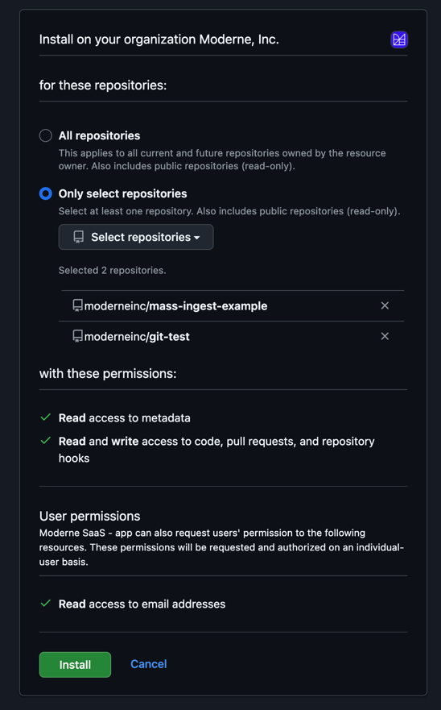
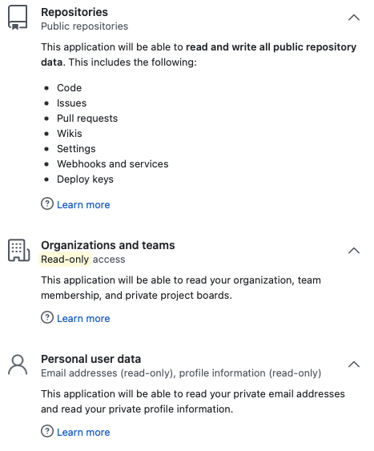
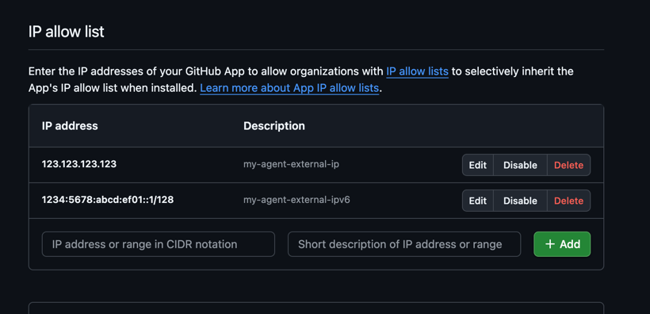

# GitHub permissions

Moderne uses a GitHub OAuth application (GitHub OAuth Apps or GitHub Apps) to perform various actions on your behalf. Below is an explanation of each type, their permissions, and how they're used by Moderne.

## GitHub App permission (preferred)

For GitHub Apps, Moderne requires a select number of OAuth scopes necessary to help you transform your code. The GitHub application can be installed into your personal, organization, or enterprise accounts as desired.

| Permission                            | Access     | Description                                                                                      |
| ------------------------------------- | ---------- | ------------------------------------------------------------------------------------------------ |
| Repositories - Contents               | Read/write | Create branches and push changesets on your behalf.                                              |
| Repositories - Pull Requests          | Read/write | Create, close, monitor status, and merge pull requests on your behalf.                           |
| Repositories - Workflows              | Read/write | Recipes that alter GitHub Action workflow files require this permission to make commits to them. |
| Account Permissions - Email addresses | Read-only  | Recognize your account as a new or returning user.                                               |

:::note
You'll need to install the GitHub application wherever you want to make code changes:

* **For personal forks**: Install it in your personal account.
* **For organization repositories**: Install it directly in the organization, or in your enterprise account (which automatically covers all member organizations).

Without the application installed, GitHub will reject any attempts to commit changes.
:::

## Installing a GitHub App

After creating your GitHub App, you need to install it in the organizations or accounts where you want Moderne to operate. This section walks through the installation process.

### Starting the installation

Navigate to your GitHub App's settings and select **Install App** from the left sidebar. You'll see a list of accounts where you can install the app:

<figure>
  
  <figcaption>_Select the organization or account where you want to install the GitHub App._</figcaption>
</figure>

Click **Install** next to the account where you want to enable the app.

### Selecting repository access

During installation, you can choose which repositories the GitHub App can access:

<figure>
  
  <figcaption>_Choose between all repositories or select specific repositories for the app to access._</figcaption>
</figure>

* **All repositories**: The app will have access to all current and future repositories in the organization.
* **Only select repositories**: Limit the app to specific repositories. This is optional and provides tighter control, but requires updating the installation when new repositories need access.

## GitHub OAuth App permission

Moderne requires a select number of OAuth scopes necessary to help you transform your code.

<figure>
  
</figure>

| Permission                            | Access     | Description                                                                                                                                                                                                                                                                                                                                                       |
| ------------------------------------- | ---------- | ----------------------------------------------------------------------------------------------------------------------------------------------------------------------------------------------------------------------------------------------------------------------------------------------------------------------------------------------------------------- |
| Repositories (public)                 | Read/write | Create branches, create forks of public repositories, and push changesets on your behalf.                                                                                                                                                                                                                                                                         |
| Repositories (private) **(optional)** | Read/write | Create branches, create forks of private repositories, and push changesets on your behalf.  Only enabled if `includePrivateRepos=true` is set in agent configuration for GitHub. See [configure an agent with github](../how-to-guides/agent-configuration/configure-an-agent-with-github.md) for more detail.                                            |
| Organizations and teams               | Read-only  | Understand the organizations you belong to and your level of access within them.                                                                                                                                                                                                                                                                                  |
| Workflow                              | Read/write | Recipes that alter GitHub Action workflow files require this permission to make commits to them.                                                                                                                                                                                                                                                                  |
| Personal user data                    | Read-only  | Recognize your account as a new or returning user. Email and Profile are included by default with OpenID Connect through OAuth.                                                                                                                                                                                                                                   |

## GitHub applications vs. GitHub OAuth applications

We recommend using GitHub Apps, which aligns with GitHub's best practices. GitHub Apps provide several significant security advantages over OAuth Apps:

* **Explicit installation scope**: GitHub Apps must be explicitly installed on an Enterprise account or organization, limiting access to only the contexts where they've been approved. OAuth Apps, by contrast, inherit access to all repositories a user can reach once authorized.
* **Fine-grained permissions**: GitHub Apps allow you to request only the specific permissions needed (e.g., read/write to repository contents, pull requests). OAuth Apps require broader permission scopes that often grant more access than necessary.
* **Short-lived tokens**: GitHub Apps use user access tokens that expire after 8 hours and are automatically refreshed. OAuth Apps use long-lived tokens that remain valid until explicitly revoked (which Moderne does after 90 days).
* **IP allow list compatibility**: For organizations that already use [IP restrictions](#configuring-ip-allow-lists), GitHub Apps can declare their IP addresses to avoid being blocked. OAuth Apps do not support this.
* **Improved rate limiting**: GitHub Apps receive more generous API rate limits. Installation access tokens start at 5,000 requests per hour and scale up based on the number of repositories—installations with more than 20 repositories receive an additional 50 requests per hour per repository, up to a maximum of 12,500 requests per hour. OAuth Apps are limited to 5,000 requests per hour regardless of installation size. See [GitHub's rate limits documentation](https://docs.github.com/en/rest/using-the-rest-api/rate-limits-for-the-rest-api) for details.

That being said, GitHub Apps require installation by an admin/owner in every context where they'll be used. This can create administrative overhead in certain scenarios.

For example, you might prefer a GitHub OAuth application instead if:

* **You support personal forks**: Each individual user would need to install the GitHub App in their personal account (not just in organizations they belong to).
* **You have many independent organizations**: An admin would need to install the GitHub App in every organization where Moderne will make changes.
    * Pro tip: Installing the GitHub App at the enterprise level automatically makes it available to all member organizations.
* **Installation overhead is too high**: The administrative burden of installing across multiple contexts may not be practical for your setup.

OAuth Apps require only user authorization (no installation), but they have broader permissions and access all repositories a user can reach.

## Configuring IP allow lists

If your organization uses an [IP allow list](https://docs.github.com/en/organizations/keeping-your-organization-secure/managing-security-settings-for-your-organization/managing-allowed-ip-addresses-for-your-organization), you can configure the GitHub App to work within those restrictions.

:::note
GitHub App IP allow lists only work when your organization has IP restrictions enabled. This feature allows GitHub Apps to bypass org-wide IP restrictions by declaring trusted IPs—it does not restrict the GitHub App independently. If your organization doesn't use IP allow lists, this configuration has no effect.
:::

**Step 1: Configure the GitHub App's IP allow list**

In the GitHub App settings under **General**, scroll to the bottom to find the **IP allow list** section:

<figure>
  
  <figcaption>_Add IP addresses for your Moderne agent to ensure it can access the GitHub API even when IP restrictions are enabled._</figcaption>
</figure>

Add the IP addresses of your Moderne agent deployment. Include both IPv4 and IPv6 addresses if your infrastructure uses both, as GitHub is gradually rolling out IPv6 support.

**Step 2: Enable IP allow list inheritance in your organization**

In your GitHub organization settings, navigate to **Security > Authentication security** and ensure both options are enabled:

* **Enable IP allow list** - Activates IP restrictions for your organization
* **Enable IP allow list configuration for installed GitHub Apps** - Allows your organization to automatically trust the IP addresses configured by installed GitHub Apps

Both settings are required for the GitHub App's IP configuration to take effect.