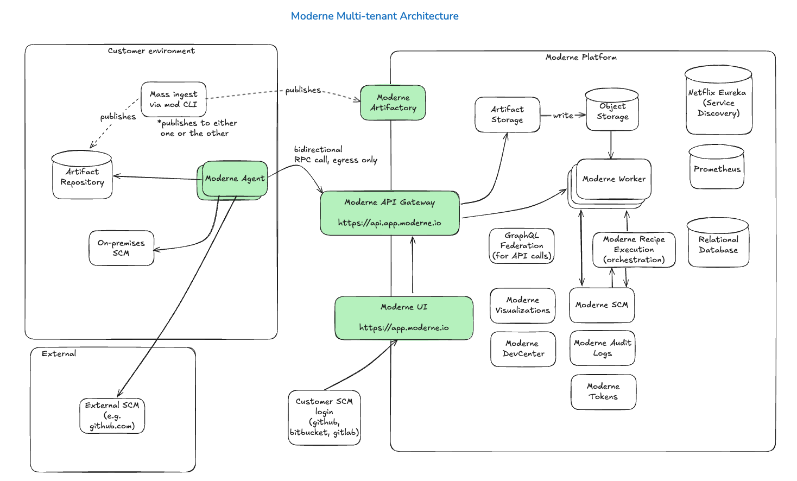

# Single-tenant vs. Multi-tenant

The Moderne Platform offers two editions based on your needs: multi-tenant and single-tenant. Both editions provide full, unlimited access to all of the platform's automated, distributed code remediation and migration features. They both also include advanced code impact analysis, code intelligence dashboards, and AI integrations.

The editions are differentiated by their implementations, enabling you to choose what fits the needs of your organization.

In this doc, we'll walk through the differences between the two. By the end, you should have a clear idea of which one is suitable for your company.

## Single-tenant

The single-tenant edition of Moderne is one where your company receives a dedicated, fully isolated instance of the Moderne Platform. The cloud provider and region for this instance can be configured based on your preferences.

For details about the single-tenant edition, please see the following docs:

* [Moderne Platform architecture](./architecture.md)
* [Authentication in the Moderne Platform](./authentication.md)
* [How sensitive data flows through the Moderne Platform](./flow.md)
* [What reports are available in the Moderne Platform](./reporting.md)

## Multi-tenant

The multi-tenant edition of Moderne is one where multiple companies have a secure, private area in a shared cloud instance of the Moderne Platform. Sincle multiple companies share a single cloud instance and resources, your contract with Moderne will cost less than it would if your company had their [own dedicated instance](#single-tenant).

### Architecture

<figure>
  
  <figcaption>_Multi-tenant architecture_ ([editable version](./assets/multi-tenant.excalidraw))</figcaption>
</figure>

### Configuration

As part of the multi-tenant setup, you will need to:

* Own and deploy a [Moderne agent](../how-to-guides/agent-configuration/agent-config.md) in some location that has access to your source code repositories
* Set up [mass ingestion](../how-to-guides/mass-ingest.md) to build and publish LSTs to an Artifactory instance (either one we own or your own personal Artifactory instance that the agent connects to)

:::tip
Since the Moderne Platform runs in AWS us-west-1, it would be beneficial for these components to be configured in the same region or in a nearby region to minimize the amount of time it takes to send data back and forth.
:::

### Authentication

Multi-tenant users are required to log in to Moderne through an SCM such as GitHub, GitLab, or Bitbucket. For added security, you can ensure that your SCM is backed by an identity provider that supports SAML or OIDC.

### Data access

Moderne does not have direct access to your code. Permissions are governed by SSO/SCM/IdP. Moderne employees can only read or write to your code if you grant them access via your SCM.

As part of setting up a multi-tenant instance of Moderne, you will [create a repos.csv file](../../references/repos-csv.md) that you share with us so that we can create an organization in the Moderne Platform for you.

After that, you will then create and share with us a file that contains a list of emails that should have access to your repositories and organization. Note that these emails **must** match the emails you use to log in to your SCM.

### Data storage

LSTs can either be stored in your own Artifactory instance or in a Moderne Artifactory instance. If LSTs are stored on your end, we will only have access to the LSTs that come to us encrypted through the agent.

Other than LSTs, we do store audit logs in our own database.

### Compliance

Moderne is SOC 2 Type 2 certified.