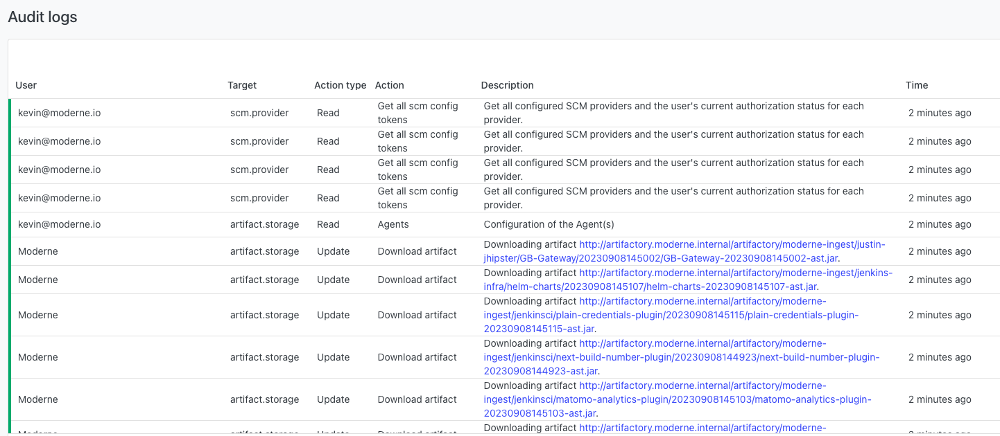
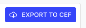
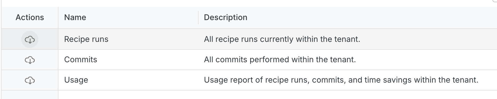
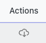
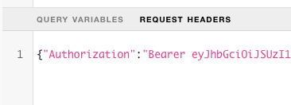

# Reporting

## Overview

Moderne offers a variety of reports for administrators:

* **Audit logs** - every action a user attempts to take in the platform, either via the UI or the API, is recorded along with the user who took the action, a description of the action, the time that action took place, and whether that action was successful. You can access audit logs via the UI or download them via the API in CEF or CSV format.
* **Recipes run** - every recipe run by every user in your system. Includes the recipe name, time saved, user that ran it, recipe, as well as various statistics of the recipe run.
* **Commits made** - every commit made by every user in your system. Includes the recipe run id (to be able to link the reports together), the type of commit, status of the commit job, as well as other statistics of the commit job.
* **Usage** - every recipe run and associated commit by every user in your system. The generated report combines the commit and recipe run reports. This report includes 
the recipe name, time saved, user that ran it, recipe, as well as various statistics of the recipe run. If any commit was created in association with the recipe run, details
of the commit are included (e.g., the type of commit or the status of the commit job). This report requires administrative permission to execute.

## Audit logs

Audit logs are accessible from `https://<TENANT>.moderne.io/admin/audit-logs`, and can be viewed in the UI, accessed via the API, or downloaded in file format.

### Export formats

Audit logs can be exported in two formats:

* **CEF (Common Event Format)** - An industry-standard format for security logs, commonly used with SIEM systems. For more information, see the [CEF implementation standard](https://www.microfocus.com/documentation/arcsight/arcsight-smartconnectors-8.3/cef-implementation-standard/).
* **CSV (Comma-Separated Values)** - A tabular format with the following columns: User, Target, Action type, Action, Description, Time, Outcome.

### Exporting via the UI

<figure>
  
  <figcaption></figcaption>
</figure>

To download audit logs from the UI:

1. Navigate to `https://<TENANT>.moderne.io/admin/audit-logs`.
2. (Optional) Use the date range picker to limit the export to a specific time period.
3. Click either "Export to CEF" or "Export to CSV" depending on your desired format.



### Exporting via the GraphQL API

You can also download audit logs programmatically using the GraphQL API. Before proceeding, make sure you have [created a Moderne personal access token](../../../user-documentation/moderne-platform/how-to-guides/create-api-access-tokens.md) and are familiar with [accessing the Moderne API](../../../user-documentation/moderne-platform/how-to-guides/accessing-the-moderne-api.md).

**Step 1: Initiate the download**

Use the `downloadAuditLogs` mutation to start the export process:

```graphql
mutation {
  downloadAuditLogs(
    format: CEF
    first: 1000
    since: "2024-01-01T00:00:00+00:00"
    until: "2024-12-31T23:59:59+00:00"
  ) {
    id
    state
    stateMessage
    url
  }
}
```

**Arguments:**

| Argument | Required | Description |
| -------- | -------- | ----------- |
| `format` | Yes | The export format. Must be either `CEF` or `CSV`. |
| `first` | No | Limit the number of records to export. Use `0` or `null` to export all records. |
| `since` | No | Start date filter in ISO 8601 format (e.g., `"2024-01-01T00:00:00+00:00"`). |
| `until` | No | End date filter in ISO 8601 format (e.g., `"2024-12-31T23:59:59+00:00"`). |

**Step 2: Check the download status**

The download is processed asynchronously. Poll the `auditLogsDownload` query with the returned `id` to check the status:

```graphql
query {
  auditLogsDownload(id: "<returned-id>") {
    id
    state
    stateMessage
    url
  }
}
```

**Response fields:**

| Field | Description |
| ----- | ----------- |
| `id` | The unique identifier for this download request. |
| `state` | The current state: `QUEUED`, `SUCCESSFUL`, or `FAILED`. |
| `stateMessage` | An error message if the state is `FAILED`. |
| `url` | The download URL, available only when state is `SUCCESSFUL`. |

**Step 3: Download the file**

Once the `state` is `SUCCESSFUL`, use the provided `url` to download the audit log file. You must include the `Authorization` header with your Moderne personal access token when making the request to the download URL.

Example using `curl`:

```bash
curl -H "Authorization: Bearer <YOUR_MODERNE_PAT>" "<download-url>"
```

## Other reports (recipe runs, commits, and usage)

To access non-audit-log reports, navigate to `https://<TENANT>.moderne.io/admin/reports`.

<figure>
  
  <figcaption></figcaption>
</figure>

These reports can be downloaded using the download button: 

## Usage report

The usage report includes several columns that may need clarification:

* **totalFilesResults** - The number of results from the recipe run. This includes both changes produced by the recipe and [markers](https://docs.openrewrite.org/concepts-and-explanations/markers) generated from the recipe.
* **totalFilesChanges** - The number of changes produced by the recipe (excludes markers).
* **timeSavingsInMinutes** - The sum of the number of changes (not markers) multiplied by the time savings as defined in the recipe that made the changes.

## Accessing via the API

All of these reports can be accessed via the API as well. Here is an example of how to prepare and download the recipe run report:

```graphql
mutation firstDownloadRecipeRunReport {
  downloadRecipeRunReport {
    id
  }
}

query secondDownloadRecipeRunReport($id: ID!) {
  recipeRunReportDownload(id: $id) {
    id
    state
    stateMessage
    url
    fileSize
  }
}
```

The output of `secondDownloadRecipeRunReport` will include a URL which you can then use to download the report.

**Note:** These actions require admin access, and Moderne tokens do not provide admin access (even for platform administrators). You must use your current JWT, accessible by accessing `https://<TENANT>.moderne.io/graphql` and copying the authorization:

<figure>
  
  <figcaption></figcaption>
</figure>
