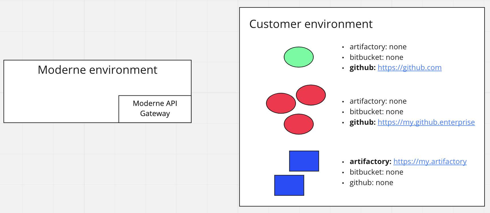

# Routing requests to agents

In most enterprise environments, deployments of developer tooling like source control management (SCM) systems and artifact repositories are complex and varied. There may be multiple SCM systems on isolated network segments.

The scaling characteristics of these solutions are also distinct. Retrieving artifacts from an artifact repository is more intensive than making API requests against an SCM.

Moderne Agents perform actions against these various pieces of tooling on behalf of Moderne users. Below is an illustration of an example Moderne deployment.

Here we have a total of 6 agents running in the customer environment. Not every agent is configured the same. Circular agents are connected to SCM repositories, and square agents are connected to artifact repositories.

:::info
The combinations of configurations are varied. A single agent instance may be configured to be connected to multiple developer tools. In our example we are configuring one tool per agent instance, but this is not the only way to work.
:::

Depending on the action, requests to these agents are routed differently. Moderne can partition requests across agents, broadcast to matching agents or not, and filter agents.

| Broadcast | Partition                            | Responses | Examples                                                                                                                   |
| --------- | ------------------------------------ | --------- | -------------------------------------------------------------------------------------------------------------------------- |
| yes       | N/A | many      | Scraping metrics from every agent                                                                                          |
| no        | yes                                  | many      | Syncing LST artifacts from a representative agent for each distinct artifact repository (partition by artifact repository) |
| yes       | no                                   | many      | No current use case                                                                                                        |
| no        | no                                   | one       | Git commit                                                                                                                 |

## How routing works

When the Moderne platform needs to communicate with your infrastructure (for example, to download an LST or make a git commit), it selects an agent using the following logic:

1. **Filter by capability** — only agents that have a matching tool configured are considered. For example, a git commit to `github.mycompany.com` only routes to agents that have a GitHub configuration pointing to that host.
2. **Round-robin** — among matching agents, requests are distributed in round-robin fashion. If an agent fails to respond, the platform tries the next one.
3. **Caching** — the list of available agents is refreshed every 10 seconds. If an agent goes down, it is removed from rotation within that window.

This means:

* All agents with the same tools configured are interchangeable — you do not need to designate primary and secondary agents.
* An agent going offline is handled gracefully — requests fail over to the next agent in the rotation.

## What routes through agents

Not all platform operations go through agents. Recipe execution happens on Moderne workers in the SaaS environment — agents are not involved.

| Operation                     | Routes through agent? | Routing strategy                             |
| ----------------------------- | --------------------- | -------------------------------------------- |
| LST artifact download         | Yes                   | Partitioned by artifact repository           |
| LST artifact listing          | Yes                   | Partitioned by artifact repository           |
| Git commit and PR creation    | Yes                   | Routed to agent with matching SCM config     |
| Repository listing            | Yes                   | Routed to agent with matching SCM config     |
| Organization mapping          | Yes                   | Agent serves `repos.csv`                     |
| Maven dependency resolution   | Yes                   | Routed to agent with matching Maven config   |
| Recipe execution              | No                    | Runs on Moderne workers (SaaS-side)          |

## Splitting agents by capability

You can run specialized agents by configuring different tools on different instances. This is useful when:

* Your artifact repository and SCM are on different network segments
* You want to scale LST artifact downloads independently from SCM operations
* Different tools require different authentication credentials

### Example: split by tool type

| Agent               | Configured tools    | Handles                                  |
| ------------------- | ------------------- | ---------------------------------------- |
| `artifact-agent-1`  | Artifactory         | LST downloads, recipe artifact sync      |
| `artifact-agent-2`  | Artifactory         | LST downloads (additional throughput)    |
| `scm-agent-1`       | GitHub, GitLab      | Git commits, PR creation, repo listing   |

### Common pitfall: missing SCM operations after splitting

If you split agents and find that git operations (commits, PRs) are no longer working, check that at least one running agent has the SCM tool configured. The platform routes git operations only to agents that have the matching SCM configuration — if no agent has it, those operations will fail silently.

## Multi-tenant customers

For multi-tenant customers, Moderne runs an agent that connects to your artifact repositories. For instance, if you work for a company whose email addresses end with `@mycompany.com`, Moderne configures an agent for you with a `tenantDomain` of `mycompany.com`.

If a user is logged into Moderne with an `@mycompany.com` email address, they will find that their requests (e.g., Maven resolution requests) are made to the `mycompany.com` artifact repositories.
