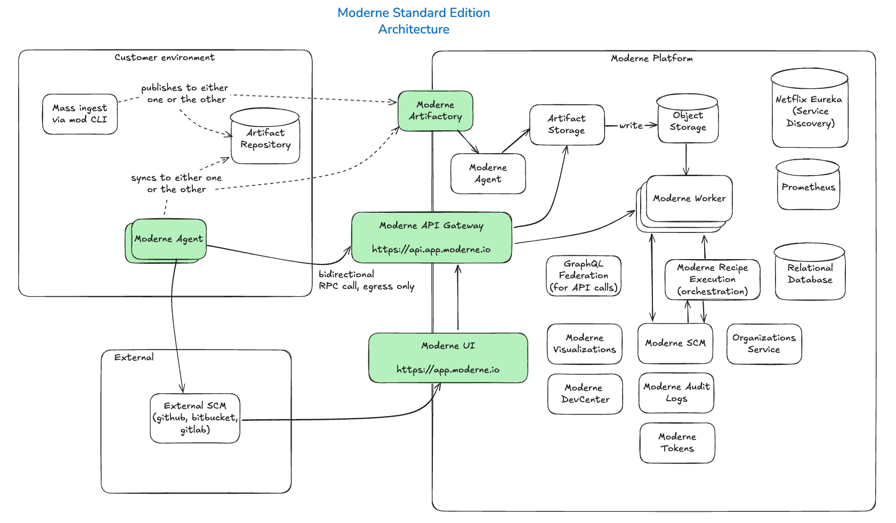

# Standard Edition vs. Enterprise Edition

The Moderne Platform offers two editions based on your needs: Standard and Enterprise. Both editions provide full, unlimited access to all of the platform's automated, distributed code remediation and migration features. They both also include advanced code impact analysis, code intelligence dashboards, and AI integrations.

The editions are differentiated by their implementations, enabling you to choose what fits the needs of your organization.

In this doc, we'll walk through the differences between the two. By the end, you should have a clear idea of which one is suitable for your company.

## Enterprise edition

The Enterprise edition of Moderne is one where your company receives a dedicated, fully isolated instance of the Moderne Platform. The cloud provider and region for this instance can be configured based on your preferences.

For details about the Enterprise edition, please see the following docs:

* [Moderne Platform architecture](./architecture.md)
* [Authentication in the Moderne Platform](./authentication.md)
* [How sensitive data flows through the Moderne Platform](./flow.md)
* [What reports are available in the Moderne Platform](./reporting.md)

## Standard edition

The Standard edition of Moderne offers a more cost-effective operational footprint by leveraging shared infrastructure – allowing it to be provided at a lower price point. In contrast, the Enterprise edition is typically more expensive, as it operates on dedicated resources and does not share infrastructure with other customers.

### Architecture

<figure>
  
  <figcaption>_Standard edition architecture_ ([editable version](./assets/standard-edition-architecture.excalidraw))</figcaption>
</figure>

### Configuration

As part of the Standard edition setup, you will need to:

* Own and deploy a [Moderne agent](../how-to-guides/agent-configuration/agent-config.md) in some location that has access to your source code repositories
* Set up [mass ingestion](../how-to-guides/mass-ingest.md) to build and publish LSTs to an Artifactory/Nexus instance (either one we own or you manage that the agent connects to)

:::tip
Since the Moderne Platform runs in AWS us-west-1, it would be beneficial for these components to be configured in the same region or in a nearby region to minimize the amount of time and money it takes to send data back and forth.
:::

### Authentication

Standard edition users are required to log in to Moderne through an SCM such as GitHub, GitLab, or Bitbucket. For added security, you can ensure that your SCM is backed by an identity provider that supports SAML or OIDC.

### Data access

Moderne does not have direct access to your code. Permissions are governed by SSO/SCM/IdP. Moderne employees can only read or write to your code if you grant them access via your SCM.

As part of setting up the Standard edition of Moderne, you will [create a repos.csv file](../../references/repos-csv.md) that you share with us so that we can create an organization in the Moderne Platform for you.

After that, you will then create and share with us a file that contains a list of emails that should have access to your repositories and organization. Note that these emails **must** match the emails you use to log in to your SCM.

### Data storage

LSTs can be stored in either your's or Moderne's artifact repository. In either case they will be unencrypted in the artifact repository.

At the time they're ingested in to the Moderne platform, they will be encrypted by the Moderne agent. This means the LSTs will be encrypted in transit and at rest in Moderne's systems.

Moderne also maintains audit logs for all actions performed within the system under your tenant.

### Compliance

Moderne is SOC 2 Type 2 certified.