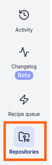
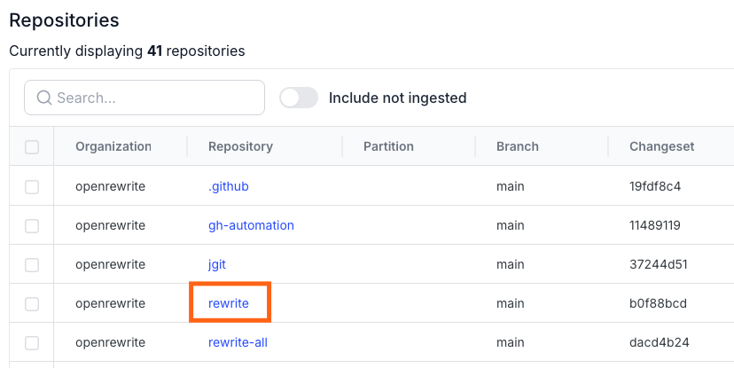
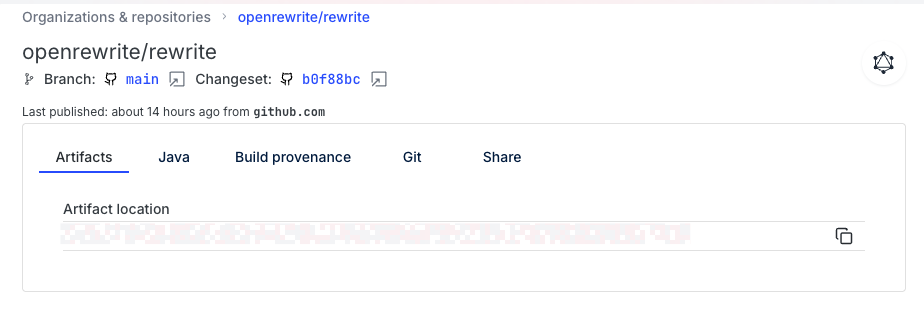

# User roles

| Action                                            |       Everyone                    |    Administrators     |
| ------------------------------------------------- | :-------------------------------: | :-------------------: |
| Interact with DevCenter                           | [Users with organization access](#organization-access)    | :white_check_mark:  |
| View Marketplace                                  |       :white_check_mark:        | :white_check_mark:  |
| Build recipes                                     |       :white_check_mark:        | :white_check_mark:  |
| Create and use access tokens                      |       :white_check_mark:        | :white_check_mark:  |
| Deploy recipe and visualization artifacts         |              :x:                  | :white_check_mark:  |
| View list of repositories                         | [Users with organization access](#organization-access)    | :white_check_mark:  |
| [View repository insights](#repository-insights)                          | [Users with organization access](#organization-access)    | :white_check_mark:  |
| View activity log                                 | [Users with organization access](#organization-access)    | :white_check_mark:  |
| Run recipes and visualizations                    | [Users with organization access](#organization-access)    | :white_check_mark:  |
| View recipe results                               | [Users with SCM access](#scm-access)             | [Users with SCM access](#scm-access)|
| Commit recipe results                             | [Users with SCM access](#scm-access)             | [Users with SCM access](#scm-access) | 
| [Download data tables](#user-content-fn-1)[^1]    | [Users with SCM access](#scm-access)             | [Users with SCM access](#scm-access) |
| View audit logs                                   |              :x:                  | :white_check_mark:  |
| Download usage reports                            |              :x:                  | :white_check_mark:  |
| View connected agents and associated technologies |              :x:                  | :white_check_mark:  |
| View and delete user access tokens                |              :x:                  | :white_check_mark:  |
| Quarantine repositories                           |              :x:                  | :white_check_mark:  |
| View connected workers                            |              :x:                  | :white_check_mark:  |

## Organization access

Organization access is determined via an [Organizations service](../how-to-guides/organizations-service.md). Once an organization service is configured, users will only be able to view and interact with repositories that belong to the organizations they've been assigned to. Even if they have direct access to a repositories code, they won't be able to do anything in Moderne with it unless they've been granted access to an organization that contains that repository.

## SCM access

In order to view recipe results, download data tables produced by a recipe, or commit recipe results, users will need to have [SCM access to the repositories](./flow#integrating-with-scms). This restriction applies even for admins in Moderne.

[^1]: If a user does not have access to a specific repository, they will not see a row for said repository in the data table.

## Repository insights

The repository insights page provides details about a repository such as what languages it is composed of, where the artifacts live, what version of Java it uses, how it was built, etc.

You can find repository insights by clicking on the repositories link in the navigation bar:

<figure>
  
  <figcaption>_Repositories link_</figcaption>
</figure>

Then find the repository you want to learn more about in the list of repositories and click on the repository name:

<figure>
  
  <figcaption>_Repository insight link_</figcaption>
</figure>

You'll then be taken to the repository insights page:

<figure>
  
  <figcaption>_Repository insights_</figcaption>
</figure>