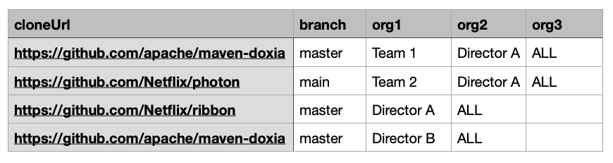

import Tabs from '@theme/Tabs';
import TabItem from '@theme/TabItem';

# Creating a repos.csv file

Whether you are configuring mass ingestion of repositories into Moderne or you are defining an organizational hierarchy, you will need to create a `repos.csv` file that defines your repositories and configuration around them. 

This doc will provide you with everything you need to know about creating and using this file.

## Supported columns

<details>
<summary>
List of all of the supported columns:
</summary>

| Column name | Required | Description                                                                                                                                                                                                                                            | Example                                                                      |
|-------------|----------|--------------------------------------------------------------------------------------------------------------------------------------------------------------------------------------------------------------------------------------------------------|-------------------------------------------------------------------------------|
| cloneUrl    | `true`   | The URL of the repository that should be ingested.                                                                                                                                                                                                     | `git@github.com:google/guava.git` or `https://github.com/openrewrite/rewrite` |
| branch      | Required for the agent but not required for mass ingestion  | The branch of the above repository that should be ingested.                                                                                                          | `main`                                                                        |
| changeset   | `false`  | If provided, this will check out the repository at this specific commit SHA.                                                                                                                                                                           | `aa5f25ac0031`                                                                |
| java        | `false`  | Configures the JDK to use.                                                                                                                                                                                                                             | `17` or `17-tem` or `17.0.6-tem`                                              |
| jvmopts     | `false`  | JVM options added to tools building LSTs. Must be configured before you can run the build command if non-standard VM options are required.                                                                                                             | `-Xmx4G`                                                                      |
| mavenArgs   | `false`  | Build arguments are added to the end of the Maven command line when building LSTs.                                                                                                                                                                     | `-Pfast`                                                                     |
| gradleArgs  | `false`  | Build arguments that are added to the end of the Gradle command line when building LSTs.                                                                                                                                                               | `-Dmyprop=myvalue`                                                            |
| org*        | `false`  | If you want to configure an organizational hierarchy, you can provide one or more organization columns. Each column will specify an organization the repository should be part of. The column name should be `org` plus a number such as: `org1,org2,org3`.  | `openrewrite`                                                           |
</details>

## Generating this file

To kick-start a `repos.csv` file, we recommend using "[repo fetchers](https://github.com/moderneinc/repository-fetchers)". Repo fetchers are scripts that generate a CSV file of all of your repositories by making API calls to your source code manager.

## Defining an organizational hierarchy

Org hierarchy is best explained with an example. Consider an organization that consists of two teams and two directors:

```
All
├── Director A
|       └── Team 1
|       └── Team 2
├── Director B

```

The following CSV file would represent this organizational structure:

```bash showLineNumbers
cloneUrl,branch,org1,org2,org3
"https://github.com/apache/maven-doxia","master","Team 1","Director A","ALL"
"https://github.com/Netflix/photon","main","Team 2","Director A","ALL"
"https://github.com/Netflix/ribbon","master","Director A","ALL"
"https://github.com/apache/maven-doxia","master","Director B","ALL"
```

In the above file, we define 5 organizations (ALL, Director A, Director B, Team 1, and Team 2) and 3 repositories. Notice that one repository can be defined multiple times if you want two distinct organizations to have access to it.

Also note that organizations on the left are children of organizations on the right. For instance, `Team 1` is a child of `Director A` which is a child of `ALL`.

:::tip
Comma-separated files (CSV) are best manipulated using a dedicated editor such as Microsoft Excel, Google Sheets, or Apple Numbers. Here is what the above CSV would look like on Apple Numbers:


:::

## Formatting details

- A single row may not have more columns than what is defined in the first row.
- A single repository may be associated with multiple organizations by being referenced in multiple rows. In the above
  example, `maven-doxia` is associated with both `Director B` and `Team 1`.
- Repositories can be associated with any organization down the tree, not just the leaves. See line 4 in the `csv` file
  for an example.

:::warning
Org columns must start immediately after the branch column. Likewise, they must be contiguous. **Do not** add empty orgs
so that the orgs line up with one another.

<Tabs>
<TabItem value="not-this" label="Don't do this">
```bash {showLineNumbers}
cloneUrl,branch,org1,org2,org3,org4
"https://github.com/apache/maven-doxia","master","Team 1","Director A","ALL"
# Non-contiguous series of orgs 👇 
"https://github.com/Netflix/photon","main","Team 2","","Director B","ALL"
# First org does not start immediately after the branch column 👇 
"https://github.com/Netflix/ribbon","master","","Director A","ALL"
```
</TabItem>

<TabItem value="do-this" label="Do this">
```bash {showLineNumbers}
cloneUrl,branch,org1,org2,org3,org4
"https://github.com/apache/maven-doxia","master","Team 1","Director A","ALL"
"https://github.com/Netflix/photon","main","Team 2","Director B","ALL"
"https://github.com/Netflix/ribbon","master","Director A","ALL"
```
</TabItem>
</Tabs>
:::

## Full example

Here is a full example of what the first two rows might look like if you defined all of the columns:

```csv
cloneUrl,branch,changeset,java,jvmOpts,mavenArgs,gradleArgs,org1,org2,org3
https://github.com/openrewrite/rewrite-recipe-bom,main,aa5f25ac0031,17-tem,-Xmx4G,-Pfast,-Dmyprop=myvalue,Team 1, Director 1, ALL
```

Formatted in a table:

| cloneUrl                                            | branch | changeset      | java     | jvmOpts   | mavenArgs   | gradleArgs         | org1     | org2         | org3   |
|-----------------------------------------------------|--------|----------------|----------|-----------|-------------|--------------------|----------|--------------|--------|
| `https://github.com/openrewrite/rewrite-recipe-bom` | `main` | `aa5f25ac0031` | `17-tem` | `-Xmx4G`  | `-Pfast`    | `-Dmyprop=myvalue` | `Team 1` | `Director 1` | `ALL`  |