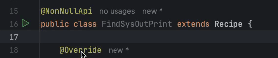

# Module 1: Recipe development environment and debugging

This module takes a deeper dive into the tools you'll use to author, run, and debug advanced OpenRewrite recipes. You'll explore the Moderne IntelliJ plugin's multi-repository search and recipe generation, then learn how to debug recipes using both IDE breakpoints and CLI runs.

:::info
This module assumes you have already completed [Fundamentals Module 1: Recipe development environment](../fundamentals/module-1-recipe-development-environment.md). That module covers the environment setup this workshop depends on, including cloning the [`rewrite-recipe-starter` repository](https://github.com/moderneinc/rewrite-recipe-starter), installing the Moderne plugin and CLI, and running the starter's tests. Complete it first if you haven't, then return here.
:::

## Exercise 1a: Using the Moderne plugin for IntelliJ

In this exercise, you'll use the [Moderne IntelliJ plugin](https://plugins.jetbrains.com/plugin/17565-moderne) to search across repositories for an API, generate a recipe from it, and run that recipe via the plugin and the CLI.

### Goals for this exercise

* Configure the Moderne plugin with repositories to search across.
* Perform a type-aware search across all of your local repositories.
* Create a simple search recipe.
* Run the recipe with the Moderne plugin and the CLI.

### Steps

1. You should already have the Moderne IntelliJ IDEA plugin installed from [Fundamentals Module 1](../fundamentals/module-1-recipe-development-environment.md). (If not, install it now with the [Moderne plugin installation guide](../../user-documentation/moderne-ide-integration/how-to-guides/moderne-plugin-install.md).) Make sure the plugin has repositories to search across: either add a local root directory as a `Multi-repo`, or select a Moderne organization (such as `Default` or `Netflix`) in the `Multi-repos` section.
2. Open any Java class in IntelliJ and look for an API that you're interested in searching for (e.g., `System.out.println(..)` or `ListUtils.map(..)`). Then, follow the instructions in our [multi-repository code search doc](../../user-documentation/moderne-ide-integration/how-to-guides/code-search.md) to look for that API across all of the repositories you added to the Moderne plugin.
3. Next, let's create a simple search recipe that finds that API you searched for. Right-click on the API again and select `Refactor > Create OpenRewrite Recipe...`. Then select that you want to create a `Visitor Style` recipe.
   * For more details on creating recipes with the Moderne plugin, check out our [how to create recipes guide](../../user-documentation/moderne-ide-integration/how-to-guides/creating-recipes.md).
4. You should now have a scratch file that contains a simple recipe. Copy it over to the `rewrite-recipe-starter` repository and add it to the `com.yourorg` package (or whatever you renamed your package to).
   * [Here's an example of what this might look like for finding System.out.println](https://gist.github.com/mike-solomon/3b49a5d19c8824776bcc4ee871b87cdd)
5. To run the recipe inside IntelliJ, click the gutter arrow next to the class declaration and select `Run <class_name>`.

<figure>
  
  <figcaption></figcaption>
</figure>

6. The recipe runs against every repository you've configured in the plugin. Find code changes in the `Changes` tab and search results in the `Find` tab.
7. You can also run this recipe from the Moderne CLI using the **Set Active Recipe** + `mod run . --active-recipe` workflow you used in [Fundamentals Module 1](../fundamentals/module-1-recipe-development-environment.md#step-4-install-and-verify-locally): right-click the class name, select **Set Active Recipe**, then run `mod run . --active-recipe` from your workshop directory.

### Takeaways

* The Moderne plugin allows you to search for APIs quickly and easily across numerous repositories.
* You can use the Moderne plugin to generate recipes based on an API you see.

## Exercise 1b: Debugging recipes

In this exercise, you’ll learn how to debug recipes using both IDE breakpoints and command-line execution.

### Goals for this exercise

* Debug recipes using the Moderne IntelliJ plugin.
* Understand how to set breakpoints in a recipe class or visitor.
* Use the `TreeVisitingPrinter` to see what an LST looks like.

### Steps

1. Follow [our guide for how to debug a recipe with the Moderne plugin](../../user-documentation/moderne-ide-integration/how-to-guides/debugging-recipes.md#step-4-debug-your-recipe). It walks you through setting an active recipe, building LSTs, and debugging the recipe — including how to attach a remote debugger from the CLI with `modw --debug run . --active-recipe`.
2. Open a test case (e.g., `FindSpringBeansTest`), set breakpoints inside `visit()` or the visitor logic, then run the test in debug mode (green bug icon in IntelliJ) and step through to inspect variables and visitor flow.
3. [Configure the TreeVisitingPrinter](../../user-documentation/recipes/authoring-recipes/concepts/tree-visiting-printer.md) to see what an LST looks like when your recipe finds a match — a great way to learn the different [Java LST elements](../../user-documentation/recipes/authoring-recipes/concepts/lst-examples/java.md). You'll need to add `import org.openrewrite.java.TreeVisitingPrinter;` to your recipe's imports.

### Takeaways

* You can use the CLI in combination with the Moderne plugin to debug recipes.
* Logging and breakpoints are helpful tools for troubleshooting recipe behavior.
* The `TreeVisitingPrinter` is a great way of understanding what the LST looks like.
