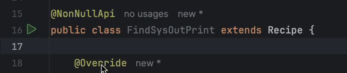

# Module 1: Recipe development environment and debugging

This module introduces the primary tools you'll use to author, run, and debug advanced OpenRewrite recipes. You'll explore the Moderne IntelliJ plugin's capabilities and learn how to debug recipes using both IDE-based tests and CLI runs.

We’ll build on what you may have seen in the fundamentals course and take a deeper dive into real-world development and troubleshooting workflows.

:::info
If you have not already run through [Fundamentals of recipe development](../fundamentals/workshop-overview), you will want to at least complete [Module 3: Recipe development environment](../fundamentals/module-3-recipe-development-environment) to validate your development environment and ensure you have all the necessary tools and setup to develop and run advanced OpenRewrite recipes. This includes making sure you have cloned the [`rewrite-recipe-starter` repository](https://github.com/moderneinc/rewrite-recipe-starter).)
:::

## Exercise 1a: Using the Moderne plugin for IntelliJ

Moderne offers an [IntelliJ IDEA plugin](https://plugins.jetbrains.com/plugin/17565-moderne) that can not only help you create and debug recipes, but can also assist with your general development experience by allowing you to easily search for code across all of your repositories at once.

### Goals for this exercise

* Install and configure the Moderne IntelliJ IDEA plugin.
* Perform a type-aware search across all of your local repositories.
* Create a simple search recipe.
* Run the recipe with the Moderne plugin and the CLI.

### Steps

1. If you haven't already installed and configured the Moderne IntelliJ IDEA plugin, follow along with our [Moderne plugin installation guide](../../user-documentation/moderne-ide-integration/how-to-guides/moderne-plugin-install.md)
   * If you have many repositories checked out locally and want to search across those, please add the root directory as a `Multi-repo`.
   * If you don't have many repositories checked out locally or would prefer to see what it looks like to add a Moderne organization, please select one of the Moderne organizations (such as `Default` or `Netflix`) in the `Multi-repos` section. 
2. Open any Java class in IntelliJ and look for an API that you're interested in searching for (e.g., `System.out.println(..)` or `ListUtils.map(..)`). Then, follow the instructions in our [multi-repository code search doc](../../user-documentation/moderne-ide-integration/how-to-guides/code-search.md) to look for that API across all of the repositories you added to the Moderne plugin.
3. Next, let's create a simple search recipe that finds that API you searched for. Right-click on the API again and select `Refactor > Create OpenRewrite Recipe...`. Then select that you want to create a `Visitor Style` recipe.
   * For more details on creating recipes with the Moderne plugin, check out our [how to create recipes guide](../../user-documentation/moderne-ide-integration/how-to-guides/creating-recipes.md).
4. You should now have a scratch file that contains a simple recipe. Copy it over to the `rewrite-recipe-starter` repository and add it to the `com.yourorg` package (or whatever you renamed your package to).
   * [Here's an example of what this might look like for finding System.out.println](https://gist.github.com/mike-solomon/3b49a5d19c8824776bcc4ee871b87cdd)
5. There are two ways to run the recipe: from inside of IntelliJ or with the CLI. Let's start with running the recipe in IntelliJ against all of the repositories that you've specified in the Moderne plugin configuration.
6. On the line where the class is defined, you should notice an arrow to the left of the text. Click it and then press `Run <class_name>`.

<figure>
  
  <figcaption></figcaption>
</figure>

7. The recipe will then begin running against all of the repositories you've specified. If any changes are made, you can find those in the `Changes` tab. If the recipe is a search recipe, you can find all search results in the `Find` tab.
8. Next, let's try running the same recipe with the Moderne CLI. Right-click on the class name and select `Set Active Recipe`.
9. Open your terminal, navigate to your workshop directory, and run the recipe: `mod run . --active-recipe`.
10. You should see that this recipe ran and marked all the locations in all of the repositories that matched the API you generated the recipe from.

### Takeaways

* The Moderne plugin allows you to search for APIs quickly and easily across numerous repositories.
* You can use the Moderne plugin to generate recipes based on an API you see.

## Exercise 1b: Debugging recipes

In this exercise, you’ll learn how to debug recipes using both IDE breakpoints and command-line execution.

### Goals for this exercise

* Debug recipes using the Moderne IntelliJ plugin.
* Understand how to set breakpoints in a recipe class or visitor.
* Use the `TreeVisitingPrinter` to see what an LST looks like.
* Understand how to set breakpoints in a recipe class or visitor.

### Steps

1. Follow [our guide for how to debug a recipe with the Moderne plugin](../../user-documentation/moderne-ide-integration/how-to-guides/debugging-recipes.md#step-4-debug-your-recipe).
   * This will walk you through the necessary steps to set an active recipe, build LSTs to run it against, then run and debug your recipe.
   * You will also see how to use the Moderne CLI to attach a remote debugger with `mod run . --jvm-debug --active-recipe`.
2. Open a test case for a recipe (e.g., `FindSpringBeansTest`), set breakpoints inside the `visit()` method or relevant visitor logic.
   * Run the test in debug mode (using the green bug icon in IntelliJ) and inspect the variables and visitor flow as you step through.
3. Another useful thing to do when debugging is to [configure the TreeVisitingPrinter](https://docs.openrewrite.org/concepts-and-explanations/tree-visiting-printer). This will really help you understand the different [Java LST elements](https://docs.openrewrite.org/concepts-and-explanations/lst-examples).
    * Follow along with the instructions in that guide and make sure you can see what the LST looks like when it finds a match.
    * **Note**: you'll need to add `import org.openrewrite.java.TreeVisitingPrinter;` to your import statements in your recipe.

### Takeaways

* You can use the CLI in combination with the Moderne plugin to debug recipes.
* Logging and breakpoints are helpful tools for troubleshooting recipe behavior.
* The `TreeVisitingPrinter` is a great way of understanding what the LST looks like.
