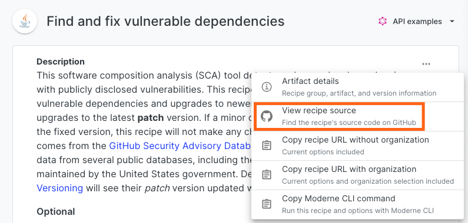

# Module 1: Running existing recipes

Before you begin writing your own recipes, you should make sure you are aware of what recipes already exist and how to run them. This is beneficial for two reasons: you won't spend time creating a recipe that someone else has already made, and you will gain a better understanding of how people will actually use any recipe you write.

There are two main locations for discovering recipes: the [OpenRewrite recipe catalog](https://docs.openrewrite.org/recipes) and [the Moderne Platform](https://app.moderne.io/marketplace). The former contains all the information you'll need to run the recipe – whereas the latter has a richer search and view, that allows you to directly run recipes.

:::warning
We recommend using Moderne multi-repository tools for authoring and testing recipes at scale. This accelerates the feedback loop on recipe quality, and allows you to validate recipes on real-life scenarios encountered in real codebases.

If you are an OSS contributor writing OSS recipes for your projects, you can use Moderne tools for free. Specifically, both the Moderne CLI and the Moderne IntelliJ plugin are free to test on OSS repositories that you control. If you don't see your project in the Moderne Platform, [please reach out to us](mailto:support@moderne.io), and we'll get it added.
:::

There are three main ways to run recipes for Moderne customers:

1. The [Moderne CLI](../../moderne-cli/getting-started/cli-intro.md) allows you to run recipes against **multiple projects locally**, and to debug recipes at scale.
   * Free to use on open-source projects, but [requires a Moderne CLI license](../../moderne-cli/getting-started/moderne-cli-license.md) for private projects.
   * **Serializes the LST of your project to disk**, and runs recipes against that serialized LST. Larger projects that won't work well with OpenRewrite can use the CLI instead.
2. The [Moderne Platform](https://app.moderne.io/marketplace) offers a UI that allows you to run recipes at scale, create data visualizations, and track progress over time.
   * Supports over 37,000 open-source projects and organizations for free.
   * Requires a company subscription for private projects.
   * Similar to the CLI, it can handle projects of any size.
3. The [Moderne IntelliJ IDEA plugin](../user-documentation/moderne-ide-integration/how-to-guides/moderne-plugin-install.md) allows you to run recipes that you're developing or have checked out locally from inside of IntelliJ.
   * Free to use on open-source projects, but [requires a Moderne CLI license](../../moderne-cli/getting-started/moderne-cli-license.md) for private projects.
   * Currently limited to only [imperative and refaster template recipes](https://docs.openrewrite.org/authoring-recipes/types-of-recipes).

:::info
Learn more about [the differences between OpenRewrite and Moderne](https://docs.openrewrite.org/#refactoring-at-scale-with-moderne).
:::

## Exercise 1: Run a recipe against a group of repositories.

To get comfortable running recipes, let's walk through using the [Moderne Platform](https://app.moderne.io/marketplace) and/or the [Moderne CLI](../../moderne-cli/getting-started/cli-intro.md) to run recipes against a group of repositories.

### Goals for this exercise

* See what recipes are already available.
* See the types of changes that can be made to your code.
* Run a recipe against a group of repositories.

### Steps

1. If you have access to the [Moderne Platform](https://app.moderne.io/marketplace), navigate to it and [follow along with our quickstart guide for running recipes](../../moderne-platform/getting-started/running-your-first-recipe.md). If you don't have access, skip to step 2.
   * Note that, by default, you will be running recipes against a hand-picked group of open-source repositories.
   * Feel free to explore other recipes that match your interests such as [migrating to Java 21](https://app.moderne.io/recipes/org.openrewrite.java.migrate.UpgradeToJava21) or [finding and fixing vulnerable dependencies](https://app.moderne.io/recipes/org.openrewrite.java.dependencies.DependencyVulnerabilityCheck).
   *   Consider checking out the source code for the recipes by clicking on the triple dots in the top-right hand corner of any recipe and then selecting `View recipe source`:

<figure>
  
  <figcaption></figcaption>
</figure>

2. If you don't have the CLI installed, please follow along with [our instructions for installing and configuring the Moderne CLI](../../moderne-cli/getting-started/cli-intro.md#installation-and-configuration).
3. Once the CLI is installed, please work through [our examples of using the CLI to run recipes](../../moderne-cli/getting-started/cli-intro.md#using-the-cli). Please refrain from applying any recipe changes, though - as this may cause issues in future steps.
   * This will have you run a recipe against a tailored group of open-source repositories and then have you study the results and data tables produced by the recipes. You will use this group of repositories again in future steps as we write and test recipes.
   * Feel free to explore the [OpenRewrite recipe catalog](https://docs.openrewrite.org/recipes) and run other recipes by following the `Moderne CLI` instructions on each recipe page.
   * Similarly, we'd recommend checking out the source code for the recipes by clicking on the `GitHub` link at the top of each recipe page.

### Takeaways

* There are over 3800 recipes already available to run that cover a wide range of use cases.
* Recipes can make changes to Java source files, properties files, XML files, build files and more.
* It's not necessary to change your build to run recipes.
* Any recipe page in the docs links to the source code of the recipe on GitHub, so you can see how it's implemented.
* The tests for the recipe are also available, so you can see how the recipe behaves in various scenarios.
* The Moderne CLI and Platform allow you to run recipes at scale, to see how recipes behave in practice.

If you're specifically interested in migrating Spring Boot applications, check out our [blogpost on migrating to Spring Boot 3.x](https://www.moderne.io/blog/speed-your-spring-boot-3-0-migration). You may also be interested in looking at the [migrate to Spring Boot 3.x recipe](https://docs.openrewrite.org/recipes/java/spring/boot3/springboot3bestpractices).