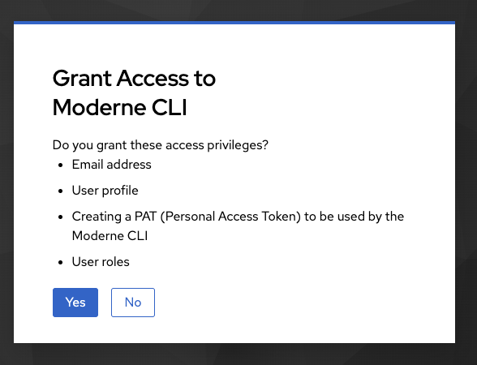
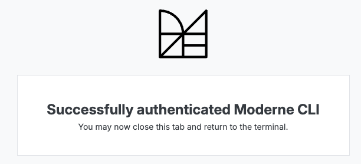
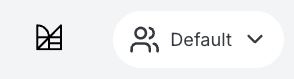
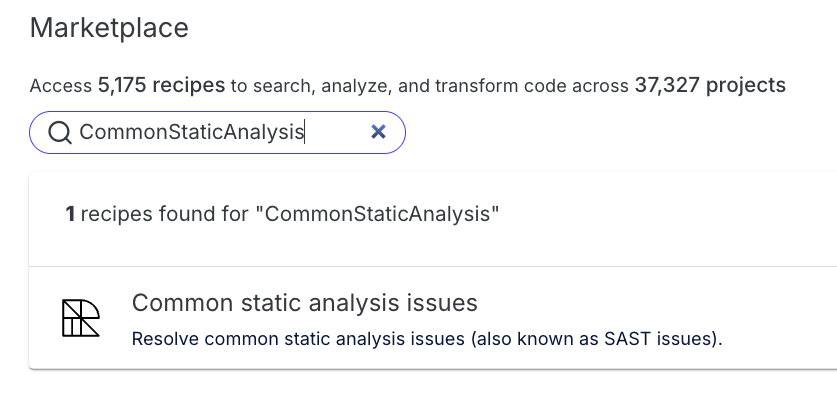
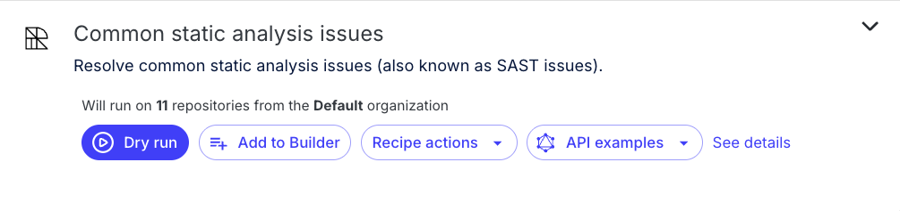
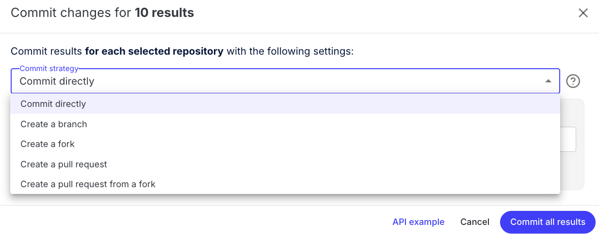

# Module 1: CLI setup and running recipes

In this module, you'll learn the key concepts behind OpenRewrite and get hands-on experience setting up and using the Moderne CLI to run recipes across repositories.

## Key concepts

Before diving into running recipes, it's important to understand some fundamental concepts. The summaries below provide a high-level overview of these ideas; review the [linked documentation](https://docs.openrewrite.org/concepts-explanations) for more details.

### Lossless Semantic Tree (LST)

The [Lossless Semantic Tree (LST)](https://docs.openrewrite.org/concepts-and-explanations/lossless-semantic-trees) is a tree representation of your source code that preserves all formatting, comments, and whitespace while also capturing type information. This is what enables OpenRewrite to make precise changes without disrupting the style of your code.

Key characteristics of the LST:

* **Lossless**: Every part of the original source is preserved, including whitespace and comments, so it can be reproduced exactly.
* **Format-preserving**: Changes made to the LST will result in code that matches the original formatting style.
* **Type-aware**: The tree is type-attributed, meaning it understands the specific types of each variable and method.

### Recipes

[Recipes](https://docs.openrewrite.org/concepts-and-explanations/recipes) are the unit of work in OpenRewrite. A recipe can:

* Make changes to source code (by modifying the LST then printing it out as code)
* Search for specific patterns and code structures (methods, types, annotations, etc.) then mark results
* Produce data tables with extracted information
* Be composed of other recipes

### Deterministic code changes

OpenRewrite recipes produce **deterministic** code changes. This means that running the same recipe on the same codebase will always produce the same result. This predictability is essential for automated code refactoring at scale.

### Running recipes: build plugins vs. Moderne tools

There are several ways to run OpenRewrite recipes:

* **Maven and Gradle plugins**: Run recipes directly in your build by configuring the OpenRewrite plugin. This works well for a single project, but running on many repositories typically means adding/configuring the plugin in each repo individually.
* **Moderne CLI**: Run recipes across one or more repositories locally without having to modify each repository to add a build plugin first. Serializes the LST to disk for faster subsequent runs.
* **Moderne Platform (SaaS)**: Run recipes at scale through a web UI with some additional capabilities like a recipe builder and data visualizations.

You can find more details about the [differences between the Moderne CLI and the OpenRewrite build plugins in the documentation](../../user-documentation/moderne-cli/getting-started/cli-intro.md#differences-between-the-moderne-cli-and-the-openrewrite-build-plugins).

For this workshop, you'll start by using the **Moderne CLI**, and then try the **Moderne Platform** as a comparison.

## Exercise 1-1: CLI setup

In this exercise, you'll download, install, and configure the Moderne CLI, then run your first recipe.

### Goals for this exercise

* Download and install the Moderne CLI
* Connect the CLI to the Moderne Platform
* Sync recipes and repositories
* Run a recipe across multiple repositories

### Steps

#### Step 1: Download and install the CLI

1. Go to [app.moderne.io](https://app.moderne.io/) and sign in.
2. Click on `?` in the top right-hand corner and select the Staging version of the CLI to download. (Make sure to use version 3.54.5 or higher for this workshop.)

:::info
Use the Staging version for local development purposes. The Stable release is only recommended for use when building LSTs at scale across whole organizations (known as "mass ingest").
:::

3. Either click the download button for your appropriate OS, or select one of the other installation methods like Homebrew (macOS), Chocolatey (Windows), or curl (Linux), then run the provided commands. (If you chose to install the CLI without a package manager, save it somewhere that your terminal can access by updating your `PATH`.)


4. Verify the installation by opening a terminal and typing:

```bash
mod --help
```

<details>
<summary>Reference output</summary>

```text
   ▛▀▀▚▖  ▗▄▟▜
   ▌   ▜▄▟▀  ▐
   ▛▀▀█▀▛▀▀▀▀▜
   ▌▟▀  ▛▀▀▀▀▜
   ▀▀▀▀▀▀▀▀▀▀▀
Moderne CLI 3.56.2

Usage:

mod [-h] [--version] [COMMAND]

Description:

Automated code remediation.

Options:

  -h, --help      Display this help message.
      --version   Display version info.
Commands:

  afterburner          (INCUBATING) Indexes built LSTs to accelerate recipe
                         execution.
  audit                (INCUBATING) Perform an audit of recent activity.
  batch                Add batch changes to the Moderne platform.
  build                Generates LST artifacts for one or more repositories.
  clean                Clean build and run artifacts produced by the CLI.
  config               Global configuration options that are required by some
                         CLI commands.
  devcenter            Generate DevCenter dashboards.
  exec                 Execute an arbitrary shell command recursively on
                         selected repository roots.
  generate-completion  Generate bash/zsh completion script for mod.
  git                  Multi-repository git operations.
  log                  Manages a log aggregate.
  list                 Lists the repositories that can be built and published.
  monitor              (INCUBATING) Launches an HTTP server used to monitor the
                         CLI.
  publish              Publishes the LST artifacts for one or more projects.
  run                  Runs an OpenRewrite recipe locally on pre-built LSTs.
  run-history          Get information about the most recent recipe runs. This
                         will be transitioning to mod audit runs list
                         eventually. A deprecation notice will be added here
                         when we suggest adopting the alternative.
  study                Produces studies from OpenRewrite recipe data tables
                         locally.
  trace                Manages trace analysis tools.
```

</details>

You should see a list of available commands.

#### Step 2: Connect the CLI to Moderne

Moderne provides a hosted platform at [app.moderne.io](https://app.moderne.io/), a public instance backed by a large catalog of open-source repositories. Connecting your CLI to this endpoint lets you authenticate and easily run recipes against these repos.

1. Connect the CLI to the Moderne Platform:

```bash
mod config moderne edit https://app.moderne.io
```

<details>
<summary>Reference output</summary>

```text
   ▛▀▀▚▖  ▗▄▟▜
   ▌   ▜▄▟▀  ▐
   ▛▀▀█▀▛▀▀▀▀▜
   ▌▟▀  ▛▀▀▀▀▜
   ▀▀▀▀▀▀▀▀▀▀▀
Moderne CLI 3.56.2

⏺ Configuring tenant https://app.moderne.io


⏺ What to do next
    > To log in, run mod config moderne login

MOD SUCCEEDED in 1s
```

</details>

2. Authenticate with Moderne:

```bash
mod config moderne login
```

<details>
<summary>Reference output</summary>

```text
   ▛▀▀▚▖  ▗▄▟▜
   ▌   ▜▄▟▀  ▐
   ▛▀▀█▀▛▀▀▀▀▜
   ▌▟▀  ▛▀▀▀▀▜
   ▀▀▀▀▀▀▀▀▀▀▀
Moderne CLI 3.56.2

Opening a browser to complete authentication...

Login successful, the token is valid for 365 days, until 2027-01-05T15:27:34-08:00

MOD SUCCEEDED in 20s
```




</details>

This command will open a web page where you'll grant the CLI access. After granting access, the CLI will automatically configure and store your token locally. You should see a success message indicating your token is valid for 365 days.

#### Step 3: Install the recipe packs you'll use

You could download the full recipe catalog from Moderne using the `mod config recipes moderne sync` command, but this will take several minutes to run. For this workshop, you can install only the recipe JARs needed for the upcoming exercises with the following command:

```bash
mod config recipes jar install \
  org.openrewrite:rewrite-java \
  org.openrewrite.recipe:rewrite-migrate-java \
  org.openrewrite.recipe:rewrite-java-dependencies \
  org.openrewrite.recipe:rewrite-static-analysis \
  org.openrewrite.recipe:rewrite-java-security
```

<details>
<summary>Reference output</summary>

```text
   ▛▀▀▚▖  ▗▄▟▜
   ▌   ▜▄▟▀  ▐
   ▛▀▀█▀▛▀▀▀▀▜
   ▌▟▀  ▛▀▀▀▀▜
   ▀▀▀▀▀▀▀▀▀▀▀
Moderne CLI 3.56.2

⏺ Installing recipes from JAR artifacts

Recipe resolution output will be written to log

▶ org.openrewrite:rewrite-java
    Selected version 8.71.0-SNAPSHOT
    Found 98 recipes
    ✓ Installed artifact
▶ org.openrewrite.recipe:rewrite-migrate-java
    Selected version 3.25.0-SNAPSHOT
    Found 415 recipes
    ✓ Installed artifact
▶ org.openrewrite.recipe:rewrite-java-dependencies
    Selected version 1.49.0-SNAPSHOT
    Found 16 recipes
    ✓ Installed artifact
▶ org.openrewrite.recipe:rewrite-static-analysis
    Selected version 2.25.0-SNAPSHOT
    Found 171 recipes
    ✓ Installed artifact
▶ org.openrewrite.recipe:rewrite-java-security
    Selected version 3.25.0-SNAPSHOT
    Found 67 recipes
    ✓ Installed artifact
Done (51s)

Installed 5 recipe JARs.

MOD SUCCEEDED in 52s
```

</details>

:::note
If you are on a corporate network that blocks access to Maven Central, this step may fail. See [Using the CLI with internal tools and artifact repositories](../../user-documentation/moderne-cli/getting-started/cli-internal-tools.md) for how to configure the CLI to use your organization's internal Maven Central mirror (Artifactory/Nexus/etc.).
:::

Each JAR includes a collection of related recipes, so these four artifacts cover everything we need for now.

:::tip
If you only need a _single_ recipe, use `mod config recipes moderne install <search term>` (for example, `mod config recipes moderne install DependencyVulnerabilityCheck`). The CLI will list the closest matches for you to choose from.
:::

#### Step 4: Set up a workspace and sync repositories

1. First, create a directory to use as your workspace for this workshop:

```bash
mkdir ~/moderne-workshop
cd ~/moderne-workshop
```

2. An **organization** in Moderne is a logical grouping of repositories. Orgs may contain nested sub-organizations which get mirrored as subdirectories when you sync with the CLI. For this exercise, you will use the flat `Default` org that just contains public repos. To sync this `Default` organization to the current working directory, run the following command:

```bash
mod git sync moderne . --organization "Default" --with-sources
```

:::info
This command will download LSTs any pre-built LSTs from the platform for the given organization. If you don't include the `--with-sources` flag, the CLI only downloads LSTs, not the source code itself. With the LSTs, you will still be able to run recipes, but once you're ready to apply changes to the code, you'll need to sync the source as well. 

You'll also need the source if there are no pre-existing LSTs to download. In this case, you will need to explicitly build LSTs with the CLI. We will see how to do this in a later module.
:::

<details>
<summary>Reference output</summary>

```text
   ▛▀▀▚▖  ▗▄▟▜
   ▌   ▜▄▟▀  ▐
   ▛▀▀█▀▛▀▀▀▀▜
   ▌▟▀  ▛▀▀▀▀▜
   ▀▀▀▀▀▀▀▀▀▀▀
Moderne CLI 3.56.2

⏺ Retrieving organization from Moderne

Found organization ALL/Default
Organization written to disk at file:///Users/somebody/moderne-workshop/.moderne/repos.csv

⏺ Analyzing organization structure

Done (1s)

Selected organization ALL/Default

⏺ Synchronizing organization directory structure

Found 1 organization containing 11 repositories

Organization directory structure was already in sync. (1s)

⏺ Performing Git operations on repositories

▶ openrewrite/rewrite-recipe-bom@main
    ✓ Checked out 1f526cc on branch main
▶ spring-projects/spring-petclinic@main
    ✓ Checked out 5c2a318 on branch main
▶ finos/messageml-utils@main
    ✓ Checked out 7eb5ddc on branch main
▶ Netflix/photon@master
    ✓ Checked out 0316085 on branch master
▶ apache/maven-doxia@master
    ✓ Checked out 475a7a7 on branch master
▶ Netflix/ribbon@master
    ✓ Checked out 1a15631 on branch master
▶ spring-projects/spring-data-commons@main
    ✓ Checked out 0167534 on branch main
▶ finos/symphony-wdk@master
    ✓ Checked out 27f7ec6 on branch master
▶ finos/spring-bot@spring-bot-master
    ✓ Checked out a3c151f on branch spring-bot-master
▶ finos/symphony-bdk-java@main
    ✓ Checked out afb1ad5 on branch main
▶ awslabs/aws-saas-boost@main
    ✓ Checked out f709bca on branch main
Done (1s)

⏺ Downloading LSTs for repositories

▶ awslabs/aws-saas-boost@main
    ✗ Failed to download LST: The artifact repository responded with HTTP status 404
▶ apache/maven-doxia@master
    ✗ Failed to download LST: The artifact repository responded with HTTP status 404
▶ openrewrite/rewrite-recipe-bom@main
    ✗ Failed to download LST: The artifact repository responded with HTTP status 401
▶ finos/messageml-utils@main
    Cleaned 1 older builds
    ✓ Downloaded messageml-utils-20260105000935564-ast.jar
▶ spring-projects/spring-petclinic@main
    Cleaned 1 older builds
    ✓ Downloaded spring-petclinic-20260105001152032-ast.jar
▶ Netflix/photon@master
    Cleaned 1 older builds
    ✓ Downloaded photon-20260105002439746-ast.jar
▶ Netflix/ribbon@master
    Cleaned 3 older builds
    ✓ Downloaded ribbon-20260105002738645-ast.jar
▶ finos/symphony-wdk@master
    Cleaned 1 older builds
    ✓ Downloaded symphony-wdk-20260105002330113-ast.jar
▶ spring-projects/spring-data-commons@main
    Cleaned 3 older builds
    ✓ Downloaded spring-data-commons-20260105003247435-ast.jar
▶ finos/spring-bot@spring-bot-master
    Cleaned 1 older builds
    ✓ Downloaded spring-bot-20260105001042852-ast.jar
▶ finos/symphony-bdk-java@main
    Cleaned 3 older builds
    ✓ Downloaded symphony-bdk-java-20260105001946413-ast.jar
Done (3s)

Synced 11 repositories.

PARTIAL SUCCESS: mod partially succeeded with an exception

⏺ Cause:
Failed to download LST: The artifact repository responded with HTTP status 404

⏺ What went wrong:
3 repositories failed to sync. The exception for the failure on apache/maven-doxia@master is shown above.

⏺ Try:
▶ Report to support@moderne.io


MOD PARTIALLY SUCCEEDED in (4s)
```

</details>

:::info
It's okay if some LSTs fail to download. As long as you have a few repositories with LSTs available, you can continue the exercise and run recipes against those repositories. 
:::


3. To confirm the repositories were synced, list the repositories and their LST status:

```bash
mod list .
```

<details>
<summary>Reference output</summary>
```text
   ▛▀▀▚▖  ▗▄▟▜
   ▌   ▜▄▟▀  ▐
   ▛▀▀█▀▛▀▀▀▀▜
   ▌▟▀  ▛▀▀▀▀▜
   ▀▀▀▀▀▀▀▀▀▀▀
Moderne CLI 3.56.2

⏺ Reading organization

Found 1 organization containing 11 repositories (1s)

⏺ Listing repositories

▶ apache/maven-doxia@master
▶ awslabs/aws-saas-boost@main
▶ finos/messageml-utils@refactor/common-static-analysis
▶ finos/spring-bot@refactor/common-static-analysis
▶ finos/symphony-bdk-java@refactor/common-static-analysis
▶ finos/symphony-wdk@refactor/common-static-analysis
▶ Netflix/photon@refactor/common-static-analysis
▶ Netflix/ribbon@refactor/common-static-analysis
▶ openrewrite/rewrite-recipe-bom@main
▶ spring-projects/spring-data-commons@refactor/common-static-analysis
▶ spring-projects/spring-petclinic@refactor/common-static-analysis
Done (1s)

Listed 11 repositories.

```
</details>

This command mirrors how other Moderne CLI commands discover repositories and makes it clear which repos have LSTs available for recipe runs. If a repository does not have an LST built, it will let you know with a `(no LST)` message for that repo. 

#### Step 5: Run a recipe

Now you're ready to run your first recipe! Let's run a recipe that fixes common static analysis issues with the following command:

```bash
mod run . --recipe CommonStaticAnalysis
```
:::tip
If you don't know the exact name of recipe you want to run, you can use `mod config recipes search <query>` to search for available recipes.
:::

<details>
<summary>Reference output</summary>

```text
   ▛▀▀▚▖  ▗▄▟▜
   ▌   ▜▄▟▀  ▐
   ▛▀▀█▀▛▀▀▀▀▜
   ▌▟▀  ▛▀▀▀▀▜
   ▀▀▀▀▀▀▀▀▀▀▀
Moderne CLI 3.56.2

⏺ Reading organization

Found 1 organization containing 11 repositories (1s)

⏺ Running recipe org.openrewrite.staticanalysis.CommonStaticAnalysis

▶ openrewrite/rewrite-recipe-bom@main
    No changes
    ✓ Recipe run complete
▶ spring-projects/spring-petclinic@main
    Fix results
    ✓ Recipe run complete
▶ apache/maven-doxia@master
    Fix results
    ✓ Recipe run complete
▶ finos/messageml-utils@main
    Fix results
    ✓ Recipe run complete
▶ Netflix/ribbon@master
    Fix results
    ✓ Recipe run complete
▶ Netflix/photon@master
    Fix results
    ✓ Recipe run complete
▶ finos/symphony-bdk-java@main
    Fix results
    ✓ Recipe run complete
▶ spring-projects/spring-data-commons@main
    Fix results
    ✓ Recipe run complete
▶ finos/spring-bot@spring-bot-master
    Fix results
    ✓ Recipe run complete
▶ finos/symphony-wdk@master
    ⚠ The latest LST is not up to date
    Fix results
    ✓ Recipe run complete
▶ awslabs/aws-saas-boost@main
    Fix results
    ✓ Recipe run complete
Done (44s)

26m 41s saved by using previously built LSTs
65h 46m saved by using recipes

Produced results for 11 repositories.

⏺ What to do next
    > A repository's source code doesn't match its LST. Run mod build to update the LSTs.
    > Click on one of the patch links above to view the changes on a particular repository
    > Run mod study to examine the following data tables produced by this recipe:
          > mod study . --last-recipe-run --data-table RecipeRunStats
          > mod study . --last-recipe-run --data-table SourcesFileErrors
          > mod study . --last-recipe-run --data-table SourcesFileResults
    > Run mod git checkout . -b refactor/CommonStaticAnalysis --last-recipe-run to prepare a refactor/CommonStaticAnalysis branch for applying the changes
    > Run mod git apply . --last-recipe-run to apply the changes
    > Run mod git apply . --recipe-run 20260105155239-ejNeJ to apply the changes
    > Run mod log runs add . logs.zip --last-recipe-run to aggregate run logs
    > Examine run telemetry

MOD SUCCEEDED in 44s
```

</details>

The CLI will run the recipe against the downloaded LSTs for all repositories in your workspace.

:::warning
You might see `The latest LST is not up to date` or `Skipped recipe run because no LST was found` for some repositories, meaning the downloaded LST is stale or doesn't exist. Don't worry, you can still move on and continue the exercise with the repositories that do have LSTs.
:::

#### Step 6: View and apply changes

After the recipe completes, the CLI output will include a `Fix results` link. Open it to review the diffs and see exactly what would change in each repository. (From a terminal, you can use command-click on Mac or ctrl-click on Windows to open the files.)

Right now, the CLI has only generated a patch for each repository, so no code has been modified yet. You'll still need to apply the patch to make changes to the code. While you could choose to do that directly on whatever branch is currently checked out, it's generally best practice to create a new branch first so you can review, test, and submit a PR cleanly.

1. Create a branch for the last recipe run:

```bash
mod git checkout . -b refactor/common-static-analysis --last-recipe-run
```

<details>
<summary>Reference output</summary>

```text
   ▛▀▀▚▖  ▗▄▟▜
   ▌   ▜▄▟▀  ▐
   ▛▀▀█▀▛▀▀▀▀▜
   ▌▟▀  ▛▀▀▀▀▜
   ▀▀▀▀▀▀▀▀▀▀▀
Moderne CLI 3.56.2

⏺ Reading organization

Found 1 organization containing 11 repositories (1s)
Found recipe run 20260105155239-ejNeJ


⏺ Executing git checkout

Command output will be written to log

▶ apache/maven-doxia@master
    ✓ Switched to branch refactor/common-static-analysis
▶ awslabs/aws-saas-boost@main
    ✓ Switched to branch refactor/common-static-analysis
▶ finos/messageml-utils@main
    ✓ Switched to branch refactor/common-static-analysis
▶ finos/spring-bot@spring-bot-master
    ✓ Switched to branch refactor/common-static-analysis
▶ finos/symphony-bdk-java@main
    ✓ Switched to branch refactor/common-static-analysis
▶ finos/symphony-wdk@master
    ✓ Switched to branch refactor/common-static-analysis
▶ Netflix/photon@master
    ✓ Switched to branch refactor/common-static-analysis
▶ Netflix/ribbon@master
    ✓ Switched to branch refactor/common-static-analysis
▶ openrewrite/rewrite-recipe-bom@main
    Skipped because there are no results to commit
▶ spring-projects/spring-data-commons@main
    ✓ Switched to branch refactor/common-static-analysis
▶ spring-projects/spring-petclinic@main
    ✓ Switched to branch refactor/common-static-analysis
Done (1s)

Checked out 10 repositories.

⏺ What to do next
    > Run mod git apply . --last-recipe-run to apply the changes
    > Commit your changes using mod git commit . -m "commit message" --last-recipe-run.

MOD SUCCEEDED in 1s
```

</details>

2. Apply the changes to the checked-out repositories:

```bash
mod git apply . --last-recipe-run
```

<details>
<summary>Reference output</summary>

```text
   ▛▀▀▚▖  ▗▄▟▜
   ▌   ▜▄▟▀  ▐
   ▛▀▀█▀▛▀▀▀▀▜
   ▌▟▀  ▛▀▀▀▀▜
   ▀▀▀▀▀▀▀▀▀▀▀
Moderne CLI 3.56.2

⏺ Reading organization

Found 1 organization containing 11 repositories (1s)
Found recipe run 20260105155949-7G4PX


⏺ Executing git apply

Command output will be written to log

▶ apache/maven-doxia@master
    Skipped because there was no patch to apply.
▶ awslabs/aws-saas-boost@main
    Skipped because there was no patch to apply.
▶ finos/messageml-utils@refactor/common-static-analysis
    ✓ Applied patch
▶ finos/spring-bot@refactor/common-static-analysis
    ✓ Applied patch
▶ finos/symphony-bdk-java@refactor/common-static-analysis
    ✓ Applied patch
▶ finos/symphony-wdk@refactor/common-static-analysis
    ✓ Applied patch
▶ Netflix/photon@refactor/common-static-analysis
    ✓ Applied patch
▶ Netflix/ribbon@refactor/common-static-analysis
    ✓ Applied patch
▶ openrewrite/rewrite-recipe-bom@main
    Skipped because there was no patch to apply.
▶ spring-projects/spring-data-commons@refactor/common-static-analysis
    ✓ Applied patch
▶ spring-projects/spring-petclinic@refactor/common-static-analysis
    ✓ Applied patch
Done (2s)

Applied patches to 8 repositories.

⏺ What to do next
    > Run mod git add . --last-recipe-run to add the changes to the index
    > Run mod exec . --last-recipe-run MODERNE_BUILD_TOOL_CHECK to verify the changes locally

MOD SUCCEEDED in 2s
```

</details>

3. Now you can navigate to any repository folder and run `git status`, or use `mod git status .` to check all repositories at once, to confirm there are local unstaged, uncommitted modifications. Before committing, you would normally make sure the changes didn't break the build and that all tests still pass successfully. In this exercise, we'll assume that is the case and move on to adding and commiting the changes in each repository:

:::tip
 If you want to verify the builds locally you can use `mod exec . --last-recipe-run MODERNE_BUILD_TOOL_CHECK` to trigger the same Gradle/Maven checks CI would run across all the affected repositories.
:::

```bash
mod git add . --last-recipe-run
mod git commit . -m "Test common static analysis changes" --last-recipe-run
```

<details>
<summary>Reference output</summary>

```text
   ▛▀▀▚▖  ▗▄▟▜
   ▌   ▜▄▟▀  ▐
   ▛▀▀█▀▛▀▀▀▀▜
   ▌▟▀  ▛▀▀▀▀▜
   ▀▀▀▀▀▀▀▀▀▀▀
Moderne CLI 3.56.2

⏺ Reading organization

Found 1 organization containing 11 repositories (1s)
Found recipe run 20260105155949-7G4PX


⏺ Executing git add

Command output will be written to log

▶ apache/maven-doxia@master
    Skipped because there are no recipe results to add to index
▶ awslabs/aws-saas-boost@main
    Skipped because there are no recipe results to add to index
▶ finos/messageml-utils@refactor/common-static-analysis
    ✓ Added 67 files to index
▶ finos/spring-bot@refactor/common-static-analysis
    ✓ Added 161 files to index
▶ finos/symphony-bdk-java@refactor/common-static-analysis
    ✓ Added 46 files to index
▶ finos/symphony-wdk@refactor/common-static-analysis
    ✓ Added 62 files to index
▶ Netflix/photon@refactor/common-static-analysis
    ✓ Added 111 files to index
▶ Netflix/ribbon@refactor/common-static-analysis
    ✓ Added 137 files to index
▶ openrewrite/rewrite-recipe-bom@main
    Skipped because there are no recipe results to add to index
▶ spring-projects/spring-data-commons@refactor/common-static-analysis
    ✓ Added 203 files to index
▶ spring-projects/spring-petclinic@refactor/common-static-analysis
    ✓ Added 30 files to index
Done (5s)

Added files for 8 repositories.

⏺ What to do next
    > Run mod git checkout . <branch-name> -b --last-recipe-run to create a new branch for your changes
    > Run mod git commit <path> --last-recipe-run to commit your changes to the current branch

MOD SUCCEEDED in 6s


   ▛▀▀▚▖  ▗▄▟▜
   ▌   ▜▄▟▀  ▐
   ▛▀▀█▀▛▀▀▀▀▜
   ▌▟▀  ▛▀▀▀▀▜
   ▀▀▀▀▀▀▀▀▀▀▀
Moderne CLI 3.56.2

⏺ Reading organization

Found 1 organization containing 11 repositories (1s)
Found recipe run 20260105155949-7G4PX


⏺ Executing git commit

Command output will be written to log

▶ apache/maven-doxia@master
    Skipped because there are no recipe results to commit
▶ awslabs/aws-saas-boost@main
    Skipped because there are no recipe results to commit
▶ finos/messageml-utils@refactor/common-static-analysis
    ✓ Committed changes.
▶ finos/spring-bot@refactor/common-static-analysis
    ✓ Committed changes.
▶ finos/symphony-bdk-java@refactor/common-static-analysis
    ✓ Committed changes.
▶ finos/symphony-wdk@refactor/common-static-analysis
    ✓ Committed changes.
▶ Netflix/photon@refactor/common-static-analysis
    ✓ Committed changes.
▶ Netflix/ribbon@refactor/common-static-analysis
    ✓ Committed changes.
▶ openrewrite/rewrite-recipe-bom@main
    Skipped because there are no recipe results to commit
▶ spring-projects/spring-data-commons@refactor/common-static-analysis
    ✓ Committed changes.
▶ spring-projects/spring-petclinic@refactor/common-static-analysis
    ✓ Committed changes.
Done (1s)

Committed changes for 8 repositories.

⏺ What to do next
    > Run mod git push . --last-recipe-run to push the changes to your remote repository
    > Run mod git push . --last-recipe-run --set-upstream to push and track the changes to your remote repository
```

</details>

#### Wrap-up: Pushing changes at scale

If this code were in repositories that you own or have write access to, you could now push the changes and submit PRs if you wanted to. However, since these are public open-source repositories that we are working with, we don't want to go any further than this. The following section is for reference only.

:::warning
**Do not run any of the following commands on these example repositories. They are for reference only.**
:::

```bash
# Don't run this command for this workshop (for reference only)
mod git push . -u origin refactor/common-static-analysis
```

:::tip
You can also run arbitrary commands across every repository in your workspace with `mod exec`. For example, if you have the GitHub CLI installed and authenticated, you could open pull requests in bulk:

```bash
# Don't run this command for this workshop (for reference only)
mod exec . -- gh pr create --title "Apply CommonStaticAnalysis" --body "Automated refactor via Moderne CLI"
```
:::

## Exercise 1-2: Run recipes using the Moderne Platform

In addition to the CLI, you can run recipes using the Moderne Platform.

### Goals for this exercise

* Navigate the Moderne Platform
* Run a recipe using the web UI
* Compare the experience with the CLI

### Steps

#### Step 1: Find the recipe in the Marketplace

1. Navigate to [app.moderne.io](https://app.moderne.io/) and sign in. Use "Sign in with GitHub" if you have an account there since most of the open-source repositories in the platform are from GitHub.
2. Make sure the `Default` organization is selected in the organization dropdown. If this is your first time logging in, this should already be selected.

<figure>

<figcaption>_The organization selector in the upper left of the screen._</figcaption>
</figure>

3. Click on `Marketplace` in the left navigation if you're not already there.
4. Search for `CommonStaticAnalysis` and click on the recipe to see available actions.

<figure>

<figcaption>_Search the marketplace to find the recipe you're looking for._</figcaption>
</figure>


#### Step 2: Run a dry run and review results

1. Click `Dry Run` to run the recipe against the Default organization's repositories.



:::note
In the Moderne Platform, `Dry Run` is conceptually similar to what you did with the CLI earlier: it computes results and shows you diffs, but it does not commit changes. In both cases, you review the patch first and then explicitly choose to apply/commit via a separate action.
:::

2. Wait for the recipe to complete. As it runs, notice the summary of results on the left side and the diff viewer on the right.
3. Explore the results and the code changes in the diff viewer.

#### Step 3: Preview the commit/PR workflow (do not submit)

1. Click the `Commit all results` button at the bottom of the summary pane to explore how the Platform would help you apply changes. (You can also use the checkboxes next to each repository and commit only those selected results.)
2. Notice the different strategies provided in the dropdown, including "Create a Pull Request", "Create a Branch", etc.



3. Since these are open-source repositories and we don't want to commit any changes, click `Cancel` to get out of the workflow.

:::warning
**Do not create commits or open pull requests against these public example repositories. This step is only to show you what the workflow looks like.**
:::

:::info
Depending on the run, you may also see additional tabs (for example, data tables or visualizations). We'll revisit those capabilities in a future module.
:::

### Takeaways

* The Moderne Platform provides a rich UI for running and exploring recipe results
* The CLI is better suited for local development and automation
* Both the CLI and Platform are well-suited for reviewing changes and (when appropriate) creating commits/PRs at scale

## Learn more

* [Moderne CLI documentation](../../user-documentation/moderne-cli/getting-started/cli-intro.md)
* [Running your first recipe on the Platform](../../user-documentation/moderne-platform/getting-started/running-your-first-recipe.md)
* [Differences between OpenRewrite and Moderne](https://docs.openrewrite.org/#refactoring-at-scale-with-moderne)
